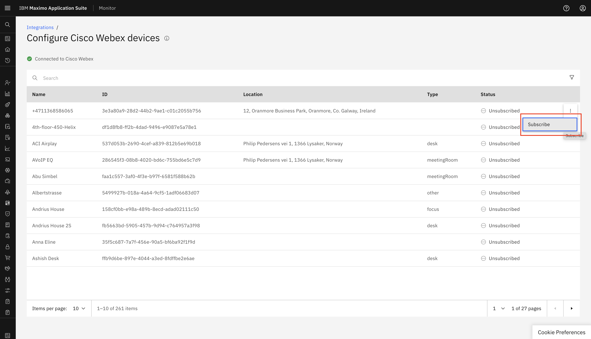
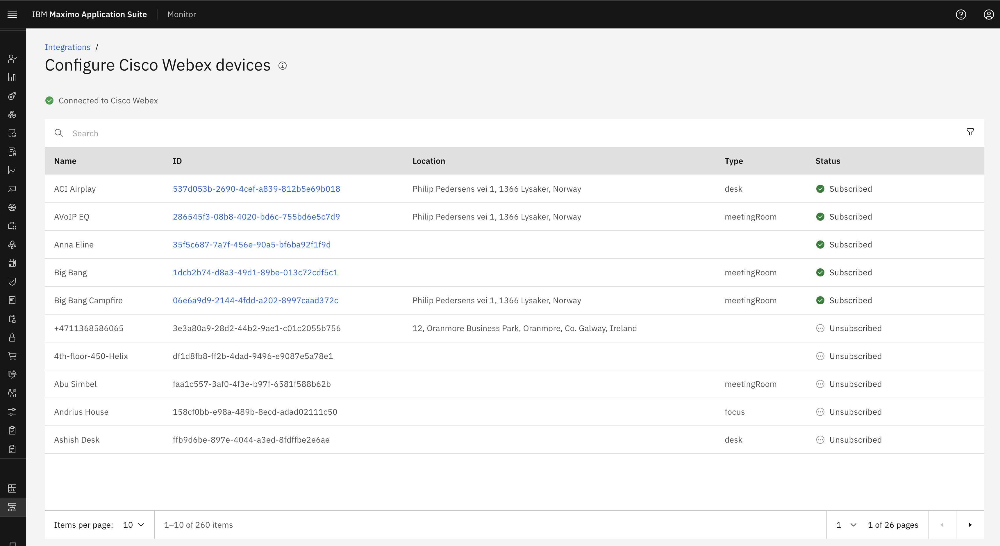
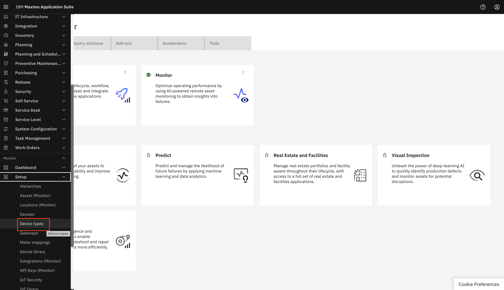
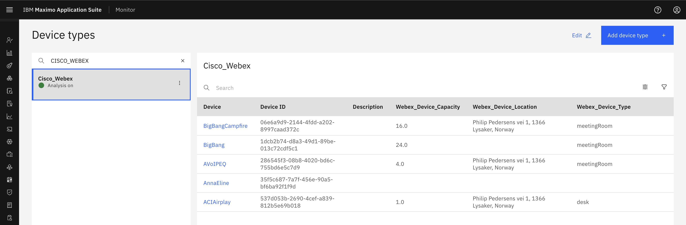
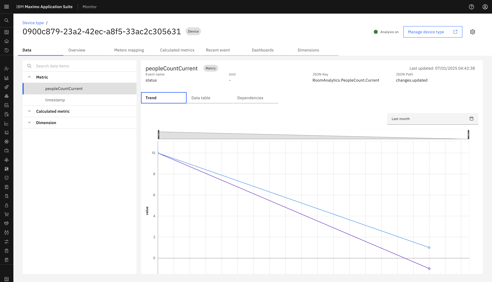
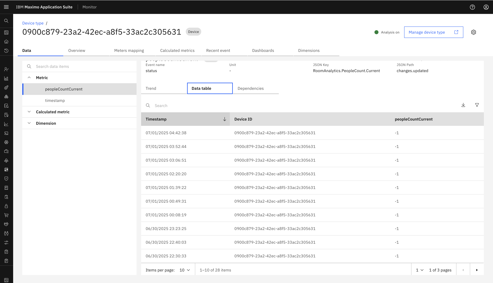

# Objectives
In this Exercise you will learn how to add the Cisco Webex device in Monitor.

---
*Before you begin:*  
This Exercise requires that you have:

1. completed the pre-requisites required for [all labs](prereqs.md)
2. completed the previous exercises

---

# Subscribe to Cisco Webex device

Once we successfully create Cisco Webex configurations, we will establish connection with the Webex control hub. This will internally trigger the schedular to fetch Webex devices from Webex control hub. 

!!! tip
    It will take upto 15 minutes to fetch device list from Webex control hub. 

Once Webex devices are fetched from Webex control hub. We can `Subscribe` device using three dot in right side and It will add in Device Type created by Cisco Webex integration. 
  

It will show `Subscribed` to those devices which we subscribed in above step. 
  

!!! note
    The type of device type will be same as Integration name mentioned in Cisco Webex. This is automatically handled by Monitor. 

 
To check `Devices` in device type expand Setup under the Monitor setup section in the left menu and select `Device types`: 
  

Search for `Cisco Webex` in device types and select the `Cisco_Webex`: 
  

 
Once these devices are subscribed, we will be able to get the people presence count in the Metrics. We will be able to see the Trends and the Data table which will have the peopleCountCurrent along with the timestamp. For it we need to click that device visible in above image and go to `Data` tab and expand `Metric` and select it. 

`people presence count` Trands: 
  

`people presence count` data table: 
  

You have now successfully `Subscribed` the Cisco Webex device to Monitor:

---
Congratulations you have successfully added Cisco Webex device to your Monitor from Cisco Webex integration. 