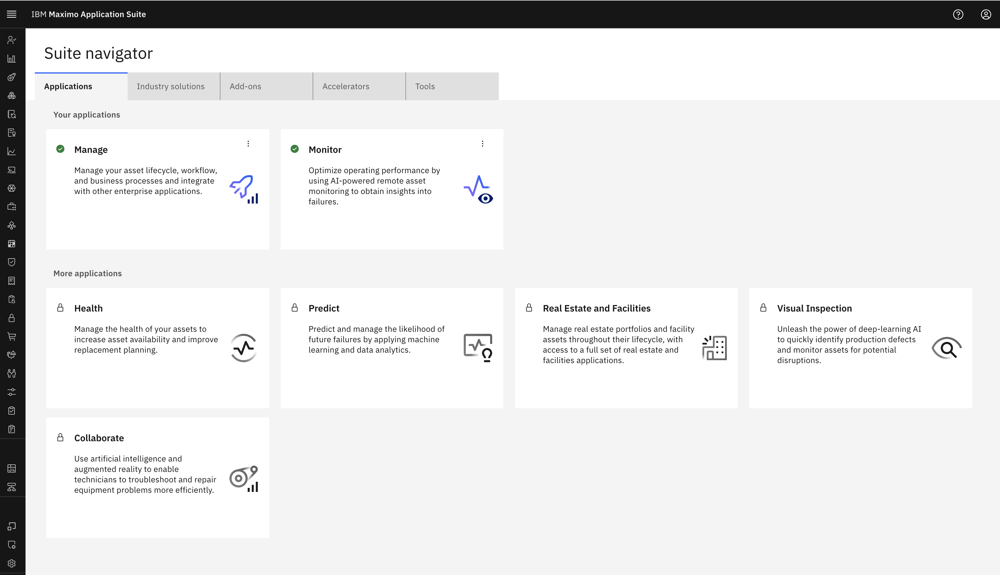
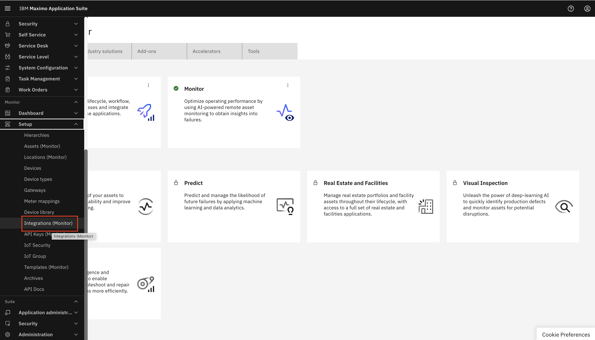
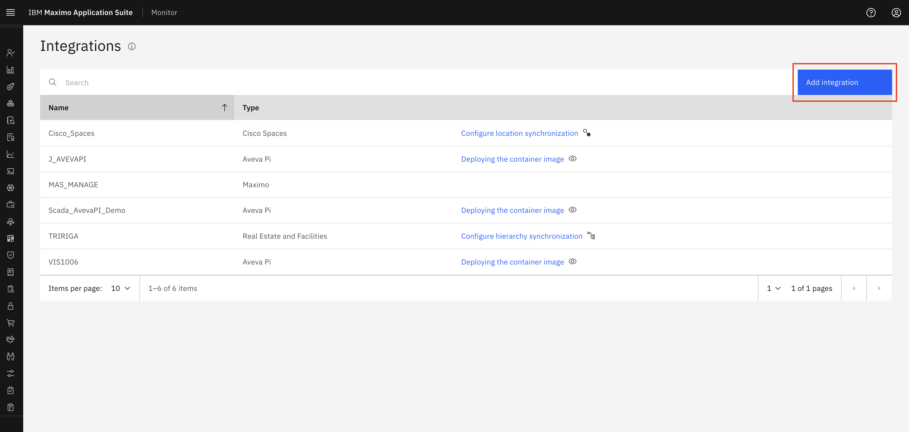
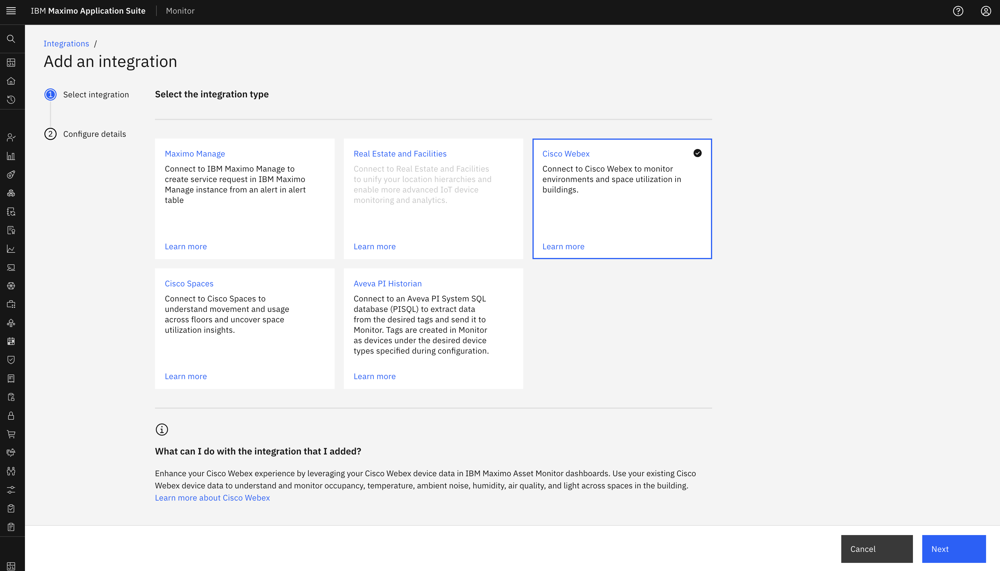
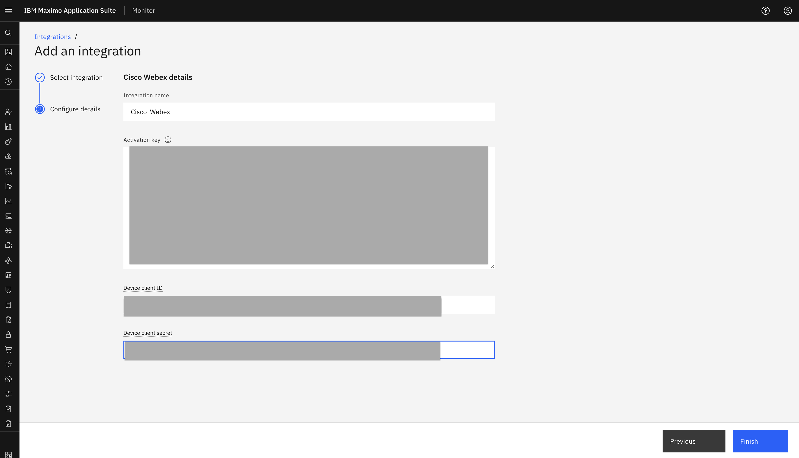
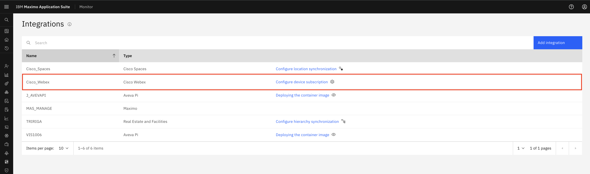

# Objectives
In this Exercise you will learn how to create the Cisco Webex Integration in Monitor.

---
*Before you begin:*  
This Exercise requires that you have:

1. completed the pre-requisites required for [all labs](prereqs.md)
2. completed the previous exercises

---

Login to MAS:
  

Expand Setup under the Monitor setup section in the left menu and select `Integration`:

!!! note "New in MAS 9.1"
    Monitor no longer have a main home page. All interaction with Monitor is initiated from the Monitor section in the left menu 

 
Select `Add Integration`: 
  

Select `Cisco Webex`: 
  

Define the Integration name `Integration name`, JWT Token `Activation key`, Device client ID `Device client ID` and Device client secret `Device client secret` and click `Next`: 
  

!!! tip
    Activation key, Device client ID and Device client secret will be provided by Cisco Webex hub

Click `Finish`: 
  

You will now see your new Cisco Webex integration.

!!! note
    We will not be able to edit the Integration Name as with that name we have already created a Webex Device Type in Monitor 

---
Congratulations you have successfully created the Cisco Webex integration in Monitor. 
