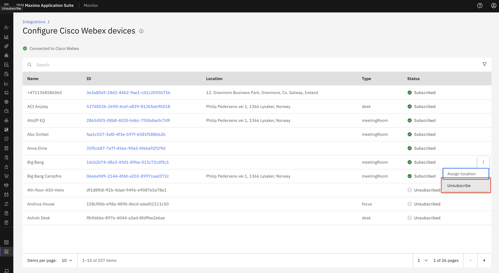
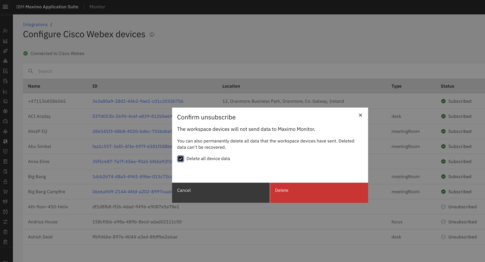

# Objectives
In this Exercise you will learn how to unsubscribe Cisco Webex devices. 
This time you will add it based on your Device Type rather than from the Managed Gateway.

---
*Before you begin:*  
This Exercise requires that you have:

1. completed the pre-requisites required for [all labs](prereqs.md)
2. completed the previous exercises

# Unsubscribe to Cisco Webex device

We can unsubscribe Cisco Webex device from Cisco Webex Integrations.
Please again go to Cisco Webex integration page and there From the device subscription page, we get an option in the ellipses icon to `Unsubscribe` the Cisco Webex device. 
  

When we unsubscribe a Webex device we remove that device from Monitor. That means that we will not be reading any realtime people presence count for that device. While unsubscribing we have an option to delete device data or keep the device data and remove just the device from Monitor: 
  

---
Congratulations you have successfully unsubscribed Cisco Webex device to your Cisco Webex integration in Monitor. 
