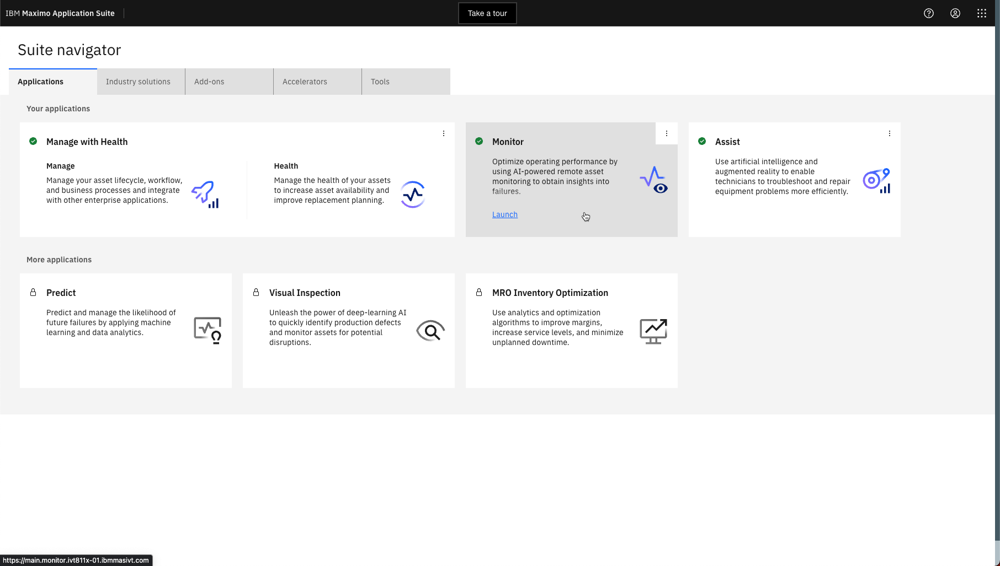
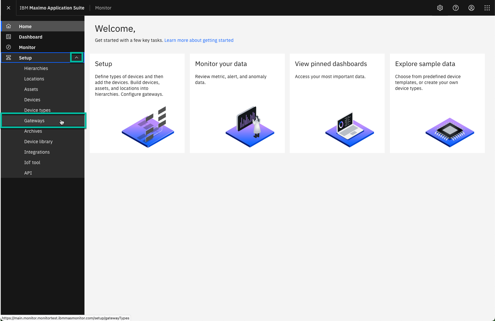
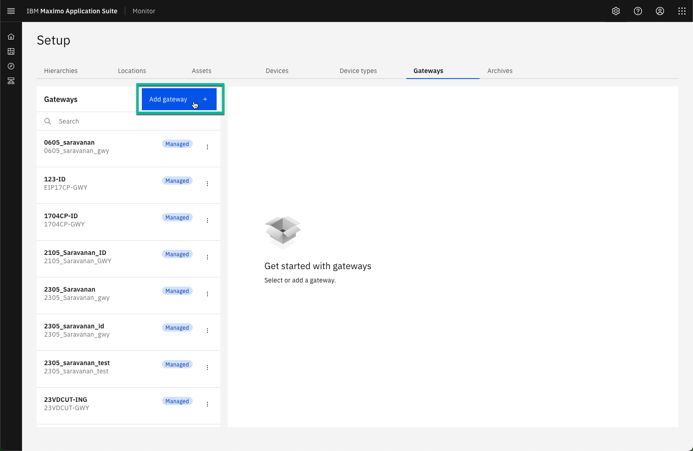
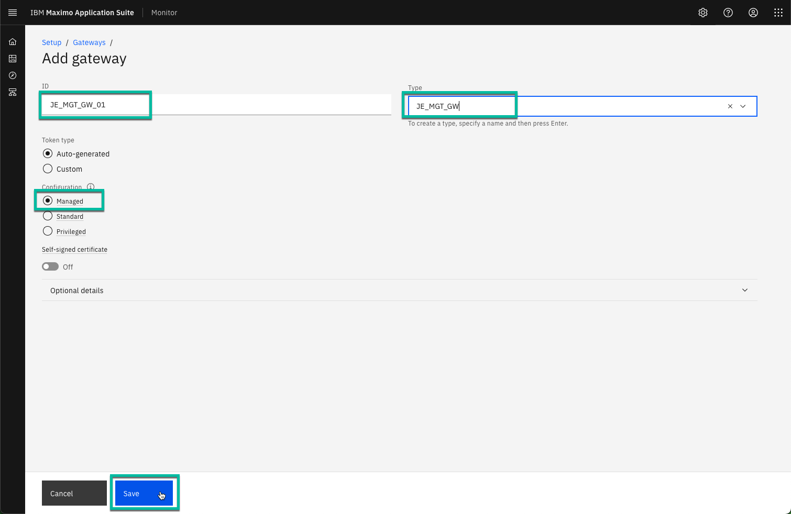
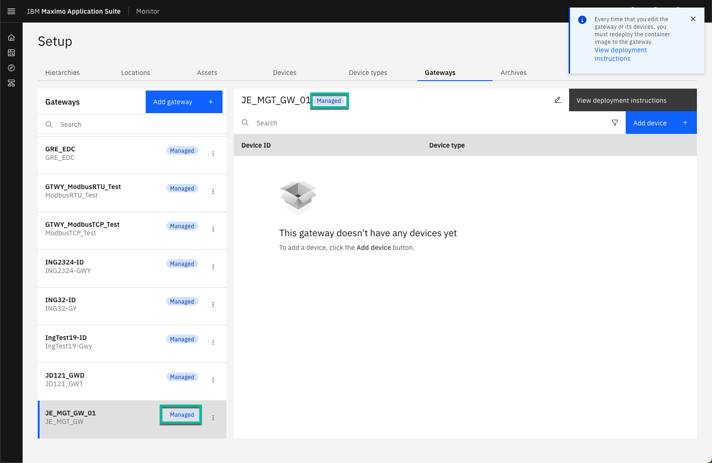

# Objectives
In this Exercise you will learn how to create the Managed Gateway in Monitor.

---
*Before you begin:*  
This Exercise requires that you have:

1. completed the pre-requisites required for [all labs](prereqs.md)
2. completed the previous exercises

---

Login to MAS and navigate to Monitor:
  

Expand Setup in the left menu and select Gateway:
  

!!! note "New in MAS 9.0"
    Gateways can now be created and managed in the Monitor UI. 

Select `Add gateway`:
  

Define the gateway ID `XX_MGT_GW_01` and the gateway Type `XX_MGT_GW`. 

!!! tip
    XX in the gateway ID and Type should be your initials in case other people are following this lab in the same Maximo Application Suite environment. 

Make sure the gateway Configuration is Managed and click `Save`:
  

!!! note "New in MAS 9.0"
    The Managed Gateway is a new type of gateway introduced in MAS Monitor 9.0. 
    It is an integrated flow in Monitor, which removes/replaces the tedious and error prone manual process of defining an Edge Data Collector Integration in prior versions. 

You will now see your new Managed Gateway, including a `Managed` tag in both the list of Gateways as well as in the gateway definition:
  

!!! note "New in MAS 9.0"
    Credentials are automatically "baked into" the docker image for the Managed Gateway. 
    This means you no longer have to write down the credentials for this type of gateway and then enter that information manually into the configuration of the Maximo Monitor End-point. This is much more streamlined and eliminate the risk of error when manually entering the credentials. 
    It also means that the credentials will not be presented to you, as you no longer need them. 

---
Congratulations you have successfully created the Managed Gateway in Monitor. 
