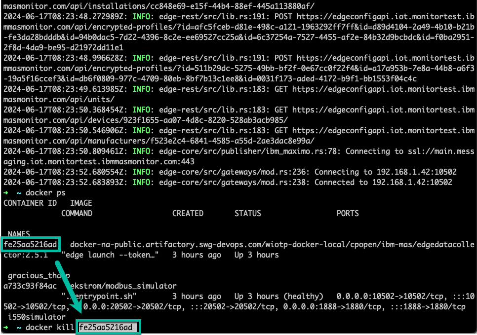
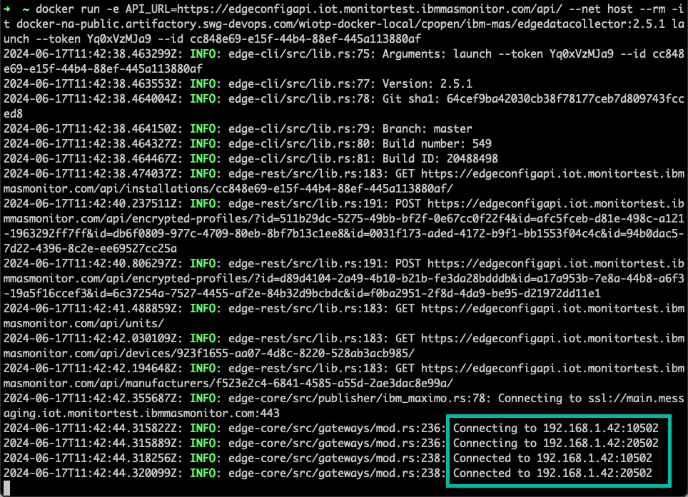
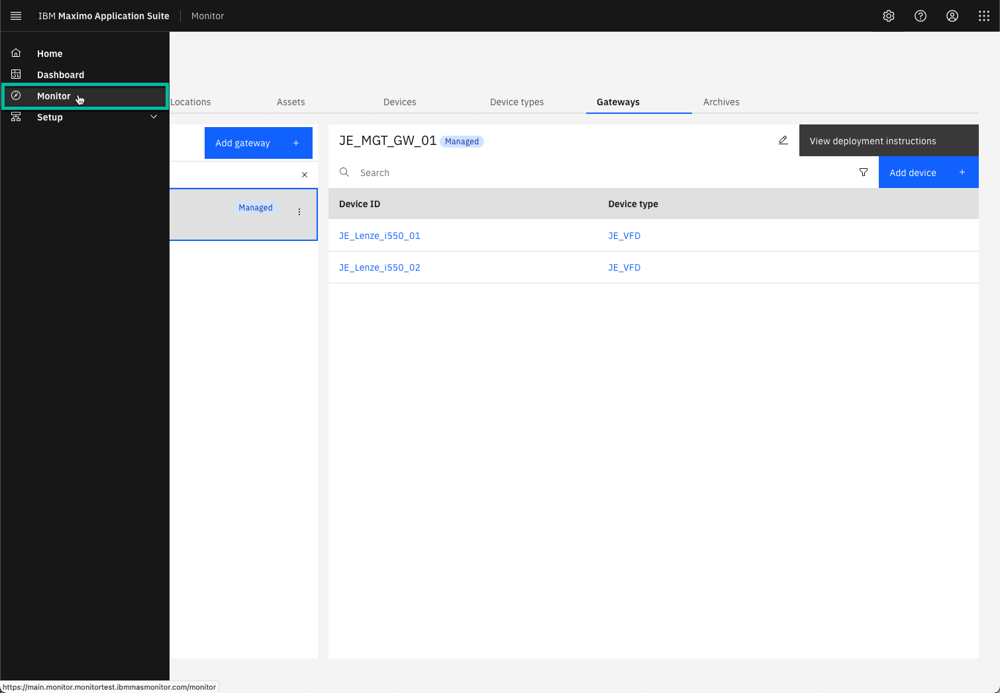
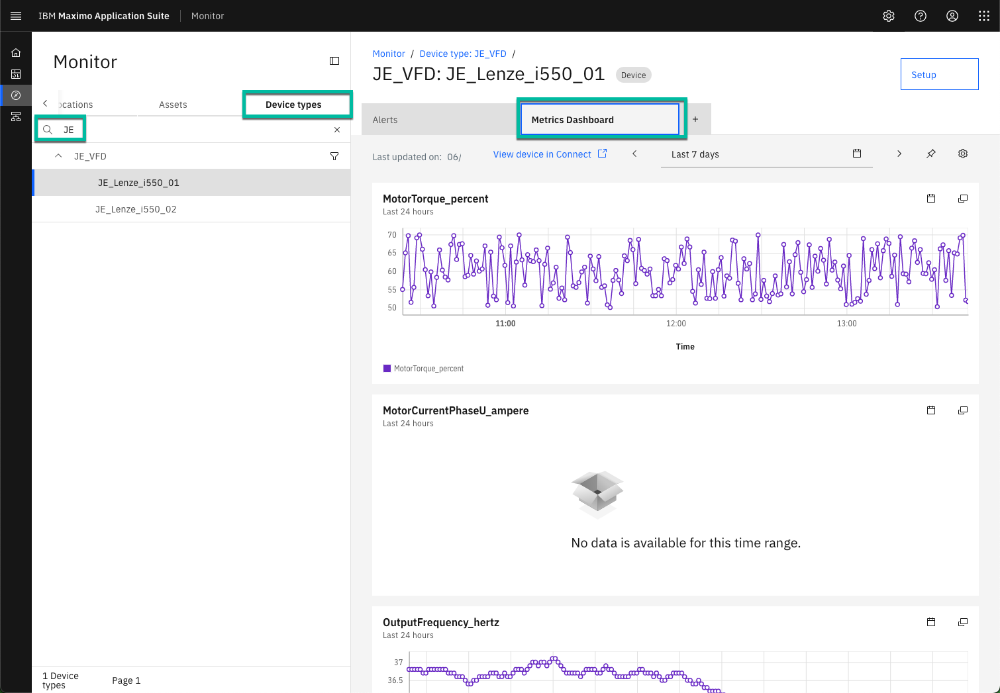
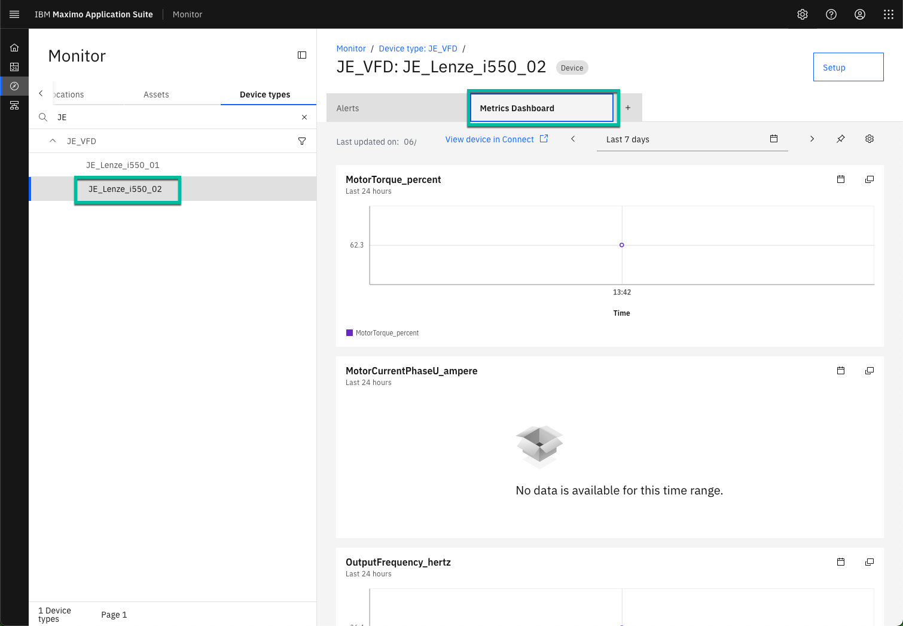
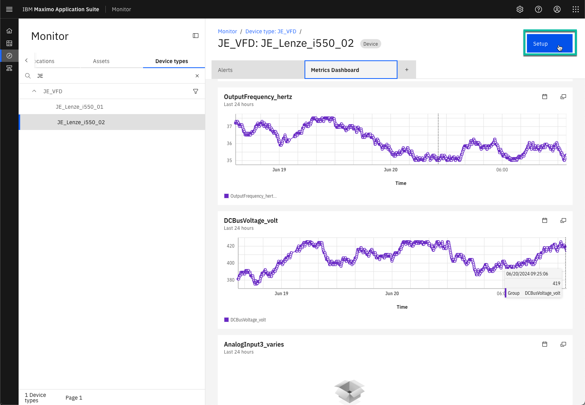
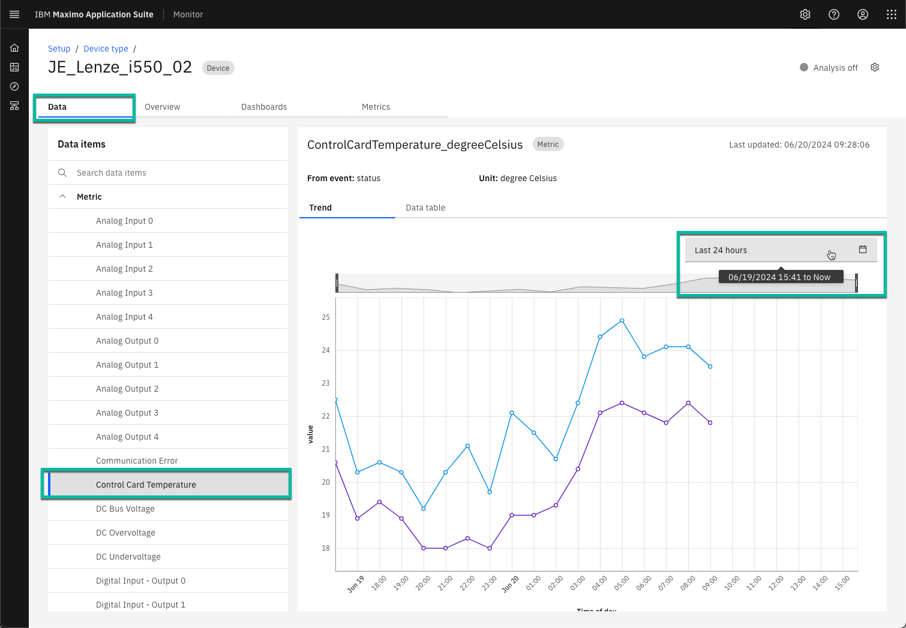
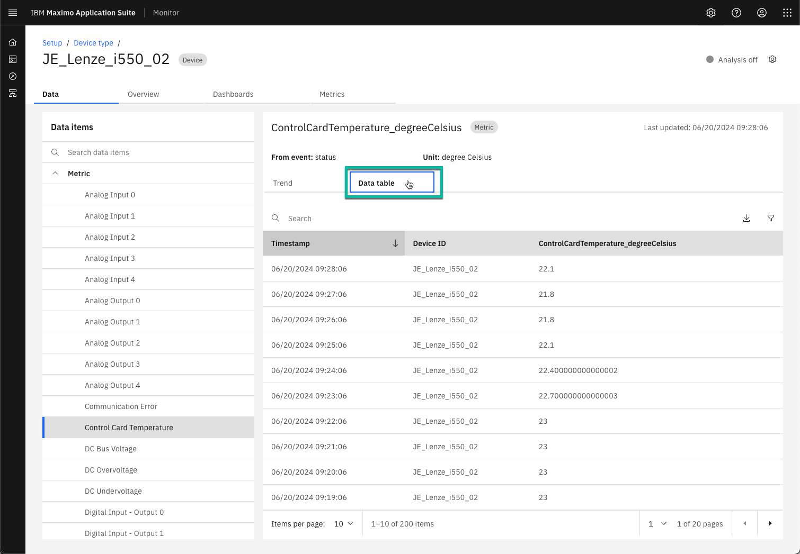
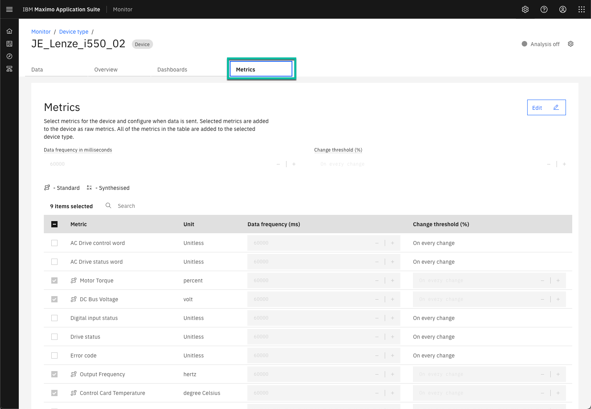

# Objectives
In this Exercise you will learn how to:

* Stop and re-deploy the Managed Gateway
* View the incoming data in Monitor dashboards

---
*Before you begin:*  
This Exercise requires that you have:

1. completed the pre-requisites required for [All Exercises](prereqs.md) and for Exercise 4
2. completed the previous exercises
3. verified the simulator is running as described in [exercise 1](setup_simulator.md){target=_blank}

---

## Re-Deploy the Managed Gateway

Go to where the current Managed Gateway docker container is running. 
Use `Ctrl-p & Ctrl-q` to get back to the prompt. 
Use the `docker ps` command to view the running docker containers. 
Locate the name of the running Managed Gateway container, here it is `fe25aa5216ad`. 
Use the `docker kill <name>` command to stop the docker container.
  

Navigate back to your Managed Gateway and press the `View deployment instructions`.  
Click on the docker command to copy it to the clipboard:
  

Get back to the prompt and then paste the docker command line from the clipboard. 
Click enter to execute it, and you should see something similar to the following:
  

!!! tip
	You can see that you successfully have connections to both the simulated Lenze i550 VFD's. 

## View data in Monitor Dashboards

Navigate to Monitor:
  

Select the `Device types` tab and search for your device type. 
Select the `XX_Lenze_i550_01` device and then the `Metrics Dashboard`:
  

!!! tip
    This has been running for a while. 😉

!!! note "New in MAS 9.0"
    When adding an OT device to a Managed Gateway, Maximo Monitor automatically add all the relevant metrics, as well as creating the Metrics Dashboard with all the metrics.

Now select the `XX_Lenze_i550_02` device and see you have only received a few data points 
in the `Metrics Dashboard`:
  

When running for a while, it could look something like this. Click on `Setup`:
  

!!! tip
    You don't need to wait until you see this beautiful line card before continueing. 🤗

Locate the `Control Card Temperature` in the `Data` tab and change the view to `Last 24 hours`:
  

Now select the `Data table` tab to view the latest data in the database table:
  

Finally click on the `Metrics` tab to view the selections you made when adding this device to the Managed Gateway:
  

!!! note "New in MAS 9.0"
    The definition of Metrics has moved to a separate tab. 
	In the `Overview` tab you'll find the definition of Dimensions as well as other information.

You could now potentially create a dashboard like this 😎:
  

---
Congratulations you have successfully re-deployed and viewed data from both VFD's in the Monitor dashboard. This concludes this lab.  
