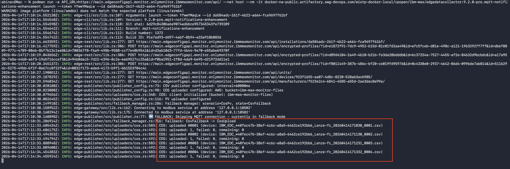
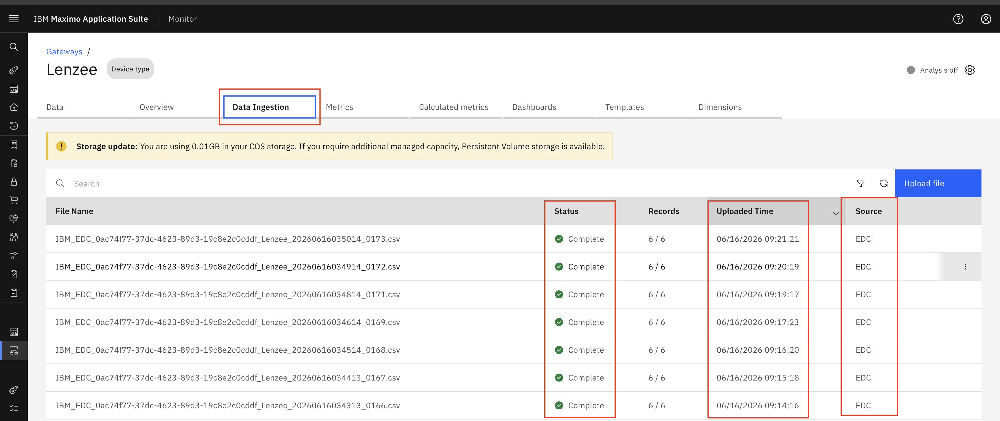
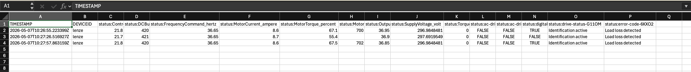
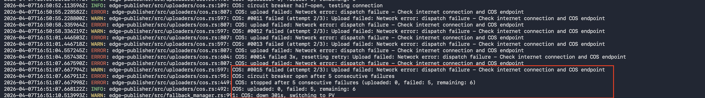
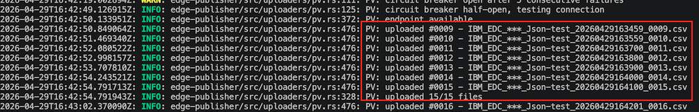

# Objectives

In this exercise, you will focus on verifying CSV file generation and COS publishing within the Managed Gateway, with COS designated as the primary publisher and PV serving as the fallback mechanism ,as demonstrated in **Scenario 2**

---

*Before you begin:*  

This Exercise requires that you have:

1. Completed the previous exercise
2. COS has been configured with monitor

---
## 1. Configure and Deploy Managed Gateway

After configuring the device in **Manage Gateway**, the Docker command is generated automatically.

Navigate to:

**Maximo Monitor → Gateway →  View deployment instructions**

  

Open a terminal on Mac or Linux, or the Command Prompt on Windows, navigate to the desired location, paste the Docker command from the clipboard, and press Enter to execute it.

## 2. Verify COS Data Flow

When IoT is not installed,COS becomes the primary publishing method then Managed Gateway start publishes data to COS in CSV.

Verify the following details based on the device configuration:

- Device connection status is active
- Device is connected using **Modbus protocol**
- Device endpoint is configured with the IP address and port: '127.0.0.1:10502'
 
Verify the following details in the terminal:

- COS is configured as the primary publisher
- CSV publisher is configured as the fallback publisher
- PV available
- Generated CSV files are uploaded to COS
- CSV files are created automatically every 1 minute

Verify the logs:

   

After the CSV files are generated locally, Managed gateway uploads the files to the configured publishing destination.

To verify CSV file ingestion in Monitor go to:

**Maximo Monitor → Device Types → Select Device Type → Data Ingestion**

Verify the following:

- CSV files are being uploaded successfully
- The ingestion status is successful
- The source is displayed as **EDC**

  

---

You can also download the uploaded CSV file for verification.

- Device ID
- Metric names
- Metric values
- Timestamp information

**Screenshot:**

  

---

!!! note
    During fallback operation, Managed gateway generates CSV files locally and uploads them to the monitor. The uploaded files can be viewed, downloaded, and validated from the Data Ingestion.

## 3. Verify Cloud Object Storage Failure Detection

Before testing the failover behavior, verify that Managed gateway is currently publishing data COS.

Possible COS Failure Scenarios

- Cloud Object Storage service connectivity issue
- COS bucket availability issue
- COS bucket configuration or permission issue
- Storage-related failures that prevent file upload

!!! attention

    To verify the COS fallback behavior, ensure that Managed Gateway is running in COS publishing mode.
    To simulate a COS connection failure, disable the network
    When COS upload is unavailable, Managed Gateway detects the publishing failure.

    - After 3 consecutive COS upload failures, the fallback mechanism is activated.
    - The system switches to the next configured fallback destination,In our case it will be PV.

  

---
Now COS has switched to PV, with logs indicating that CSV files are being uploaded via PV
The system periodically attempts to reconnect to the primary publisher, which in this case is COS, every hour while functioning in PV mode.

  
