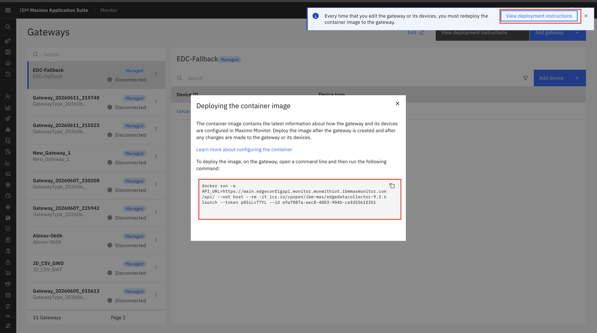
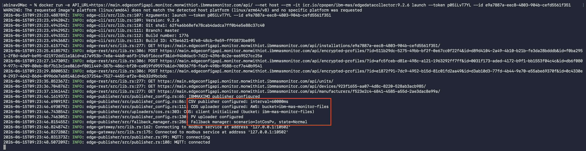
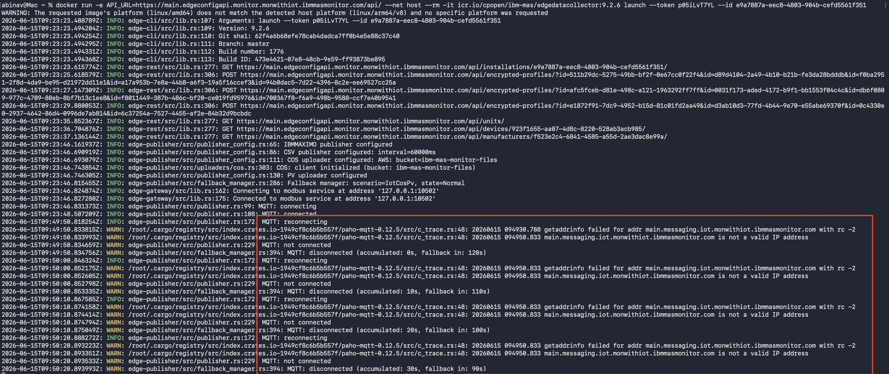
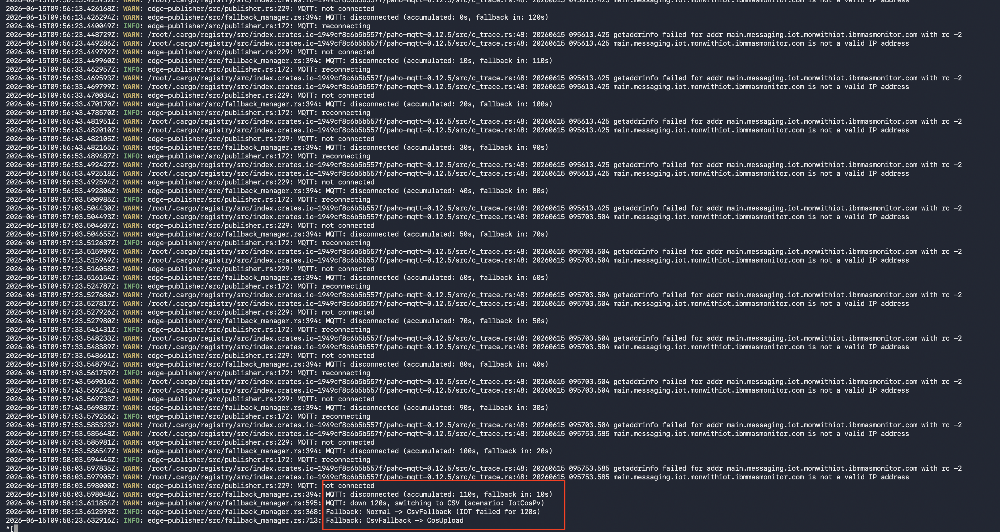

# Objectives

In this Exercise you will learn how Manage gateway handles an MQTT connection failure and automatically switches data publishing to the COS fallback mechanism , as demonstrated in **Scenario 1**

---

*Before you begin:*

This Exercise requires that you have:

1. completed the previous exercise
2. created Managed Gateway
3. added the required device and configured metrics

---

## 1. Configure and Deploy Managed Gateway

After configuring the device in **Manage Gateway**, the Docker command is generated automatically.

Navigate to:

**Maximo Monitor → Gateway →  View deployment instructions**

  

Open a terminal on Mac or Linux, or the Command Prompt on Windows, navigate to the desired location, paste the Docker command from the clipboard, and press Enter to execute it.

---

## 2. Verify MQTT Data Flow

Verify the following details based on the device configuration:

- Device connection status is active
- Device is connected using **Modbus protocol**
- Device endpoint is configured with the IP address and port: '127.0.0.1:10502'
- Data publishing is active through MQTT connection
 
Verify the following details in the terminal:

- IOT/MQTT is configured as the primary publisher
- CSV publisher is configured as the fallback publisher
- COS is configured as the fallback storage
- PV available

  

---

## 3. Verify MQTT Failure Detection

!!! info

    **MQTT Failure Scenario:**

    To evaluate the fallback behavior of the Managed Gateway, disable the internet.

    The Managed Gateway detects the loss of connectivity and automatically starts the fallback mechanism within the within the designated timeout period.

  

When a connection failure occurs, Managed gateway monitors the publisher status and automatically activates the fallback mechanism based on the configured publisher type.

The behavior of failure detection is determined by the configured publishing scenarios.

- The system detects MQTT connection failure in 4 minutes approximately .
- Failure detection includes:
    - 2-minute connection timeout
    - 2-minute static delay
    - Connection status checks

After failure detection completes, Managed gateway switches to the configured fallback publisher.

!!! attention
    During the MQTT failure detection period (approximately 4 minutes), data loss may occur. Since MQTT is a real-time publishing protocol and does not queue messages when the connection is unavailable, data collected before the fallback mechanism cannot be recovered.

    Once the fallback publisher is activated, data collection continues without interruption. New data is stored in CSV format. After the system remains in fallback mode for 60 minutes and automatically attempts to reconnect to the primary publisher.

  

!!! note

     Managed Gateway detects the internet connection is lost and switches to COS, if COS also fails, it transitions to PV fallback.