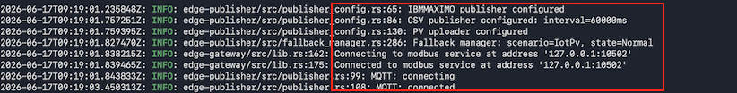
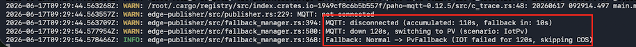
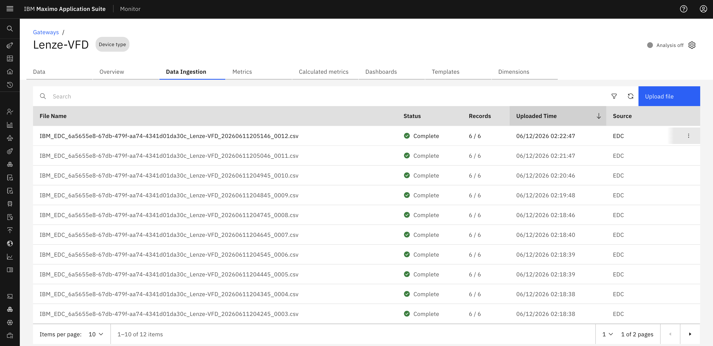
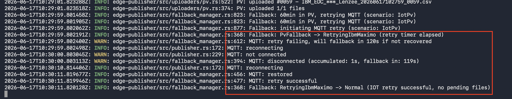
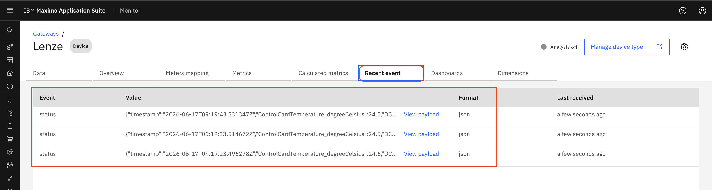

# Objectives

In this exercise, you will learn how the Manage Gateway handles MQTT connection failures and seamlessly transitions data publishing to the PV fallback mechanism, as demonstrated in **Scenario 4**

---

*Before you begin:*

This Exercise requires that you have:

1. completed the previous exercise
2. Confirmed that the Monitor is configured for MQTT.

---
## 1. Configure and Deploy Managed Gateway

After configuring the device in **Manage Gateway**, the Docker command is generated automatically.

Navigate to:

**Maximo Monitor → Gateway →  View deployment instructions**

  

Open a terminal on Mac or Linux, or the Command Prompt on Windows, navigate to the desired location, paste the Docker command from the clipboard, and press Enter to execute it.

---
## 2. Verify MQTT Data Flow

Verify the following details based on the device configuration:

- Device connection status is active
- Device is connected using **Modbus protocol**
- Device endpoint is configured with the IP address and port: '127.0.0.1:10502'
- Data publishing is active through MQTT connection
 
Verify the following details in the terminal:

- IOT/MQTT is configured as the primary publisher
- CSV publisher is configured as the fallback publisher
- PV available

  

## 3. Verify MQTT Failure Detection and PV Activation

Before testing the failover behavior, verify that Managed gateway is currently publishing data MQTT.

!!! info

    **MQTT Failure Scenario:**

    In this situation, when the primary MQTT publisher and PV serving as the fallback mechanism, the fallback behavior of the Managed Gateway can be assessed by disable the internet. The Managed Gateway identifies the connectivity loss and initiates the fallback mechanism, switching the PV within the specified timeout period.

- The system detects MQTT connection failure in 4 minutes approximately .
- Failure detection includes:
    - 2-minute connection timeout
    - 2-minute static delay
    - Connection status checks

!!! attention
    During the MQTT failure detection period (approximately 4 minutes), data loss may occur. Since MQTT is a real-time publishing protocol and does not queue messages when the connection is unavailable, data collected before the fallback mechanism cannot be recovered.

    Once the fallback publisher is activated, data collection continues without interruption. New data is stored in CSV format. After the system remains in fallback mode for 60 minutes and automatically attempts to reconnect to the primary publisher.

After failure detection completes, Managed gateway switches to the PV fallback publisher.

  

---

After the CSV files are generated locally, Managed gateway uploads the files to the configured publishing method

To verify CSV file ingestion in Maximo Monitor go to:

**Maximo Monitor → Device Types → Select Device Type → Data Ingestion**

Verify the following details:

- CSV files continue to be uploaded successfully
- Source is displayed as **EDC**

**Screenshot:**

  

## 4. Verify MQTT Retry Configuration and publishing.

After the system remains in PV mode for 1 hour, Managed Gateway automatically retries the configured primary publisher every 1 hour until the connection is restored and normal data publishing resumes.

Retry behavior:

- MQTT retry process is started after 1 hour in PV mode
- MQTT connection check is performed
- Primary MQTT publisher recovery is attempted

  

!!! note
    The Edge Data Collector automatically retries the primary MQTT publisher every one hour after the system remains in PV mode for one hour. Once the MQTT connection is restored, publishing automatically returns to the primary publisher.
---

Verify the device data update status in Monitor:

**Maximo Monitor → Devices →  Recent event**

Verify the following details:

- Device telemetry data is updating continuously
- Latest event timestamps are updated

  

---

---
# Learning Outcomes

After completing this exercise, you will be able to:

- Understand the  Managed Gateway fallback architecture and publishing hierarchy
- Explain each fallback level and its purpose (MQTT, COS, and PV)
- Verify MQTT connection failure handling and automatic fallback activation
- Verify CSV generation and COS publishing behavior
- Verify PV fallback and primary publisher recovery

Congratulations, you have successfully verified that the  Managed Gateway fallback system is working as expected.
