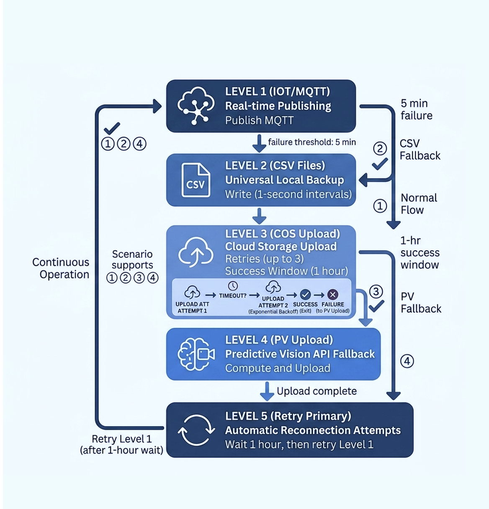

# Objectives
In this Exercise you will learn how the  Managed Gateway fallback system works and understand the fallback publishing hierarchy in Maximo Monitor 9.2.

---

*Before you begin:*  
This Exercise requires that you have:

completed the pre-requisites required for [all labs](prereqs.md)

---

!!! note "New in MAS 9.2"
    Maximo Monitor 9.2 introduces a multi-level fallback publishing architecture in Managed Gateway. This system provides continuous data availability by automatically switching between real-time publishing and storage methods during connectivity failures.

## 1.  Managed Gateway Fallback System Overview

The Edge Data Collector fallback system ensures reliable data collection and prevents data loss during network outages, connection failures, or downstream service unavailability.

The system automatically detects publishing failures and moves through a predefined fallback hierarchy. Each fallback level provides additional redundancy and ensures collected device data remains available.

The fallback system provides:

- Real-time telemetry publishing
- Local data persistence
- Cloud-based backup storage
- Long-term data durability
- Automatic recovery and retry mechanism

---
## 2. Configuration Scenarios

The Edge Data Collector fallback system supports different configuration scenarios based on the configured publishing destinations.

Each scenario defines the primary publisher, fallback path, and retry behavior.

---

#### Scenario 1: Monitor with IoT Installed 

Primary publisher is MQTT, with COS and PV serving as fallback options.

In this configuration, MQTT is the primary publisher and delivers real-time data to the IoT platform.
If MQTT connectivity fails, the system falls back to local CSV storage. Data is then uploaded to Cloud Object Storage as a secondary publisher. If Cloud Object Storage also becomes unavailable, the system transitions to Persistent Volume (PV) as the final fallback.

---

### Scenario 2: Monitor with COS Installed 

Primary Publisher: COS and PV as fallback

In this configuration, CSV with Cloud Object Storage is the primary publishing mechanism.
If Cloud Object Storage is unavailable, data continues to be persisted locally in CSV format and is then uploaded to Persistent Volume as the fallback destination.
---

### Scenario 3: Monitor with PV Installed 

Primary publisher is PV.

In the PV-only configuration, data is consistently uploaded to PV, with the local CSV functionality remaining continuously enabled. As there is no alternative publishing mechanism in this setup, no supplementary fallback or retry options are provided.

---

### Scenario 4: Monitor with IoT Installed 

Primary publisher is MQTT, with PV serving as a fallback option.

In this configuration, MQTT serves as the primary publisher. If MQTT becomes unavailable, the system stores data locally in CSV files and uses PV as the fallback destination for uploads. The system attempts to reconnect to MQTT every hour while operating in PV mode.

---

## 3. Fallback Hierarchy

The fallback system operates in a hierarchical structure with multiple redundancy levels.

The system contains five fallback levels

### Level 1: MQTT (IoT Platform)

**Data Format:**  JSON

**Active Scenarios:**  Primary publisher: Scenario 1 and Scenario 4

**Purpose:** When MQTT is configured as the primary publisher,Managed Gateway sends device telemetry data directly to the IoT platform.

If MQTT communication encounters a failure, Manage Gateway automatically transitions to the CSV fallback.

---

### Level 2: CSV Files (Local Storage)

**Data Format:**  CSV

**Active Scenarios:**  All scenarios from 1 to 4 .

**Purpose:** Local CSV storage is always enabled. When the primary publisher is unavailable, Managed Gateway stores collected data locally to prevent data loss.

Features:

- Data is stored locally during outages
- Temporary failures do not interrupt data collection
- Stored data can be processed after connection recovery

---

!!! attention
    The CSV files stored inside the Docker container temporary `/tmp/` location will be lost if the Docker container is stopped.

    Before stopping the Edge Data Collector container, ensure that all generated CSV files are successfully uploaded to the monitor.
    
    CSV files are generated for every device type with a unique timestamp. Within 24 hours, 1440 files are stored locally. Once the network connection is established, the files are uploaded to the monitor

    If a Network connection is not established within this timeframe and is instead established in the 25th hour, 1 hour data will be lost

---

### Level 3: COS (Cloud Object Storage)

**Data Format:**  CSV

**Active Scenarios:**  Primary Publisher: Scenario 2; Secondary Publisher: 1

**Purpose:** Cloud Object Storage provides an additional backup destination after local CSV storage.

Supported storage options:

- IBM Cloud Object Storage
- AWS S3

!!! note
    Only one cloud storage option can be configured at a time.

---

### Level 4: PV (Persistent Volume)

**Data Format:**  CSV

**Active Scenarios:**  All scenarios

**Purpose:** Persistent Volume acts as the final fallback storage destination when other publishing methods are unavailable.This ensures collected data remains available during extended outages.

---

### Level 5: Primary Retry Mechanism

**Purpose:**  Automatic reconnection to the primary publisher.

 The system is activated after remaining in fallback mode for a duration of one hour.The Managed Gateway automatically attempts to reconnect to the primary publishing destination.

Recovery process:

- Retry is performed every 1 hour
- Once the primary publisher becomes available, normal data publishing resumes
- Stored fallback data is handled based on recovery configuration

---

## 4. Complete Fallback Flow

The complete fallback hierarchy works as follows:
             

---

## 5. Setting up Managed Gateway Fallback System

Before testing the fallback functionality, you need to complete the common setup steps required for Managed Gateway.

The following steps are required before validating the fallback behavior:

1. Create a Managed Gateway
2. Add the required device from the Device Library
3. Configure the device and metrics
4. Deploy the Managed Gateway configuration
5. Verify device data flow in Maximo Monitor

For detailed steps, refer to the following exercises:

- [How to Create Managed Gateway](/monitor_managed_gw_modbus_9.1/create_gateway/)
- [How to Add Device from Device Library](/monitor_managed_gw_modbus_9.1/add_device_2/)

After completing the above setup, continue with the fallback system validation steps.

---

Congratulations, you have successfully understood the Edge Data Collector fallback hierarchy. 🤗
