# Objectives
In this Exercise you will learn how to add a Json-over-http device to the Device library.

---
*Before you begin:*  
This Exercise requires that you have:

1. completed the pre-requisites required for [all labs](prereqs.md)
2. completed the previous exercises

---

!!! note "New in MAS 9.1"
    You can add custom devices, such as PLCs or OPC-UA servers, or industrial devices which supports Modbus, BACnet and Json protocols that are not available in the Maximo Monitor Device library. Later the same device can be used by anyone who is creating a device on the Devices page. </br>

## 1. Adding device for GET method

Since Json-over-http are very customizable you will need to add a new device to the Device library instead of using a pre-configured device in the Device library by uploading the CSV file in given format.</br>

- Navigate to the Device library page:</br>
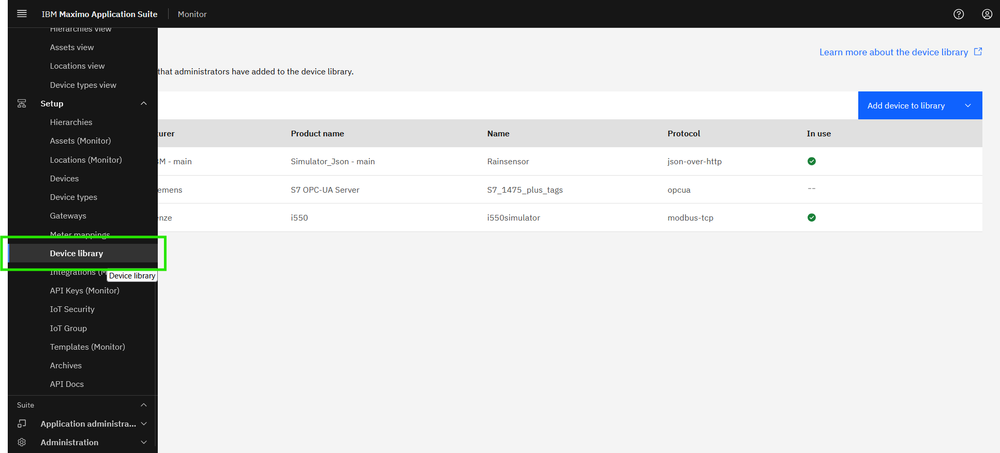</br>

- Modbus devices can be added using device settings in CSV file format .</br>
Click `Add device to library` and select `Import device settings` option:</br>
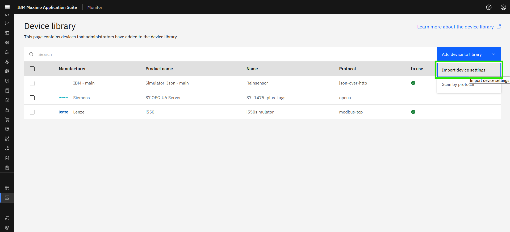</br>

- Select protocol as `JSON Over HTTP` </br>
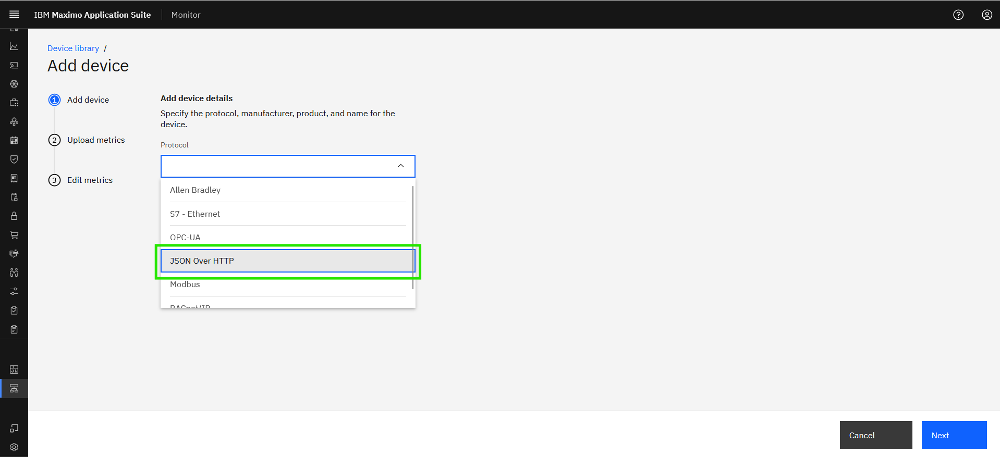</br>

- Enter the device details and click `Next`:</br>
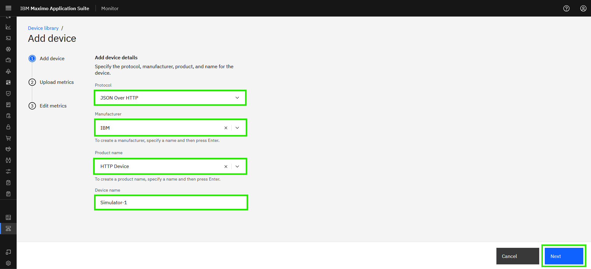</br>

!!! tip
    * New manufacutrer can be added if you couldn't find it in the option.
    * XX in the Device name should be your initials in case other people are following this lab in the same Maximo Application Suite environment.

- Download `example.xlsx file`</br>
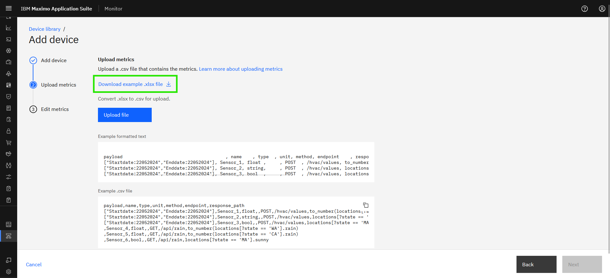</br>

- Open Excel file to fill the data points in `metrics` sheet, Each column in the template, offering context on its purpose and instructions for completing the corresponding cell values. It is important to note that each row in the CSV represents a single json-over-http datapoint.
</br>

# Examples of input for csv template 

| Column_Name&emsp;&emsp;&emsp;&emsp;&emsp;| Description&emsp;&emsp;&emsp;&emsp;&emsp;&emsp;&emsp;&emsp;&emsp;&emsp;&emsp;&emsp;&emsp;&emsp;&emsp;&emsp;&emsp;&emsp;&emsp;&emsp;&emsp;&emsp;&emsp;&emsp;&emsp;&emsp;&emsp;&emsp;&emsp;&emsp;&emsp;&emsp;&emsp;&emsp;&emsp;&emsp;&emsp;&emsp;&emsp;&emsp;&emsp;&emsp;&emsp;&emsp;&emsp;&emsp;&emsp;&emsp;&emsp;&emsp;&emsp;&emsp;&emsp;&emsp;&emsp;&emsp;&emsp;&emsp;&emsp;&emsp;&emsp;&emsp;&emsp;&emsp;&emsp;&emsp;&emsp;&emsp;&emsp;&emsp;&emsp;&emsp;&emsp;&emsp;&emsp;&emsp;&emsp;|
|----------------------------------------------------------------|------------------------------------------------------------------------------------|
| <i>Payload</i> | RSpecifies the JSON body required for POST API calls to retrieve the desired datapoint. This payload consists of key-value pairs representing standard JSON data types (objects, arrays, strings, numbers, booleans, null). This field is applicable only when the HTTP method is set to POST.|
| <i>Name</i> | The name of the data point should be added in this column. The value will be used in Monitor as the related metric name. `Actual Torque` |
| <i>Type</i>   | Indicates the data type of the datapoint, enabling the EDC tool to correctly interpret incoming values. Supported types include: `float`,`string` and `bool`. `float:` Numeric values with decimal points (e.g., voltage readings: 254.5698).</br> `string:` Alphanumeric values (e.g., model name, firmware version: “V52.1.4”). </br> `bool:` Coil addresses represent Boolean values, storing simple binary data (0 or 1). |
| <i>Unit</i>     | This column indicates the unit in which the data is reported for a specific datapoint. This is an optional parameter as not all datapoints require a unit. |
| <i>Method</i>     |Specifies the HTTP method used to interact with the API. GET and POST are the only acceptable values. </br> `GET` Retrieves records from the server. </br> `POST` Sends data to create a new record on the server. |
| <i>Endpoint</i>     |Refers to the API URL that acts as the access point for retrieving or sending data. This is appended to the base URL to define the target resource. e.g: `/device-1` |
| <i>Response_Path</i>     |Specifies the path used to extract the required value from the API response payload. Use a JMESPath expression to navigate the JSON structure. For more information on syntax and examples., please refer to [Jmespath.org](https://jmespath.org/) |

- Copy the json payload from the browser
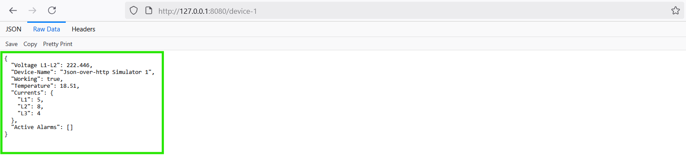</br>
- The response path expression for the Json-over-http datapoint can be evaluated in [JMESPath](https://jmespath.org/) 
- Paste the payload in `JSON data` and Enter an expression in the search box to see JMESPath in action and see the result in result pane
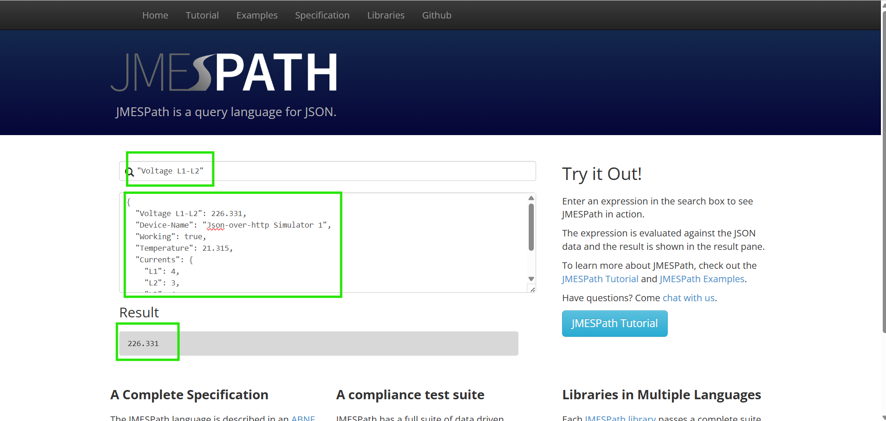</br>
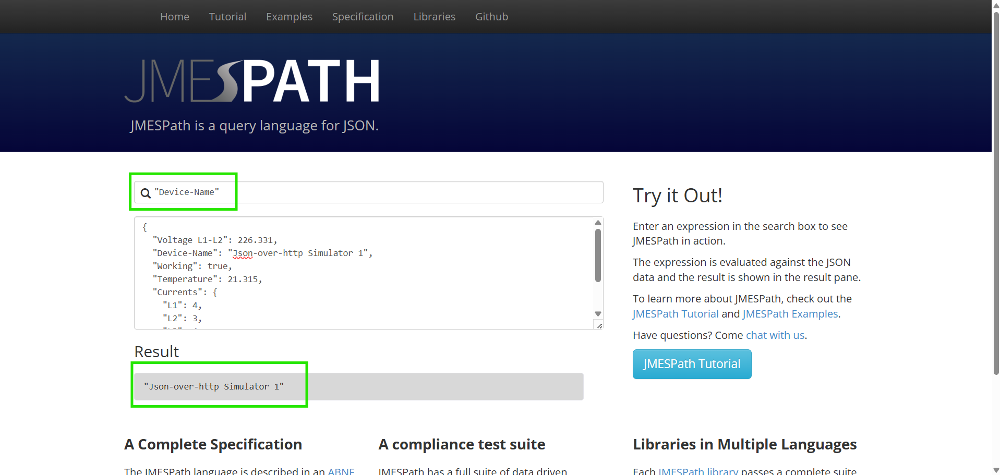</br>
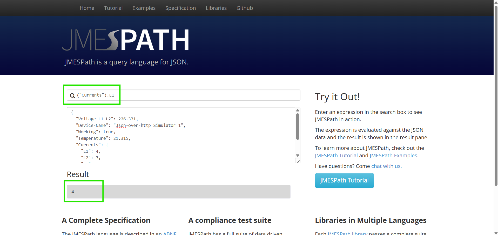</br>

- Fill the `Metrics` sheet using the details:
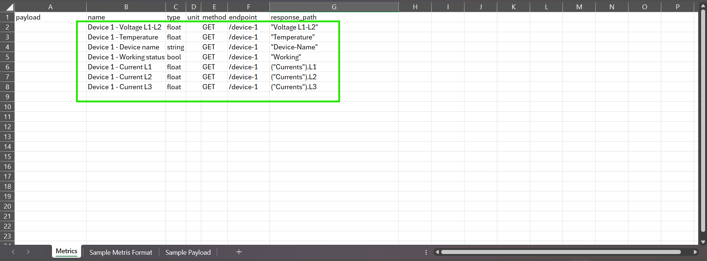</br>

- For filling the `metrics` sheet, you can refer `Sample Metrics Format`sheet.
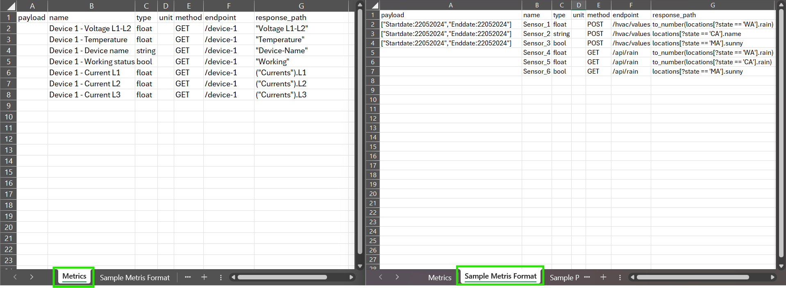</br>

!!! note
    Once the required datapoint details is filled to the Metrics sheet, kindly save the Metrics sheet to CSV format for uploading.  </br>

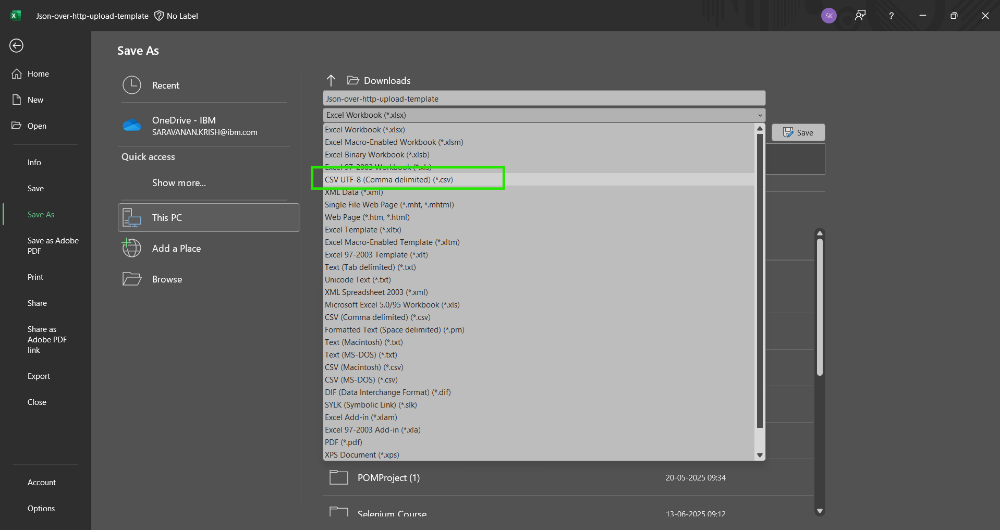</br>

- Upload the CSV file and select `Next`
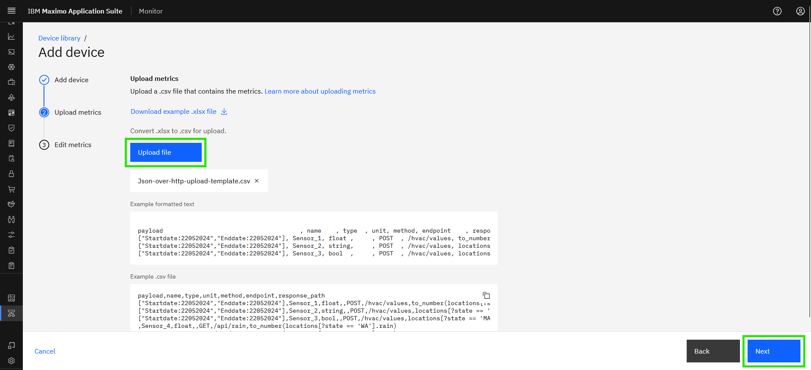</br>

- You can see the summary of datapoints, if required you can remove the metrics here. Once done click `Finish`:</br>
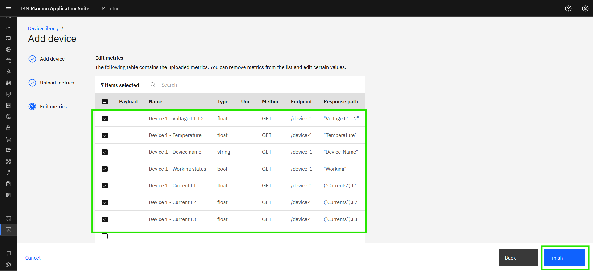</br>

!!! attention
    If you see a `Bad Request` error while Uploading the CSV file, </br>
    then you might need to check the CSV file for each metrics which you might be missing details or it maybe in a invalid format.

- You can see the newly added device in Device library:</br>
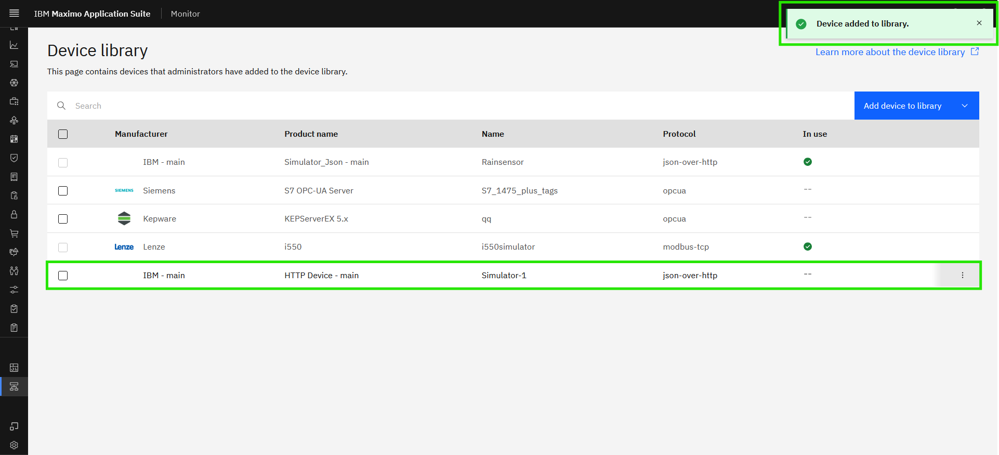
 
!!! note
    If new Manufacturer is created, it will be appended along with the OrganizationID. `IBM - Main` </br>
    e.g - If the the OrganizationID is `MASPROD` then the manfucturer will be `XXXXX - MASPROD`  </br>

Now the device is ready to use. Enjoy!!! 🤗.</br>
    
## 2. Adding device for POST method

- Open Excel file to fill the data points in `metrics` sheet, Each column in the template, offering context on its purpose and instructions for completing the corresponding cell values. It is important to note that each row in the CSV represents a single json-over-http datapoint.
</br>

- To get the response payload use the `curl` command
``` json 
curl -X POST -d "['Temperature','Voltage L1-L2','Device-Name','Working','Active Alarms']" http://localhost:8080/device-3
```
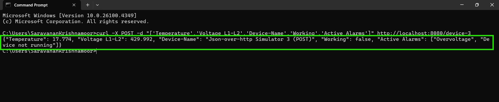</br>

- The response path expression for the Json-over-http datapoint can be evaluated in [JMESPath](https://jmespath.org/)
- Copy the respose from the terminal or command window
- Paste the payload in `JSON data` and Enter an expression in the search box to see JMESPath in action and see the result in result pane. 
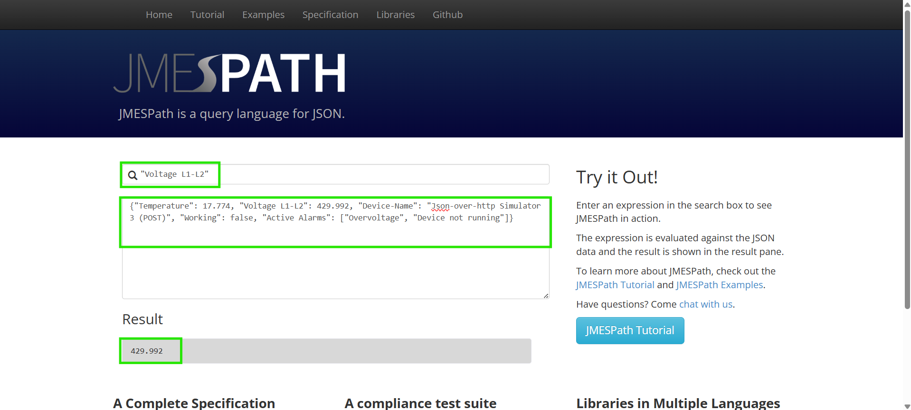</br>
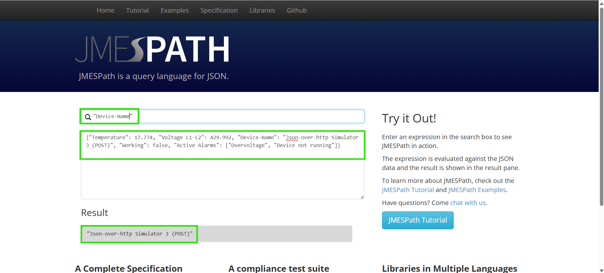</br>
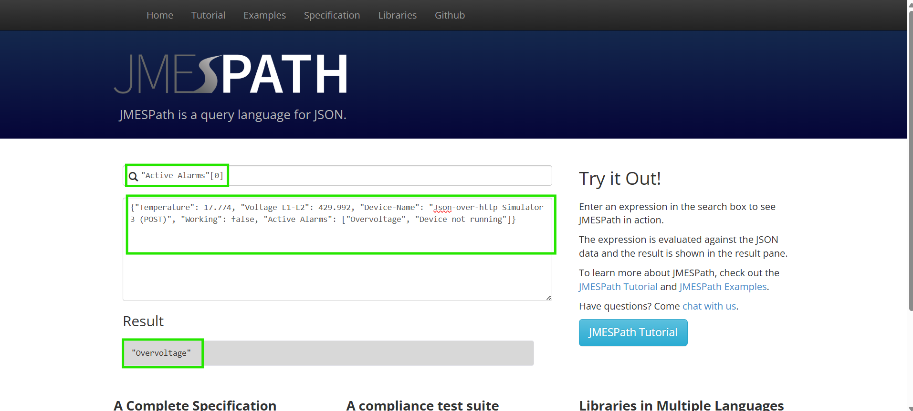</br>

- Fill the `Metrics` sheet using the details:
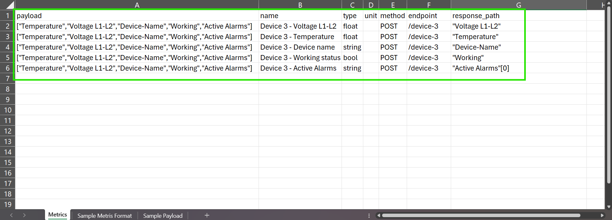</br>

- Save the Metrics Excel file to CSV and create new device in the Device library, by following the previous step.
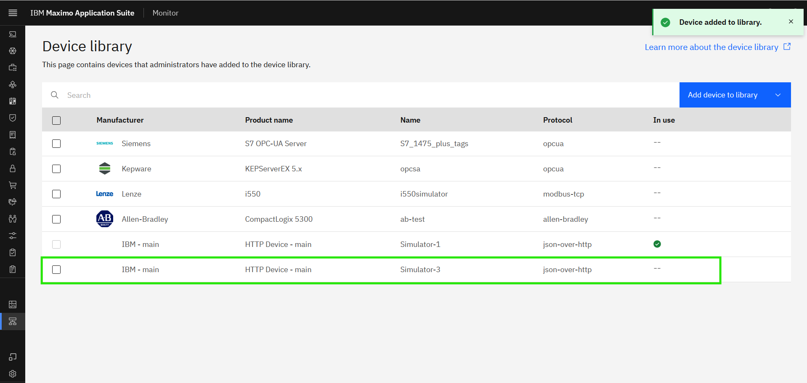</br>

Now the device is ready to use for Managed Gateway. Enjoy!!! 🤗

---
Congratulations you have successfully added a device to the Device library.</br>
