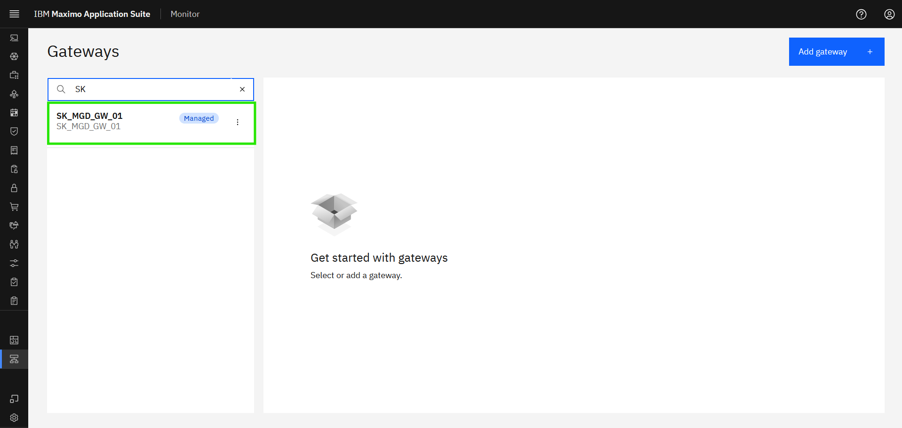
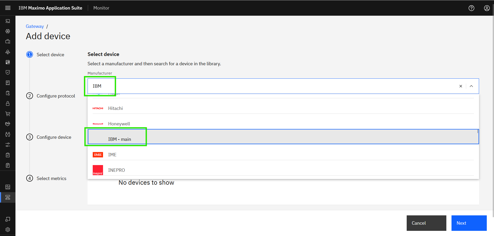
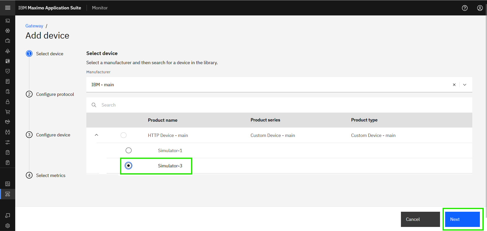
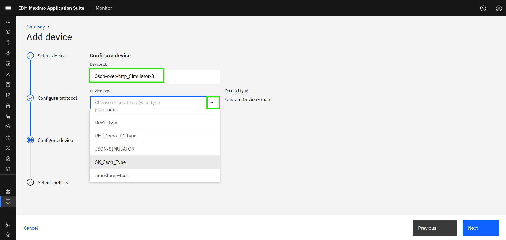
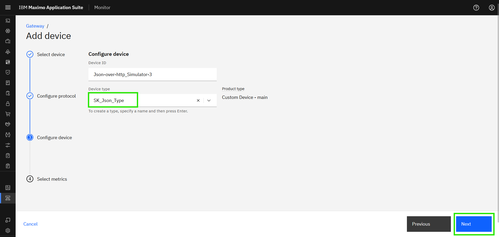
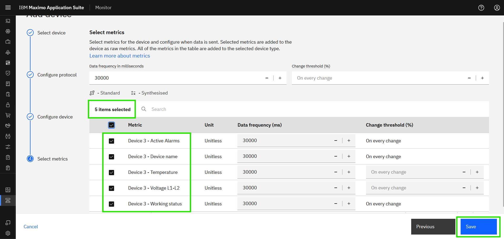
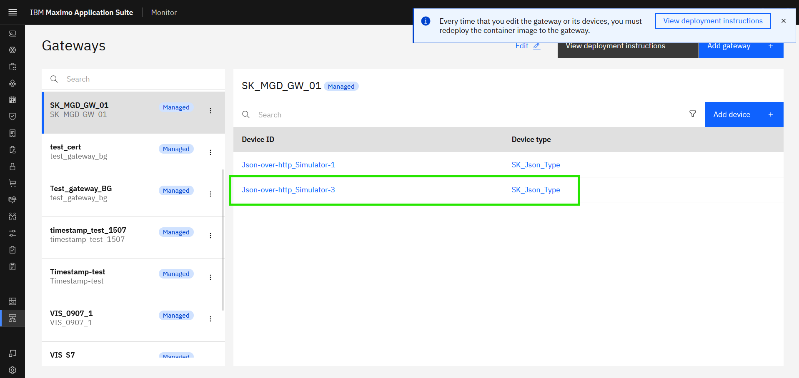

# Objectives
In this Exercise you will learn how to add a second simulator device to the Managed Gateway. 

---
*Before you begin:*  
This Exercise requires that you have:

1. completed the pre-requisites required for [all labs](prereqs.md)
2. completed the previous exercises
 
---

Filter to find and select your Gateway  
- select it and you should also see devices handled by your Managed Gateway: 
  

In the Managed Gateway click on `Add device`: 
[![Add device]][Add device]{target=_blank} 

The `Use device library` will automatically be selected, as a Managed Gateway only supports devices from the library. Simply click on `Continue`:  
[![Use device library]][Use device library]

!!! note
    The type of gateway defines which types of devices that can be added to the gateway. 
    This is automatically handled by Monitor.  
    Managed Gateway: OT devices from the device library. 
    Standard/Privileged Gateway: IoT devices are added as custom devices. 

 
It is time to add the Json simulator-3 device. 
Search for `IBM` in the manufacurer drop-down and select it. Click `Next`: 
  

Select the HTTP Device - main product, choose `Simulator-3` and click on `Next`: 
  

Select the `http` protocol for endpoint: 

!!! tip 
    The simulator is running in our local machine at http://localhost:8080 or http://127.0.0.1:8080 . 

 
Now it is time to use the IP address of the simulator and  port number `127.0.0.1`, `8080`. 
Click on `Next`;

!!! tip 
    Context path of the URL should be added to the datapoints in the `endpoint` column during CSV upload. 

 
Define the Device ID as `Json-over-http_Simulator-3`. 
You can see the Product Type as Custom Device, i.e. The product type of all the custom device added to the device library. 
Click on the `Device type` and you should see this:
  

You can either select the old device type or create new Device Type: 
Click on the `XX_Json_Type` and click `Next`:

!!! tip 
    You can select your own Device Type from the drop-down list once you have created it. 

 
Define the Data frequency to 30000 (30 seconds) and it will automatically be used when you select the metrics: 
  

Select all the Metrics. Click `Save`:

 
You will now see your 2nd device being a part of your Managed Gateway:
  

---
Congratulations you have successfully added another simulator device to your Managed Gateway. 

[Add device]: img/2nd_device_02.png
[Use device library]: img/2nd_device_03.png