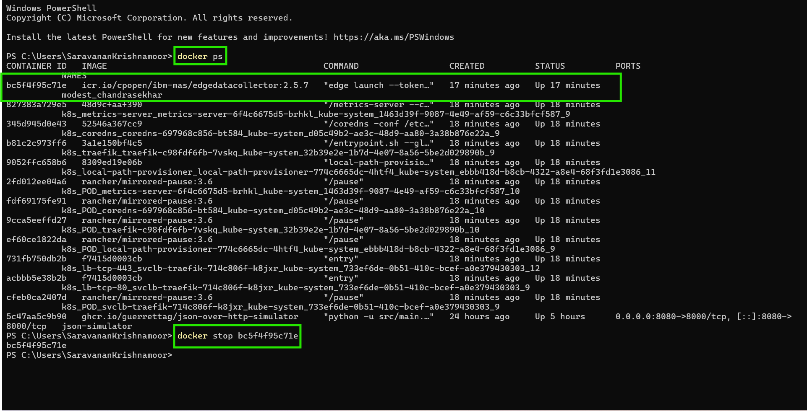
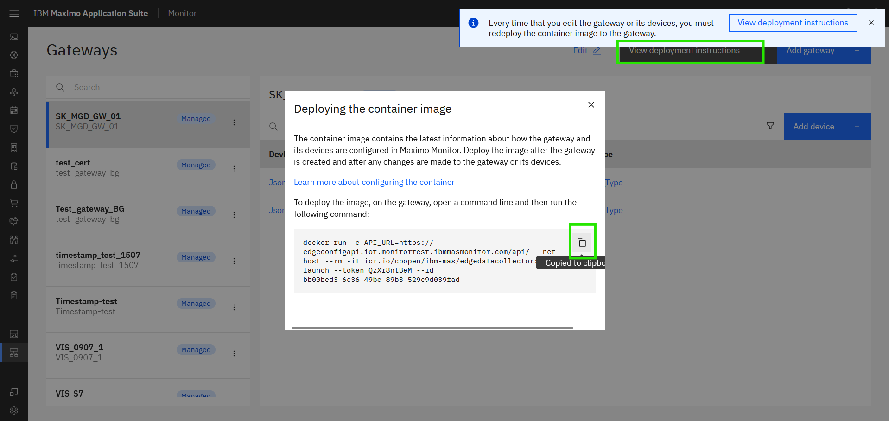
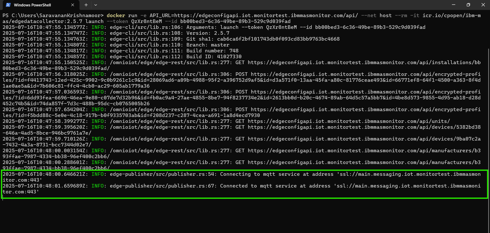
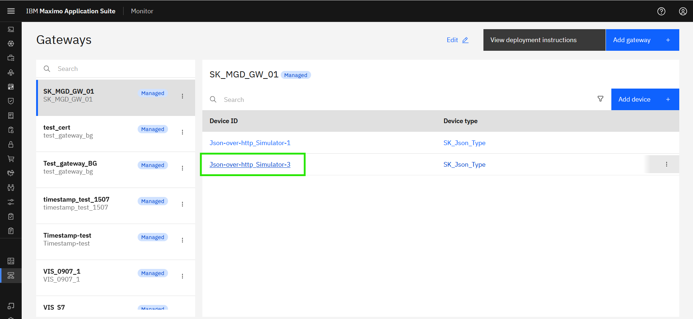
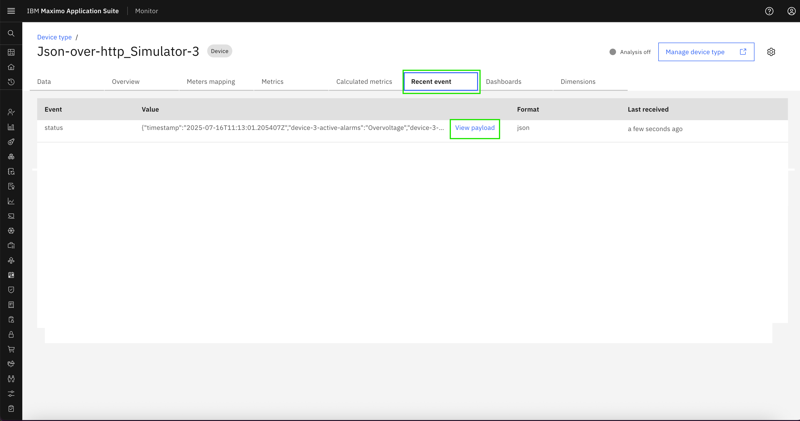
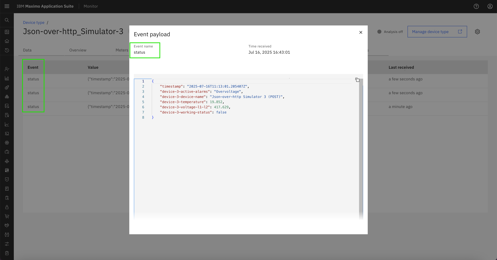
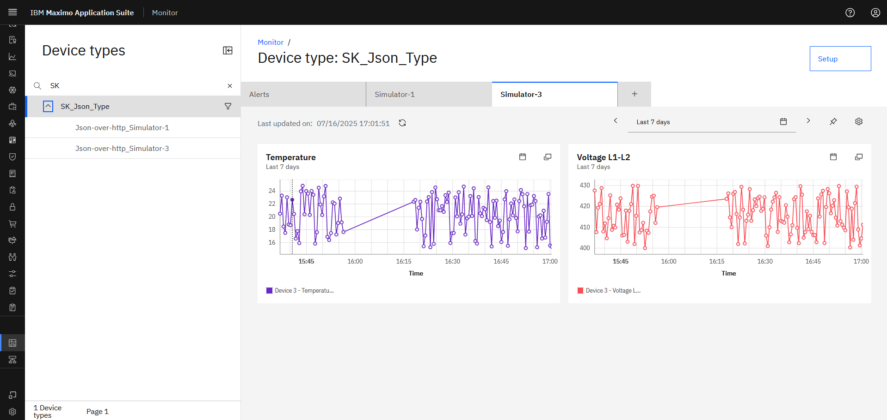

# Objectives
In this Exercise you will learn how to:

* Stop and re-deploy the Managed Gateway
* View the incoming data in Monitor dashboards

---
*Before you begin:*  
This Exercise requires that you have:

1. completed the pre-requisites required for [All Exercises](prereqs.md) and for Exercise 4
2. completed the previous exercises
3. verified the simulator is running as described in [exercise 1](setup_simulator.md){target=_blank}

---

## Re-Deploy the Managed Gateway

Go to new Terminal or Command window, Use the `docker ps` command to view the running docker containers. 
Locate the CONTAINER ID of the running Managed Gateway container (look for `edgedatacollector`) - here it is `bc5f4f95c71e`. 
Use the `docker stop <CONTAINER ID>` command to stop the docker container.
  

Navigate back to your Managed Gateway in Monitor and press the `View deployment instructions`.  
Click on the docker command to copy it to the clipboard:
  

Get back to the terminal and then paste the docker command line from the clipboard. 
Click enter to execute it, and you should see something similar to the following:
 

## View data in Device data table

Click to open the `Json-over-http_Simulator-3` device:
  

Navigate to `Recent event` and wait for half a minute (you know those 30000ms defined when adding the device) until the first message is coming through. 
  

Click on `View payload` and see the data points being send to the Event name `status`: 
  

Potentially the stored data could be used in a dashboard for the Siemens S7 device: 
  

---
Congratulations you have successfully re-deployed and viewed data from both Simulators in a Monitor dashboard. This concludes this lab.  
