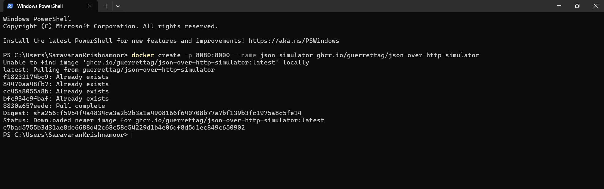
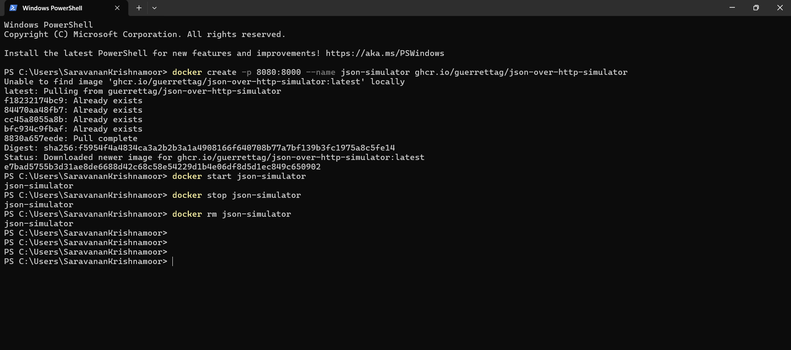

# Objectives
In this Exercise you will learn how to use Docker to run a fixed and ready docker container with the json simulator.

---
*Before you begin:*  
This Exercise requires that you have:

1. completed the pre-requisites required for [all labs](prereqs.md)

---

!!! note
    The created docker container should work on the following architectures:</br>
    - x86 (Windows/Linux/macOS)</br>
    - ARM (Linux/macOS).

## 1. Install Docker

There are different ways to install the Docker engine depending of the package and the OS.</br>
One multi platform option is Rancher Desktop. It is fairly easy to install Rancher Desktop,</br>
as you just have to follow this guide: [Running Docker locally](https://docs.rancherdesktop.io/getting-started/installation/){target=_blank}</br>

## 2. Create the Docker container
Open a terminal or command window and run the following command:

    docker create -p 8080:8000 --name json-simulator ghcr.io/guerrettag/json-over-http-simulator

Please be patient even though you'll see the following message:

    Unable to find image 'ghcr.io/guerrettag/json-over-http-simulator:latest' locally

It needs to pull the docker image. It has been given the name: `josn-simulator`



## 3. Start the Docker container

Run the follwing command to start the container:

    docker start json-simulator

The simulator is now active and the random and dynamic values will change every 30 second.
It will run in the background and not produce any output in the terminal/command window.

## 4. Stop and remove the Docker container

Once you are done using the docker based simulator you can stop it with the following command:

    docker stop json-simulator

and remove the container with the following command:

    docker rm json-simulator

## All Docker commands in one window



!!! tip
    The dynamic and random values will change for every `GET` or `POST` Request.</br>

## The Simulator

The json-simulator is simulating 2 device payload for `GET` method and 1 device for `POST` method</br>
delivering the following data points:

# Payload for GET method

Device - 1 :
``` json
{
  "Voltage L1-L2": 221.868,
  "Device-Name": "Json-over-http Simulator 1",
  "Working": true,
  "Temperature": 18.67,
  "Currents": {
    "L1": 3,
    "L2": 5,
    "L3": 8
  },
  "Active Alarms": []
}
```
Device - 2:
``` json
{
  "Voltage L1-L2": 414.613,
  "Device-Name": "Json-over-http Simulator 2",
  "Working": false,
  "Temperature": 17.217,
  "Active Alarms": [
    "Overvoltage",
    "Device not running"
  ]
}
```
# Payload for POST method

Device - 3:
To get the response from the device use below command in terminal or command window

``` json 
curl -X POST -d "['Temperature','Voltage L1-L2','Device-Name','Working','Active Alarms']" http://localhost:8080/device-3
```
The Response should be as seen below,
``` json
{"Temperature": 22.088, "Voltage L1-L2": 419.303, "Device-Name": "Json-over-http Simulator 3 (POST)", "Working": false, "Active Alarms": ["Overvoltage", "Device not running"]}
```

!!! Note
    All three devices are using port 8080.</br>
    So you need to use the localhost IP Address along with the port number and enpoint details.</br>
    GET - [127.0.0.1:8080/device-1](http://127.0.0.1:8080/device-1)</br>
    GET - [127.0.0.1:8080/device-2](http://127.0.0.1:8080/device-2)</br>
    POST - Use the above curl command to get the values.

</br>

---
Congratulations you have successfully setup a json simulator environment using a preconfigured docker container.</br>
