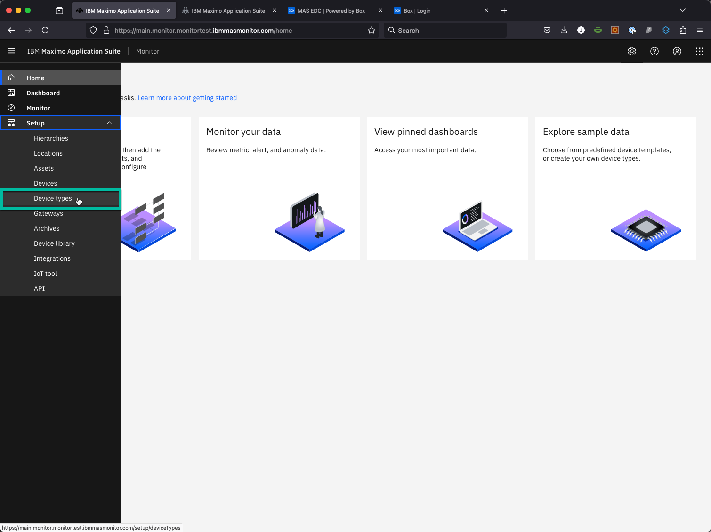
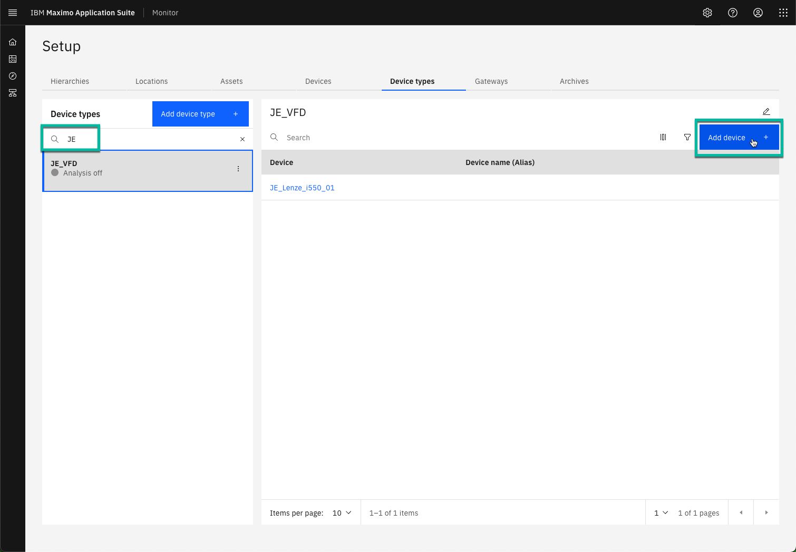
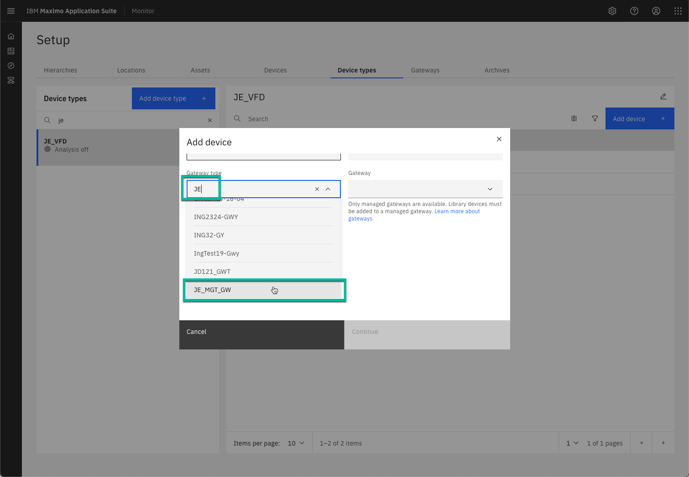
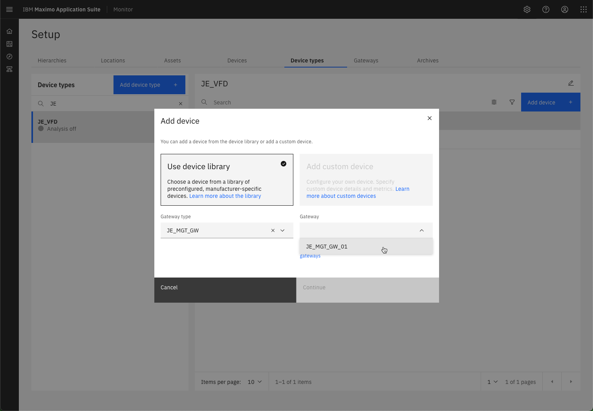
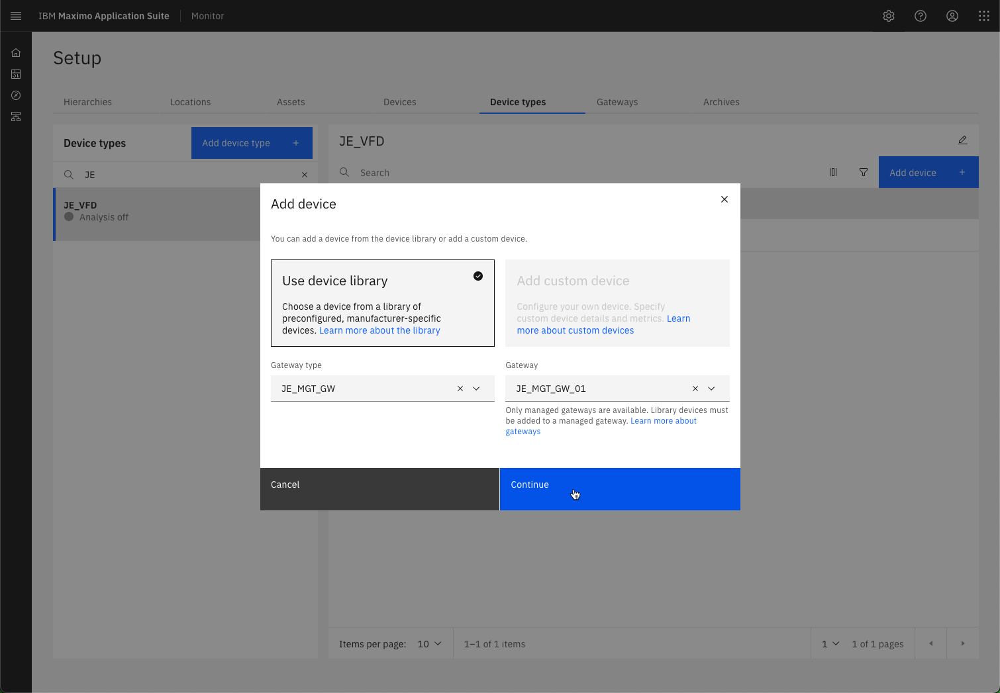
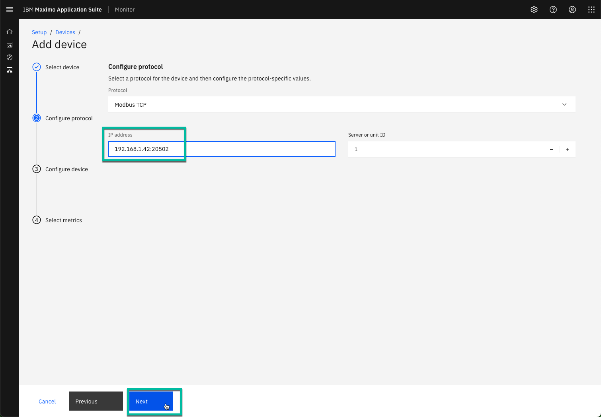
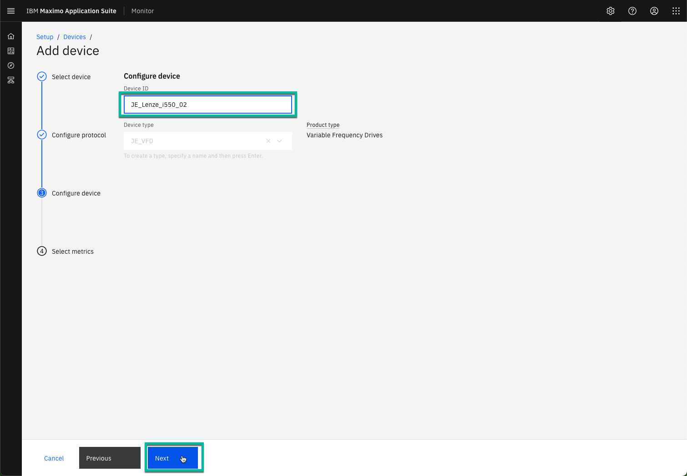
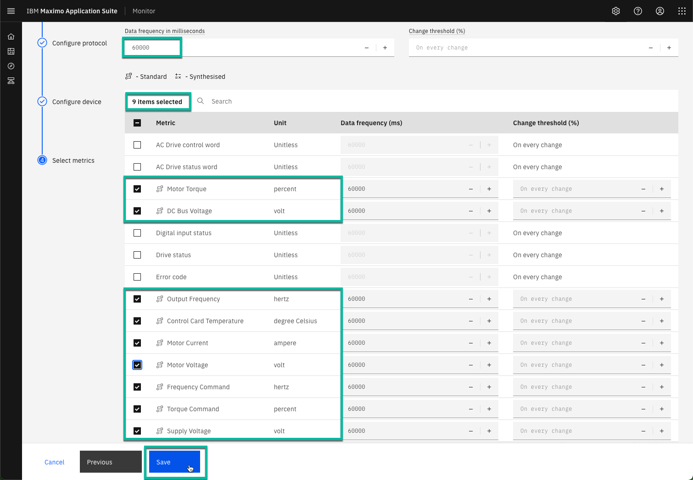
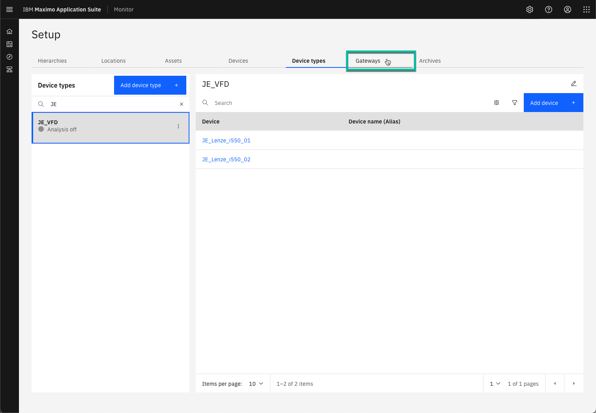
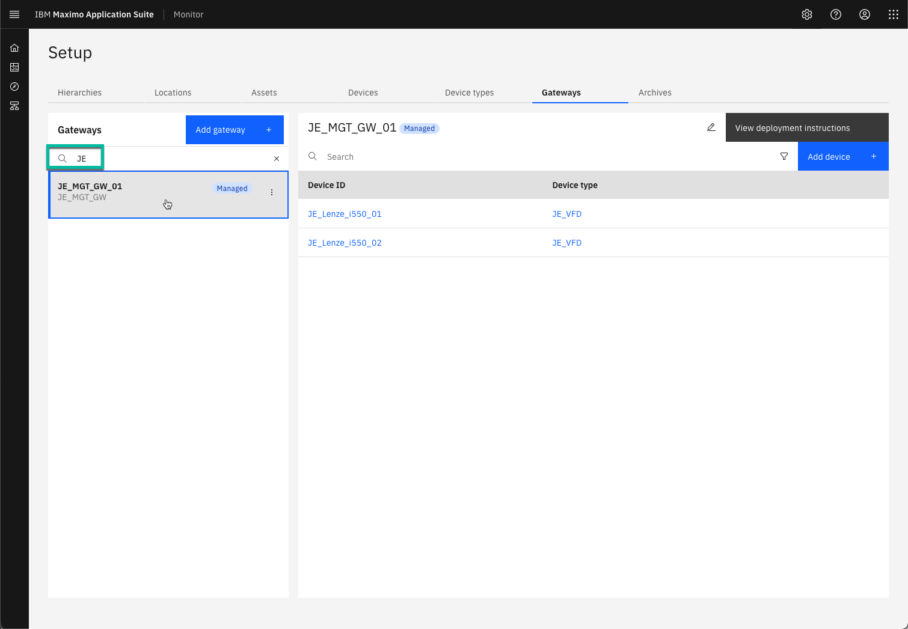

# Objectives
In this Exercise you will learn how to add a second industrial device to the Managed Gateway. 
This time you will add it based on your Device Type rather than from the Managed Gateway.

---
*Before you begin:*  
This Exercise requires that you have:

1. completed the pre-requisites required for [all labs](prereqs.md)
2. completed the previous exercises
 
Please find the IP address of the machine the [Modbus simulator](setup_simulator.md) is running on.
I was running the simulator on my local network on a machine with the IP address: 192.168.1.42.

---

Expand Setup in the left menu and select `Device types`:
  

Filter on your initials and the click on `Add device +`:  
  

The `Use device library` will automatically be selected, as this Device type is based on a device from the library. Filter to find and select your Gateway Type in the first dropdown:
  

Select your Managed Gateway in the second dropdown:
  

You should now see your gateway type and name. Click on `Continue`:
 

!!! note "New in MAS 9.0"
    Adding a new device and adding it to a Managed Gateway is handled as a natural part of the flow. That means only managed gateways types are shown in the first dropdown and only instances of the selected managed gateway type in the second dropdown box.

Find and select the Lenze i550 device and click `Next`. 
Select the `Modbus TCP` protocol. 
Use the IP address of the simulator using port 20502, like `192.168.1.42:20502`. 
Click on `Next`;
  

Define the Device ID as `XX_Lenze_i550_02` where you replace XX with your initials. 
Click `Next`:
  

!!! tip 
    The Device type has already been selected, as the flow knows that the new device is added based on the Device type. 

Define the Data frequency to 60000 (60 seconds) 
Select the 9 Standard metrics, that was also selected for the first device. 
Click `Save`:
  

You can now see both your VFD devices - navigate to the Gateways tab: 
  

Filter to find and select your Gateway  
- select it and you should also see both VFD devices handled by your Managed Gateway: 
  

---
Congratulations you have successfully added another industrial device to your Managed Gateway. 
