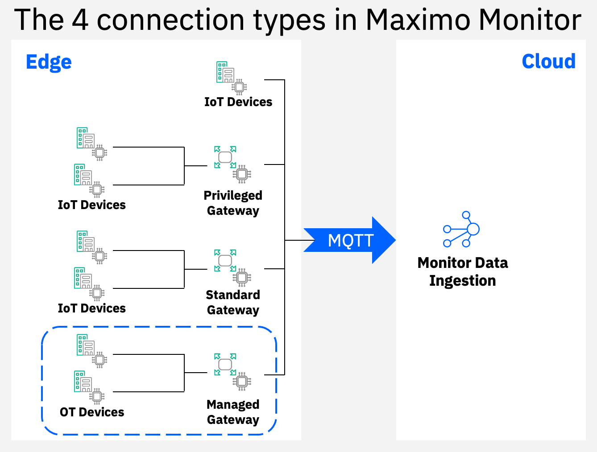
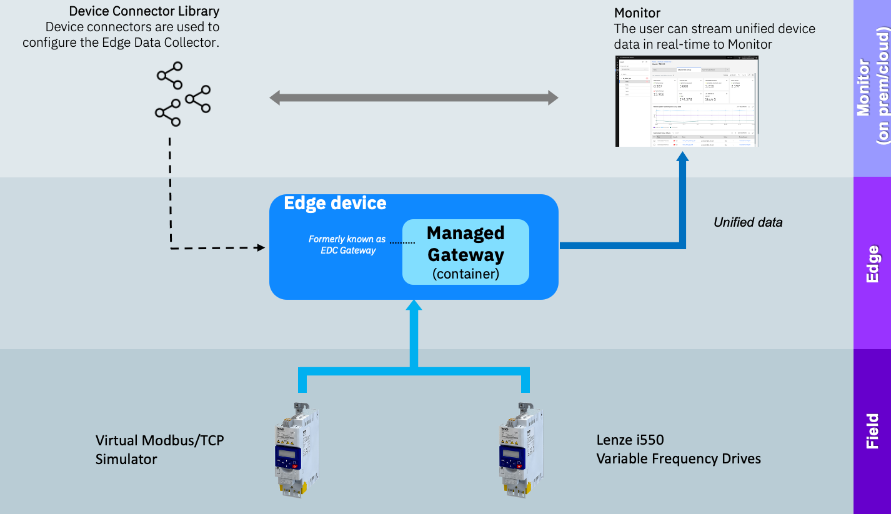

# Welcome to the  Maximo Monitor Managed Gateway Modbus Lab

!!! note "New in MAS 9.0"
    From MAS 9.0 the setup of the Edge Data Collector capability have changed dramatically in order to streamline and simplify the configuration process. 
    This means you will no longer see the `Edge Data Collactor` or `EDC` in the UI, as it has been implemented as a third Gateway type in Monitor, called a Managed Gateway:  
      
    Further it is no longer needed to: 
    - create a gateway in the IoT Tool, as that is now done in the Monitor UI 
    - create the device type up front for the devices in the Monitor UI 
    - stick with a fixed device type per canonical model

---

You will learn about how to setup a Managed Gateway within Maximo Monitor.

In this lab you will learn the steps needed to successfully setup a Managed Gateway using some virtual simulated Variable Frequency Drives (VFD) that will deliver the device data over Modbus/TCP via the Managed Gateway into Maximo Monitor using the pre-configured connector for Lenze i550 VFD from the Device Connector Library.  

  

The exercises will cover:

* Setting up the simulator environment
* Create a Managed Gateway
* Add devices to the Manage Gateway
* Verify data flow from Modbus/TCP Variable Frequency Drives all the way into Maximo Monitor
* Have fun

!!! note
    Expected time needed to run the complete lab: 1 hour

---

**Updated: 2024-10-16**

---