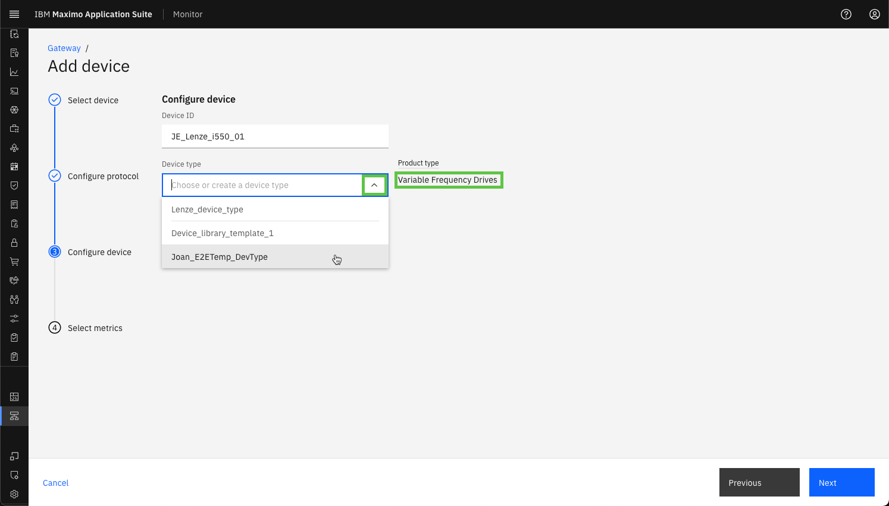

# Objectives
In this Exercise you will learn how to add the first industrial device to the Managed Gateway.

---
*Before you begin:*  
This Exercise requires that you have:

1. completed the pre-requisites required for [all labs](prereqs.md)
2. completed the previous exercises
 
Please find the IP address of the machine the [Modbus simulator](setup_simulator.md) is running on.
I was running the simulator on my local network on a machine with the IP address: 192.168.1.42.

---

While looking at your Managed Gateway in the Gateways list, press the `Add device`:

[![Add device]][Add device]{target=_blank}

The `Use device library` will automatically be selected, as a Managed Gateway only supports devices from the library. Simply click on `Continue`:  
[![Use device library]][Use device library]

!!! note
    The type of gateway defines which types of devices that can be added to the gateway. 
    This is automatically handled by Monitor.  
    Managed Gateway: OT devices from the device library. 
    Standard/Privileged Gateway: IoT devices are added as custom devices. 

It is time to add the Lenze i550 device. 
Search for `Lenze` in the manufacurer drop-down and select it. Click `Next`:
  

Select the i550 product and `default`. Click on `Next`:
  

Select the `Modbus TCP` protocol. Click on `Next`:
 

!!! tip 
    The simulator only supports the Modbus TCP protocol, so it will fail if you select another. 

Now it is time to use the IP address of the simulator 
- combine it with port number 10502 separated by `:`, like `192.168.1.64:10502`. 
Click on `Next`;
  

Define the Device ID as `XX_Lenze_i550_01` where you replace XX with your initials. 
You can see the Product Type of the industrial device you have chosen, 
i.e. Variable Frequency Drives for the Lenze i550. 
Click on the `Device type` and you should see this:
  

You will create your own Device Type. Since you have not yet done so, you just type `XX_VFD` where you replace XX with your initials: 
Click on the new device type to create it and click `Next`:
  

!!! tip 
    You can select your own Device Type from the drop-down list once you have created it. 

Define the Data frequency to 60000 (60 seconds) and it will automatically be used when you select the metrics: 
  

Select all the Standard Metrics. Click `Save`:
  

!!! tip 
    Standard metrics use labels, units, and values that are unified by the Managed Gateway once deployed. 
    Synthesized metrics are created by using other metrics. Some standard metrics are synthesized, but those metrics are only listed as standard metrics.

You have now successfully added the first OT device to your Managed Gateway:
  

---
Congratulations you have successfully added an industrial device to a Managed Gateway. 

[Add device]: img/add_device_01.png
[Use device library]: img/add_device_02.png
