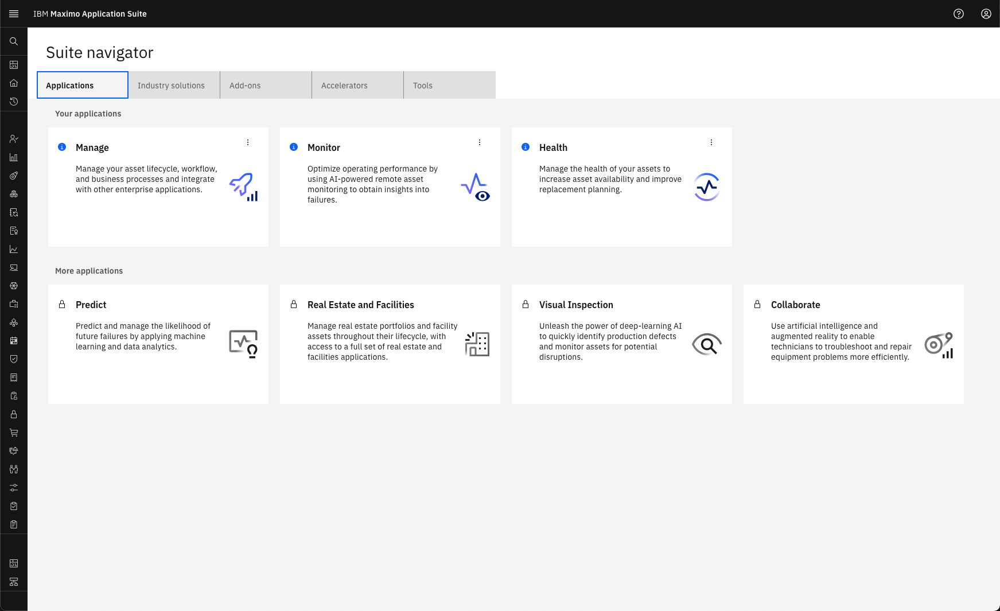
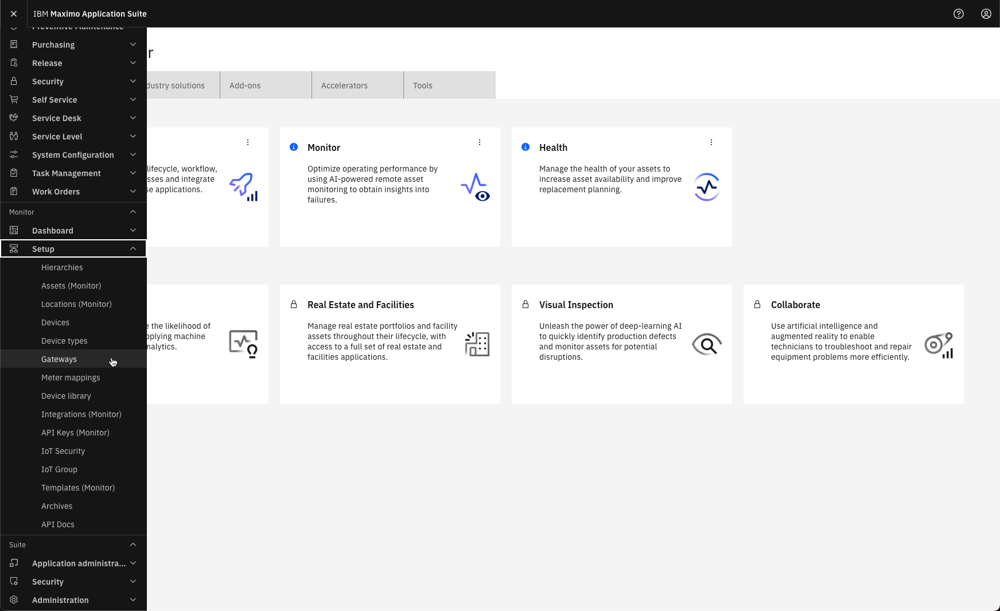
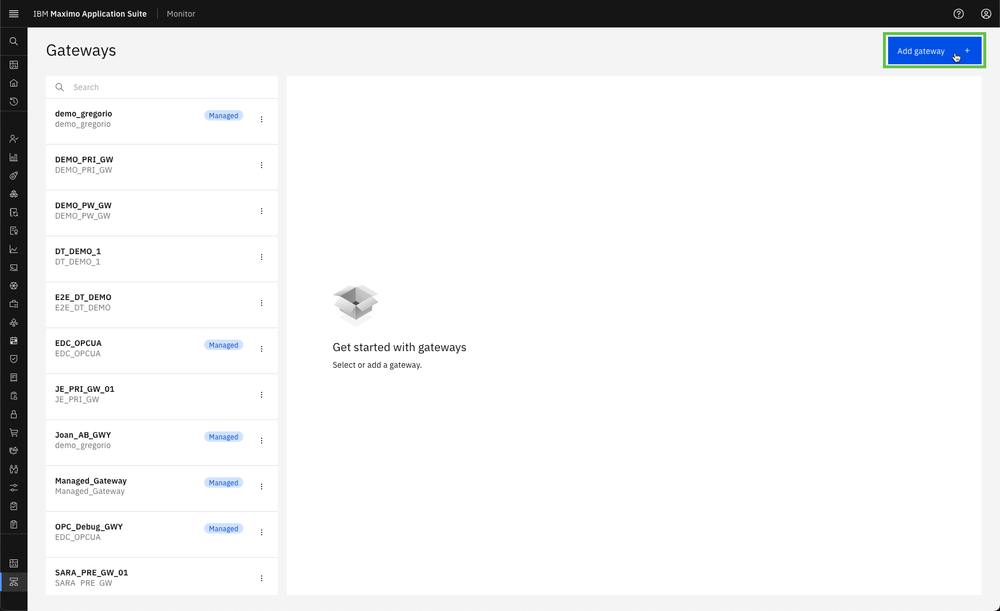
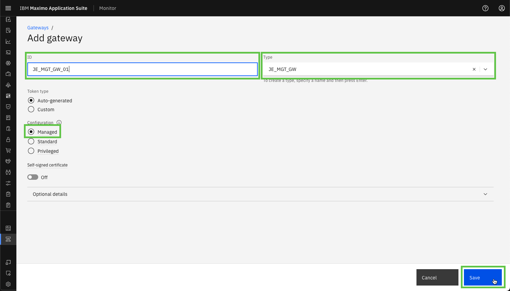
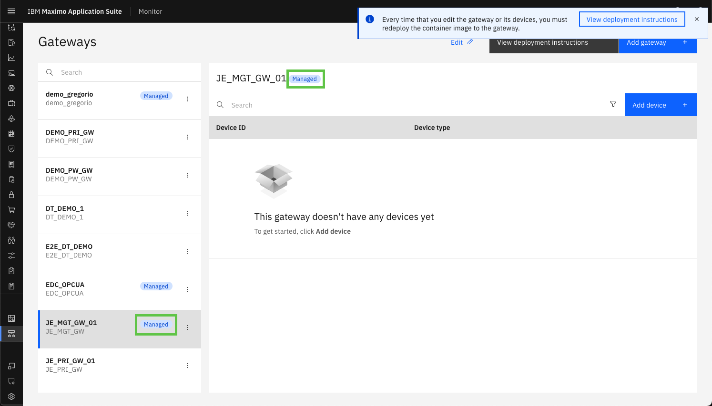

# Objectives
In this Exercise you will learn how to create the Managed Gateway in Monitor.

---
*Before you begin:*  
This Exercise requires that you have:

1. completed the pre-requisites required for [all labs](prereqs.md)
2. completed the previous exercises

---

Login to MAS:
  

Expand Setup under the Monitor section in the left menu and select Gateways:

!!! note "New in MAS 9.1"
    Monitor no longer have a main home page. All interaction with Monitor is initiated from the Monitor section in the left menu 

 
Select `Add gateway`:
  

Define the gateway ID `XX_MGT_GW_01` and the gateway Type `XX_MGT_GW`.

!!! tip
    XX in the gateway ID and Type should be your initials in case other people are following this lab in the same Maximo Application Suite environment.

Make sure the gateway Configuration is Managed and click `Save`:
  

You will now see your new Managed Gateway, including a `Managed` tag in both the list of Gateways as well as in the gateway definition:
 

!!! note
    Credentials are automatically "baked into" the docker image for the Managed Gateway. 
    This means that the credentials will not be presented to you, as with the other gateway configuration types. 

---
Congratulations you have successfully created the Managed Gateway in Monitor. 
