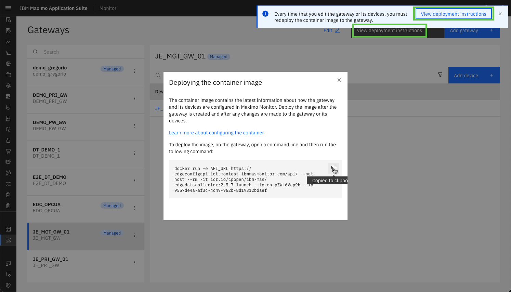
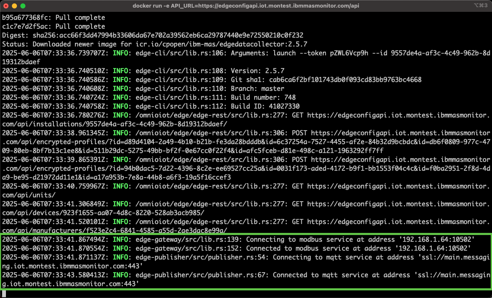
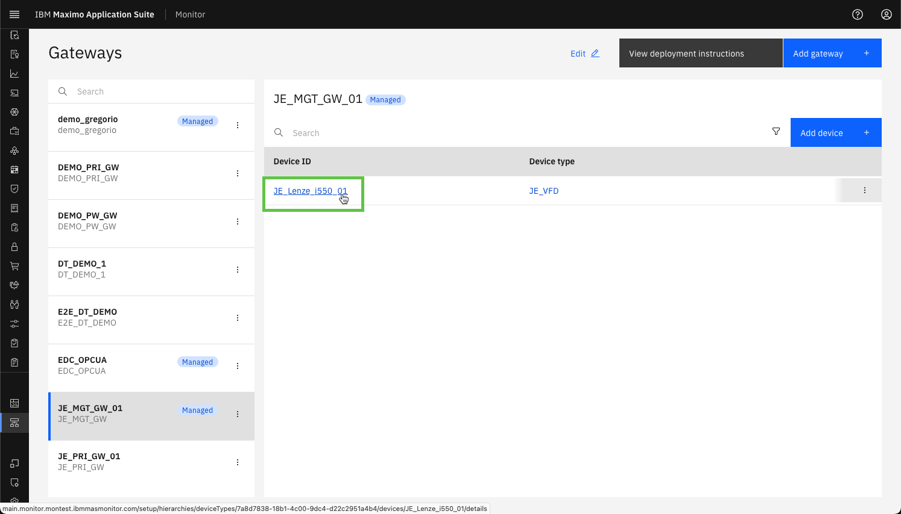
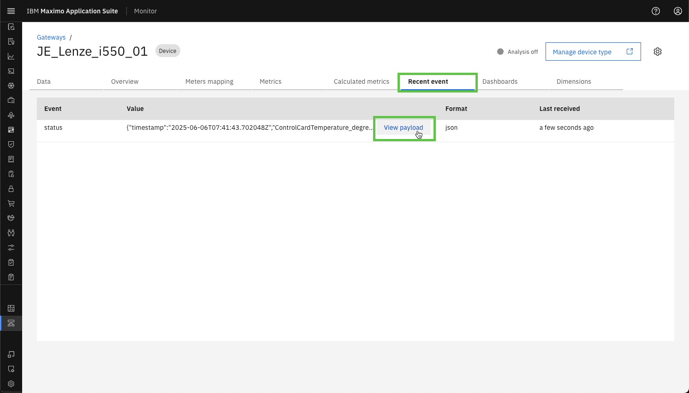
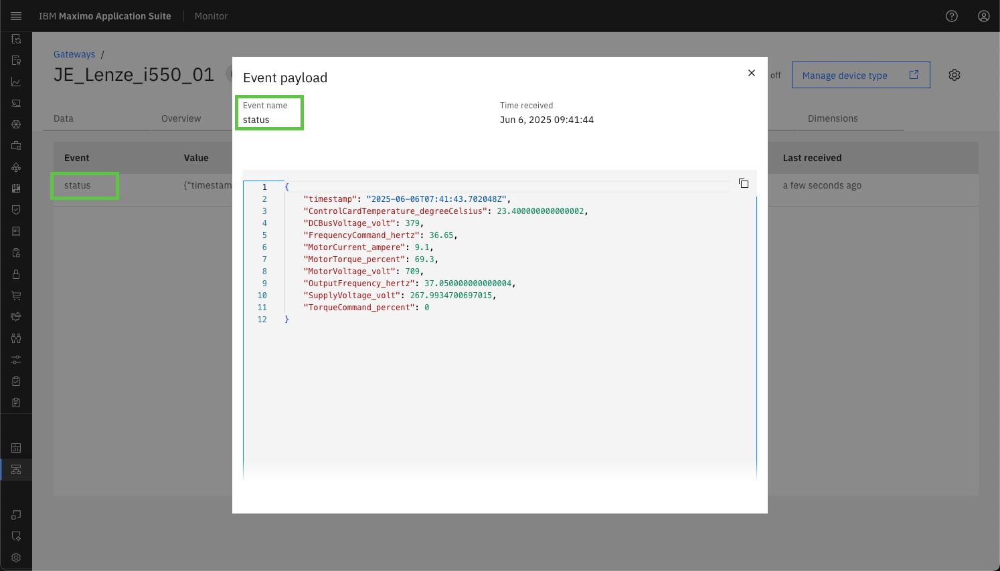

# Objectives
In this Exercise you will learn how to:

* Deploy the Managed Gateway
* Verify connectivity and data inflow

---
*Before you begin:*  
This Exercise requires that you have:

1. completed the pre-requisites required for [all labs](prereqs.md) and for this exercise
2. completed the previous exercises
3. verified the simulator is running as described in [exercise 1](setup_simulator.md){target=_blank}

---

## Deploy the Managed Gateway

While looking at your Managed Gateway in the Gateways list, press the `View deployment instructions`. </br>
Click on the docker command to copy it to the clipboard:
</br></br>

Open a terminal window (Mac/Linux) or Command window (Windows) where you want to run the Managed Gateway and then paste the docker command line from the clipboard. Click enter to execute it, and you should see something similar to the following:
</br>

!!! tip
	The first time you deploy you might get a response like: `Unable to find image 'icr.io/cpopen/ibm-mas/edgedatacollector:2.5.7' locally`</br>
	Please be patient while the Edge Data Collactor docker container is bering downloaded and started.</br>


## Verify the selected Lenze VFD data flowing into Monitor

Click to open the `XX_Lenze_i550_01` device:
</br></br>

Navigate to `Recent event` and wait for a minute (you know those 60000ms defined when adding the device) until the first message is coming through.</br>
</br></br>

Click on `View payload` and see the data points being send to the Event name `status`:</br>
</br></br>

These are the data points that you selected when adding the device to the Managed Gateway:

``` json
{
    "timestamp": "2025-06-06T07:41:43.702048Z",
    "ControlCardTemperature_degreeCelsius": 23.400000000000002,
    "DCBusVoltage_volt": 379,
    "FrequencyCommand_hertz": 36.65,
    "MotorCurrent_ampere": 9.1,
    "MotorTorque_percent": 69.3,
    "MotorVoltage_volt": 709,
    "OutputFrequency_hertz": 37.050000000000004,
    "SupplyVoltage_volt": 267.9934700697015,
    "TorqueCommand_percent": 0
}
```


---
Congratulations you have successfully deployed and verified the data inflow.</br>
