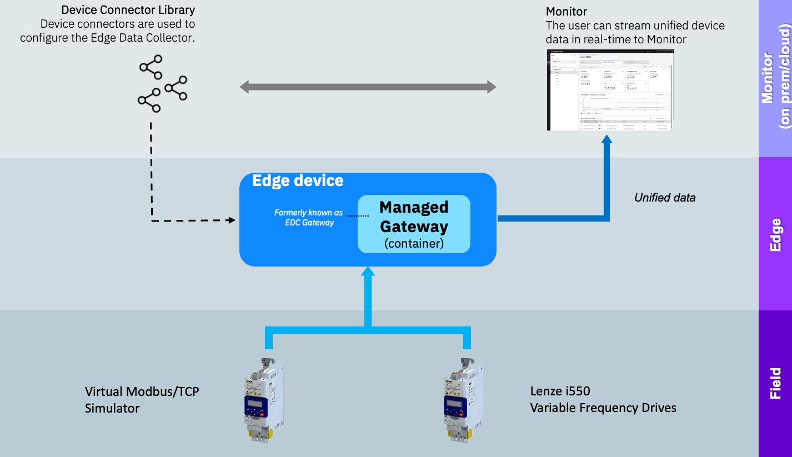

# Welcome to the Maximo Monitor 9.1  Managed Gateway Modbus Lab

In this lab you will learn how to setup a Managed Gateway within Maximo Monitor 9.1 and adding a couple of OT devices from the Device Library.

You will learn the steps needed to successfully setup a Managed Gateway using some virtual simulated Variable Frequency Drives (VFD) that will deliver the device data over Modbus/TCP via the Managed Gateway into Maximo Monitor using the pre-configured connector for Lenze i550 VFD from the Device Connector Library.  

  

The exercises will cover:

* Setting up the simulator environment
* Create a Managed Gateway
* Add devices to the Manage Gateway
* Verify data flow from Modbus/TCP Variable Frequency Drives all the way into Maximo Monitor
* Have fun

!!! note
    Expected time needed to run the complete lab: 1 hour

---

**Updated: 2025-06-12**

---