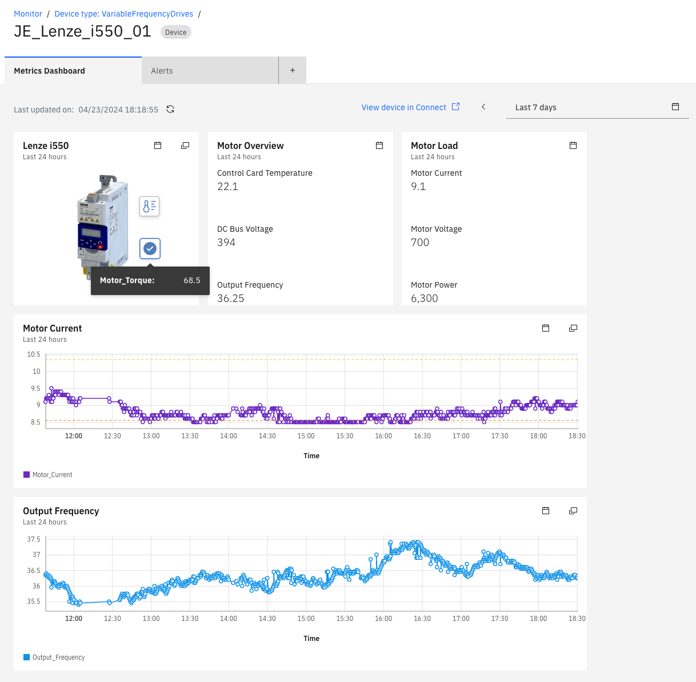

# Objectives
In this Exercise you will learn how to:

* Stop and re-deploy the Managed Gateway
* View the incoming data in Monitor dashboards

---
*Before you begin:*  
This Exercise requires that you have:

1. completed the pre-requisites required for [All Exercises](prereqs.md) and for Exercise 4
2. completed the previous exercises
3. verified the simulator is running as described in [exercise 1](setup_simulator.md){target=_blank}

---

## Re-Deploy the Managed Gateway

Go to where the current Managed Gateway docker container is running. 
Use `Ctrl-p & Ctrl-q` to get back to the prompt. 
Use the `docker ps` command to view the running docker containers. 
Locate the CONTAINER ID of the running Managed Gateway container (look for `edgedatacollector`) - here it is `fd0e37d3ddb5`. 
Use the `docker kill <CONTAINER ID>` command to stop the docker container.
  

Navigate back to your Managed Gateway in Monitor and press the `View deployment instructions`.  
Click on the docker command to copy it to the clipboard:
  

Get back to the terminal and then paste the docker command line from the clipboard. 
Click enter to execute it, and you should see something similar to the following:
 

!!! tip
	You can see that you successfully have connections to both the simulated Lenze i550 VFD's on ports: 10502 and 20502. 

## View data in Monitor Dashboards

Navigate to the `Device types view` in the Monitor Dashboard section:
  

Filter on your credentials and open to see all your VFD devices. 
Select the `XX_Lenze_i550_01` device and then click on `Create dashboard`:
  

Give your new dashboard a name and press `Configure dashboard`: 
  

You will now see an empty dashboard configuration. Add a Time series line card by clicking on it: 
  

Locate the `Control Card Temperature` in the `Data item` dropdown and change the Time range to `Last 24 hours`. 
Give the card a title, like `Temperature [℃]` and drag the lower right corner to resize the card to full width. 
Once that is in place, then Add another Time series line card: 
  

Configure the second Time series line card according to the screen shot below and press `Save and close`:
  

You have now created a simple dashboard to view some of the data for `XX_Lenze_i550_01`. 
Select the second device: 
  

Note that the dashboard is configured on the Device Type level, hence will also be used for the `XX_Lenze_i550_02` device  
- but obviously with some other data: 
  

You could now potentially create a dashboard like this 😎: 
 

!!! tip
    The above dashboard is also using an Image card and two additional Value/KPI cards. Please do experiment and have fun 🤗

---
Congratulations you have successfully re-deployed and viewed data from both VFD's in a Monitor dashboard. This concludes this lab.  
