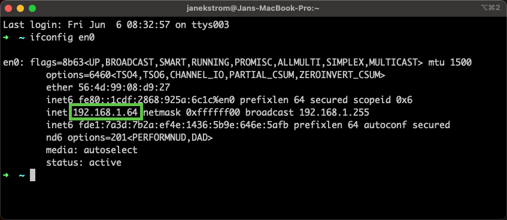
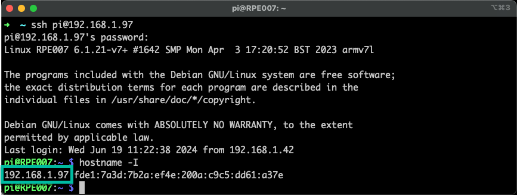
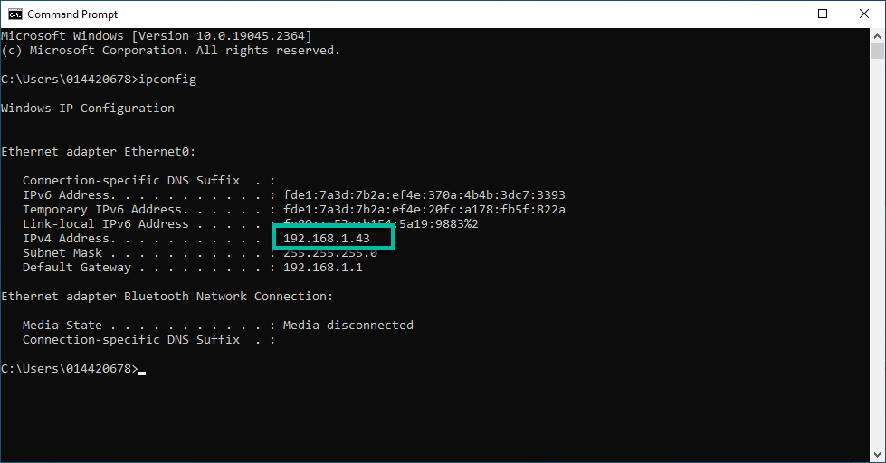

# Objectives
In this Exercise you will learn how to:

* Install the Modbus simulator

---
*Before you begin:*  
This Exercise requires that you have:

1. completed the pre-requisites required for [all labs](prereqs.md)

---

The simulator in this exercice is using the dynamic multi-platform Modbus simulator which you can install by following this lab:</br>
[IBM Maximo Monitor Modbus Simulator Lab](../../monitor_modbus_simulator){target=_blank}

You need the IP address of the machine where you run the simulator no matter which version you are using. You will need that later.

#### Get IP Adddress on macOS

Use the following command:
```` bash
ifconfig en0
````

</br>

!!! tip
    Use `ifconfig` without any paramter if you don't see the above screen</br>
    and then search for a similar IP Address among the other interfaces.

#### Get IP Adddress on LINUX

Use the following command: 
```` bash
hostname -I
````

</br>

#### Get IP Adddress on Windows

Use the following command:
```` bash
ipconfig
````

</br>

---
Congratulations you have successfully setup the simulator environment.</br>
