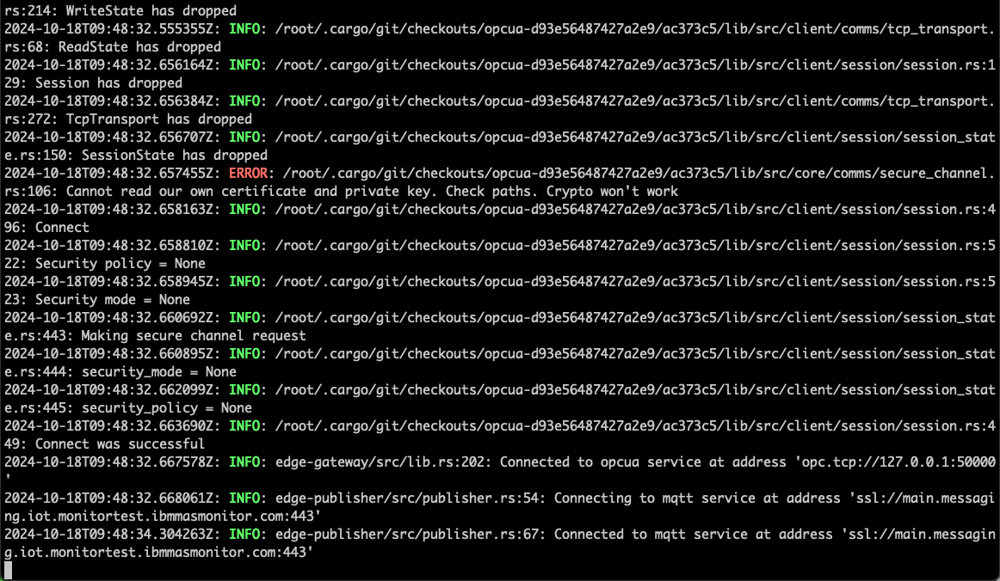

# Objectives
In this Exercise you will learn how to:

* Deploy the Managed Gateway
* Verify connectivity and data inflow

---
*Before you begin:*  
This Exercise requires that you have:

1. completed the pre-requisites required for [all labs](prereqs.md) and for this exercise
2. completed the previous exercises
3. verified the simulator is running as described in [exercise 1](setup_simulator.md){target=_blank}

---

#### Deploy the Managed Gateway

While looking at your Managed Gateway in the Gateways list,</br>
press the `View deployment instructions`. </br>
Click on the docker command to copy it to the clipboard:
</br></br>

Open a terminal window (Mac/Linux) or Command window (Windows) where you want to run the Managed Gateway and then paste the docker command line from the clipboard.</br>
Click enter to execute it, and you should see something similar to the following:
</br></br>

#### Verify connection and data flowing into IoT Tool

Navigate to the IoT Tool from the App Switcher in the upper right hand corner or from the main home page:
</br></br>

Since the gateway and the devices uses the same prefix, then it is easy to search for them.</br>
Verify the gateway `XX_MGT_GW_01` is in Connected state and the device `XX_OPC_UA_Server_01` is in disconnected state.
</br></br>

!!! tip
    The devices belonging to the gateway will always be in Disconnected state, as they receive their data through the gateway.

!!! note "New in MAS 9.0"
    Both the Managed Gateway and the OT Devices have been created by the Monitor UI when creating the Managed Gateway and adding the OT Devices, i.e. the devices will no longer be created by the gateway when data have been collected as in previous versions.

Select the simulated Siemens S7 OPC UA Server and navigate to `Recent Events`.</br>
Wait for a couple of minutes (you know those 30000ms defined when adding the device) until you see the first messages coming through:
</br></br>

Click on the last received payload: and see the data points that you selected when adding the device to the Device library:
</br></br>

And see the data points that was selected being send on the status event type:

``` json
{
	"timestamp": "2024-10-21T15:15:52.662245Z",
	"opcplc-telemetry-anomaly-dipdata": -84.4327925502015,
	"opcplc-telemetry-anomaly-negativetrenddata": -210.39999999999998,
	"opcplc-telemetry-anomaly-positivetrenddata": 410.5,
	"opcplc-telemetry-anomaly-spikedata": -84.4327925502015,
	"opcplc-telemetry-basic-alternatingboolean": false,
	"opcplc-telemetry-basic-randomsignedint32": -1944417017,
	"opcplc-telemetry-basic-randomunsignedint32": 2131461779
}
```
</br>

#### Verify data flowing into Monitor

Go to the Setup of Device types and search for your device, then click to open it:</br>
</br></br>

!!! note "New in MAS 9.0"
    You can also see the incoming data directly in Monitor.</br>


Select the `Resent event` and wait a little bit:</br>
</br></br>

Click on `View payload` for the last incoming message:</br>
</br>
and once again you can see tha data flowing.</br></br>

Potentially the stored data could be used in a dashboard for the Siemens S7 device:</br>
</br></br>

---
Congratulations you have successfully deployed and verified the connectivity and data inflow, and thereby completed this Maximo Lab.</br>
