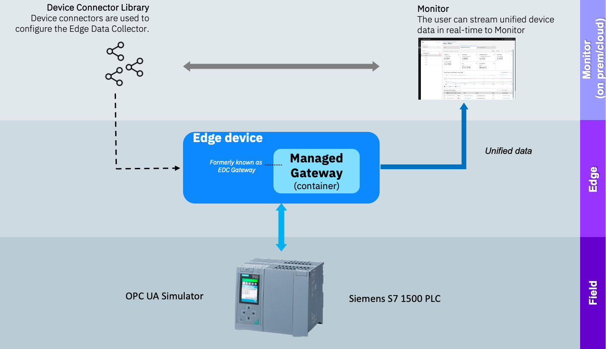

# Welcome to the  Maximo Monitor Managed Gateway OPC UA Lab

!!! note "New in MAS 9.0"
    From MAS 9.0 the setup of the Edge Data Collector capability have changed dramatically in order to streamline and simplify the configuration process. 
    This means you will no longer see the `Edge Data Collactor` or `EDC` in the UI, as it has been implemented as a third Gateway type in Monitor, called a Managed Gateway:  
      
    Further it is no longer needed to: 
    - create a gateway in the IoT Tool, as that is now done in the Monitor UI 
    - create the device type up front for the devices in the Monitor UI 
    - stick with a fixed device type per canonical model

---

You will learn about how to setup a Managed Gateway within Maximo Monitor.

In this lab you will learn the steps needed to successfully use an OPC UA simulator to act as a Siemens S7 PLC and get the data from the Siemens S7 into Maximo Monitor using a Managed Gateway. .  

  

!!! tip
    If you want to know more about OPC UA Servers, then go to the [OPC Foundation OPC UA Server page](https://reference.opcfoundation.org/Core/Part1/v104/docs/6.3){target=_blank}

The exercises will cover:

* Setting up the OPC UA simulator
* Adding a new device to the library by utilizing device scanning
* Create a Managed Gateway and add the device
* Verify data flow from Siemens S7 PLC via OPC UA all the way into Maximo Monitor
* Have fun

!!! note
    Expected time needed to run the complete lab: 1 hour

---

**Updated: 2025-04-02**

---