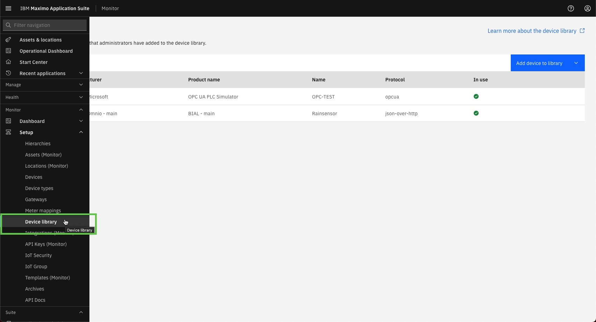

# Objectives
In this Exercise you will learn how to add a device to the Device library.

---
*Before you begin:*  
This Exercise requires that you have:

1. completed the pre-requisites required for [all labs](prereqs.md)
2. completed the previous exercises

---

Since PLC's are very customizable you will need to add a new device to the Device library instead of using a pre-configured device in the Device library, like a Variable frequency Drive communicating over Modbus. 

Navigate to the Device library page: 
  

For OPC UA devices it is possible to either upload a device configuration or to use the built-in data tag auto-detection functionality which is a lot easier. 
Select `Add device to library` and the menu item `Scan for devices`: 
  

Select the OPC-UA protocol: 
  

Enter the device details and scroll down: 
 
!!! tip
    XX in the Device name should be your initials in case other people are following this lab in the same Maximo Application Suite environment.

!!! attention
    If you see a `BadTcpEndpointUrlInvalid` error when you execute the docker command in a few steps,  
    then you might need to end the `Server IP address or domain` with a forward slash, like `127.0.0.1:50000/`

 
Copy the Device scan command and don't click `Done` just yet: 
 

Open a terminal window (Mac/Linux) or Command window (Windows) and run the Device scan command: 
  

Wait until it has finalized and returned to the command prompt. 
The new device has now been added to the Device library. 
  

Go back to the browser, click `Done`and then `Leave page`: 
  

Search for your new device in the Device library: 
  

Click on your new device to see the metrics (data tags) that was added to this device: 
 
Click on `Cancel` once you are done looking at these beautiful data tags 🤗. 

---
Congratulations you have successfully added a device to the Device library. 
