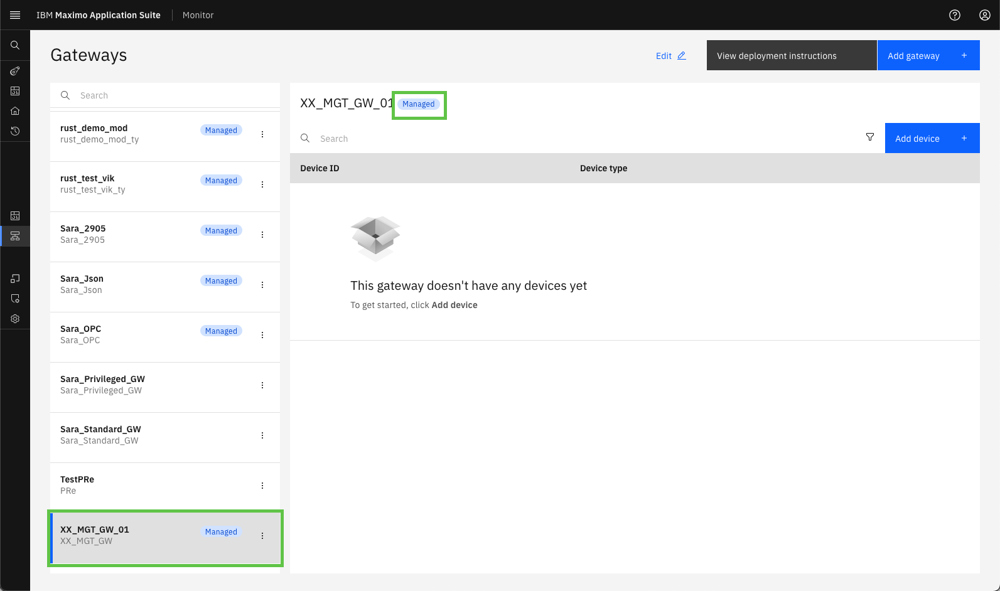
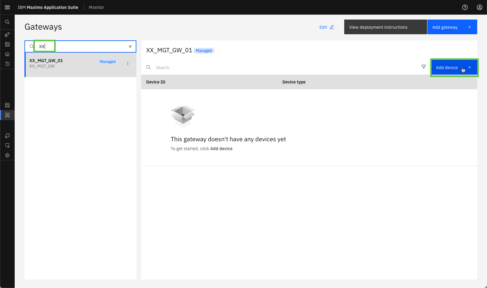
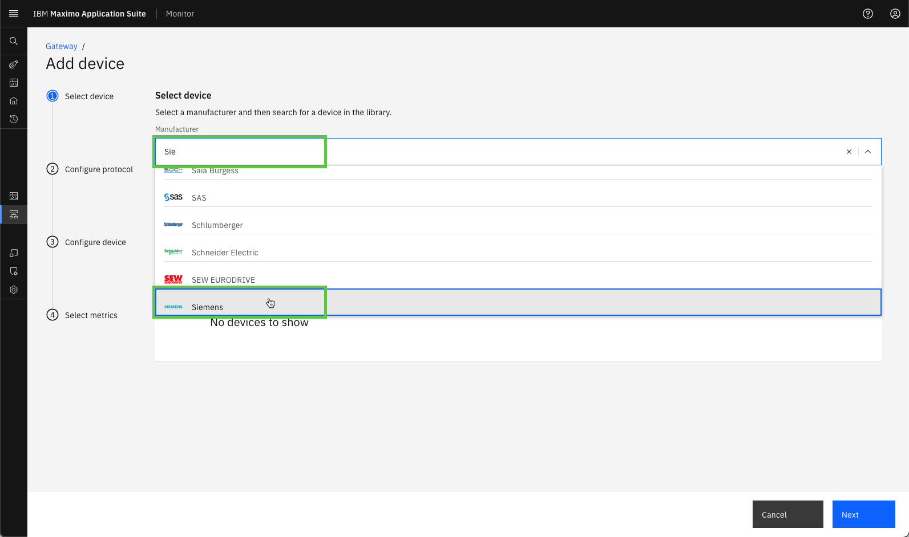
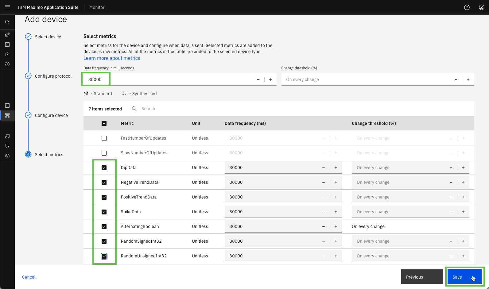

# Objectives
In this Exercise you will learn how to create the Managed Gateway in Monitor and add the new device you've added to the Device library.

---
*Before you begin:*  
This Exercise requires that you have:

1. completed the pre-requisites required for [all labs](prereqs.md)
2. completed the previous exercises

---

#### Add a Managed Gateway

Login to MAS and navigate to Monitor:
  

Expand Setup in the left menu and select Gateways:
 

!!! note "New in MAS 9.1"
    Monitor no longer have a main home page. All interaction with Monitor is initiated from the Monitor section in the left menu 

 
Select `Add gateway`:
  

Define the gateway ID `XX_MGT_GW_01` and the gateway Type `XX_MGT_GW`. 

!!! tip
    XX in the gateway ID and Type should be your initials in case other people are following this lab in the same Maximo Application Suite environment. 

Make sure the gateway Configuration is Managed and click `Save`:
  

!!! note "New in MAS 9.0"
    The Managed Gateway is a new type of gateway introduced in MAS Monitor 9.0. 
    It is an integrated flow in Monitor, which removes/replaces the tedious and error prone manual process of defining an Edge Data Collector Integration in prior versions. 

You will now see your new Managed Gateway, including a `Managed` tag in both the list of Gateways as well as in the gateway definition:
 

!!! note
    Credentials are automatically "baked into" the docker image for the Managed Gateway. 
    This means that the credentials will not be presented to you, as with the other gateway configuration types. 

 

#### Add your new device to the Managed Gateway

In the Managed Gateway click on `Add device`: 
  

Since this is a Managed Gateway the `Use device library` is automatically selected, as it is only possible to use devices from the Device library. 
Just click on Continue 🤗 
  

Search for Siemens in the Manufacturer list: 
  

Then search for S7 devices in the long list of Siemens devices - select you newly added device under `S7 OPC-UA Server`, and click `Next`: 
  

Add the OPC UA Server IP Address and Port, and click `Next`: 
  

Define the Device type and Device ID (using your initials instead of XX), and click `Next`: 
  

Set the Data frequency to 30000 ms (30 seconds) and select the following 7 data tags to be used as metrics in Monitor. Once done click `Save`: 
  

You will now see your new added device being a part of your new Managed gateway: 
  

---
Congratulations you have successfully created the Managed Gateway in Monitor and added an instance of the newly added device in the Device library. 
