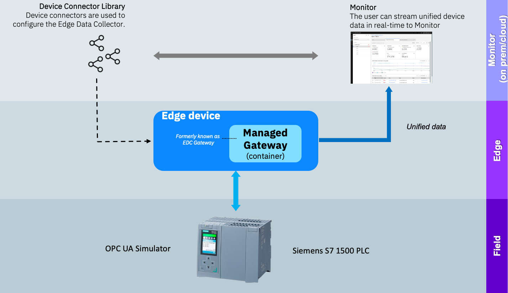

# Welcome to the Maximo Monitor 9.1 Managed Gateway OPC UA Lab

!!! info
    This Maximo Monitor lab demonstrates the use of a custom device from the Device library.

In this lab you will learn the steps needed to successfully use an OPC UA simulator to act as a Siemens S7 PLC and get the data from the Siemens S7 into Maximo Monitor using a Managed Gateway. .  

  

!!! tip
    If you want to know more about OPC UA Servers, then go to the [OPC Foundation OPC UA Server page](https://reference.opcfoundation.org/Core/Part1/v104/docs/6.3){target=_blank}

The exercises will cover:

* Setting up the OPC UA simulator
* Adding a new device to the device library by utilizing device scanning
* Create a Managed Gateway and add the device
* Verify data flow from Siemens S7 PLC via OPC UA all the way into Maximo Monitor
* Have fun

!!! note
    Expected time needed to run the complete lab: 1 hour

---

**Updated: 2025-06-24**

---