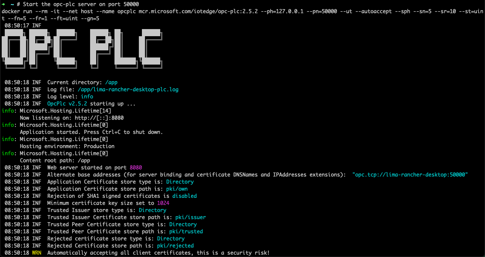

# Objectives
In this Exercise you will learn how to:

* Install the OPC UA simulator

---
*Before you begin:*  
This Exercise requires that you have:

1. completed the pre-requisites required for [all labs](prereqs.md)

---

The simulator in this exercice is a PLC OPC UA simulator with dynamic data tags: [Microsoft OPC UA PLC](https://github.com/Azure-Samples/iot-edge-opc-plc){target=_blank}

#### Running the OPC UA Server

Open a terminal window (Mac/Linux) or Command window (Windows) and enter the following command:
```` bash
docker run --rm -it --net host --name opcplc mcr.microsoft.com/iotedge/opc-plc:2.5.2 --ph=127.0.0.1 --pn=50000 --ut --autoaccept --sph --sn=5 --sr=10 --st=uint --fn=5 --fr=1 --ft=uint --gn=5
````

</br>

Wait until the initialization has been complete:</br>
</br>

You should now see the URL of the Endpoint: `opc.tcp://127.0.0.1:50000` - which will be used later in the lab.</br>

!!! note Notes
    Info on the different options for the command can be found [here](https://github.com/Azure-Samples/iot-edge-opc-plc#command-line-reference){target=_blank}</br>
    The added command options compared to the suggested one provided in the page are:
    <ul>
    <li> Be absolutely sure to use version 2.5.2 of the simulator - if you use any later version you’ll get close to 4000 tags instead of just 27</li>
    <li> `--ut`: To enable unsecure transport, so that there is the possibility to establish connection without certificates and user authentication</li>
    <li> `--ph=<path>`: The fully-qualified hostname of the PLC - in our case `127.0.0.1`.</li>
    <li> `--pn=<port number>`: The server port of the OPC server endpoint - in our case `50000`.</li>
    </ul>


#### Verifying the OPC UA Server is running

This part of the exercise is optional.

If you want to verify that the OPC UA server is running there are several options. </br>
The [Prosys OPC UA Browser](https://prosysopc.com/products/opc-ua-browser/){target=_blank} is fairly easy to use and it is available for all major operating systems (Windows, Linux, macOS).

The OPC UA Browser is free, but you are required to click the Request Download and provide your contact information in return for downloading it.

Install and open the application, then enter the URL of the Endpoint: `opc.tcp://127.0.0.1:50000`</br>
Select the `RandomSignedInt32` basic telemetry and you can see a Value attribute:</br>
</br>
Click on the `Refresh Attributes` and verify that the Value changes for each click.

---
Congratulations you have successfully setup the simulator environment.</br>
