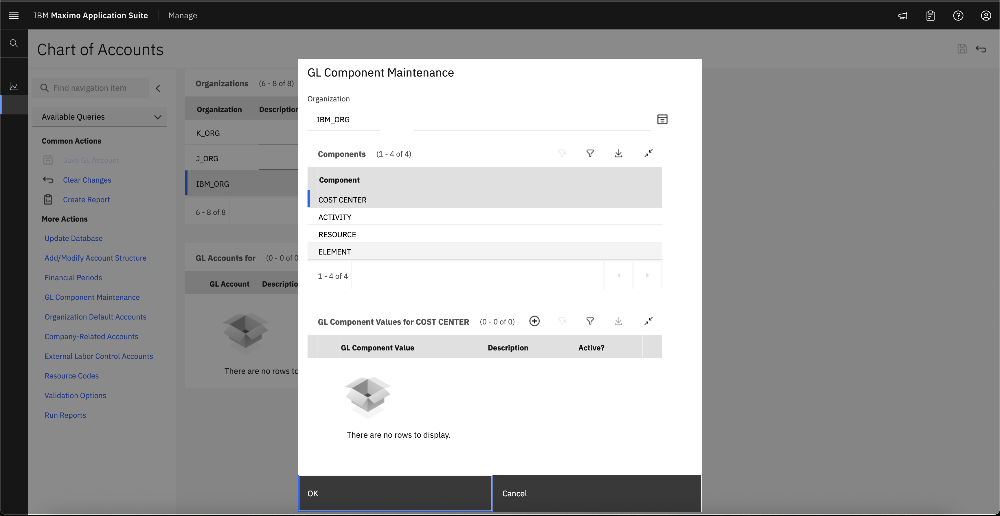
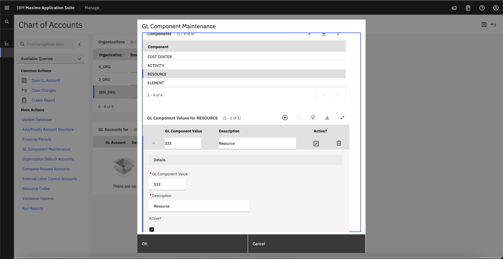
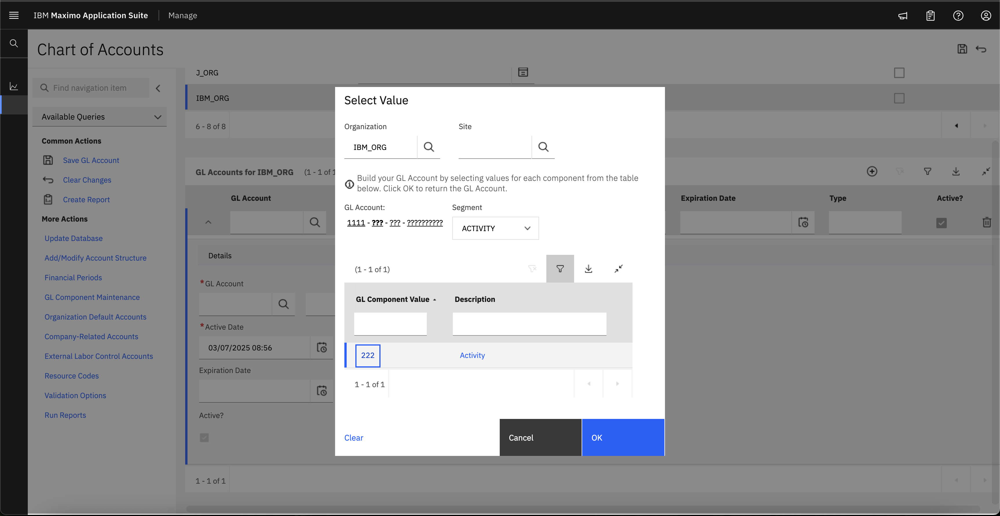
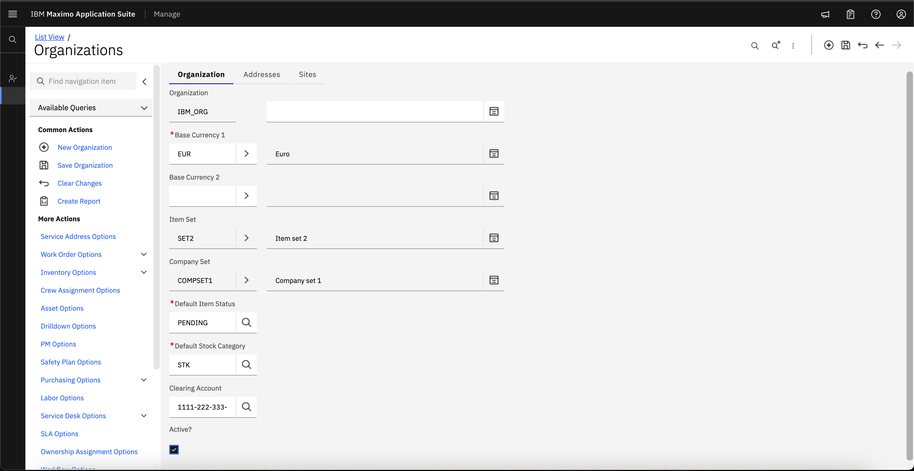

# Objectives
In this Exercise you will learn how to:

* Activate Organization

To Activate organization, we need financial details of our organization.

1. To Activate organization, we need to Create clearing account in the chart of accounts. So naviagte to Chart of Accounts from Financial.
&nbsp;&nbsp;

2. Select the organization that you want to add GL account for.
&nbsp;&nbsp;

3. Select GL Component Maintenance
&nbsp;&nbsp;
&nbsp;&nbsp;

4. For each component(Cost Center, Activity, Resource, Element), create GL component Values using plus icon and save it.
&nbsp;&nbsp;
&nbsp;&nbsp;
&nbsp;&nbsp;
&nbsp;&nbsp;

5. Expand GL Accounts for IBM_ORG
&nbsp;&nbsp;

6. Select GL Account for Each Segment(Cost Center, Activity, Resource, Element)
&nbsp;&nbsp;

7. Save GL Account Details.
&nbsp;&nbsp;

8. Navigate back to Organizations and Select Clearing Account details.
&nbsp;&nbsp;
&nbsp;&nbsp;

9. Select the Active check box.
&nbsp;&nbsp;