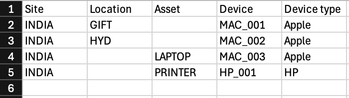
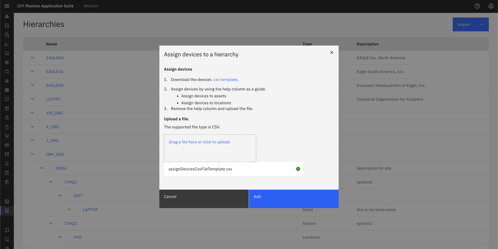

# Objectives
In this Exercise you will learn how to:

* Assign devices to the hierarchy

---
*Before you begin:*  
This Exercise requires that you have:

1. completed the pre-requisites required for [all labs](prereqs.md)
2. completed the previous exercises

---

!!! info
    Assign IT devices to assets by using a CSV template file and import it. Devices are always grouped by their device type.

## 
The CSV file to assign devices for our functional company that manages transportation networks looks like this:
&nbsp;&nbsp;

### Edit the assign devices CSV to match your hierarchy
1. Download the [.CSV Template](assignDevicesCsvFileTemplate.csv) to your local system.
2. Open the file in your favorite text editor
3. Find/Replace -MLL with -<your initials\>
4. Save the file

### Assign devices

1. Open the Monitor Setup page
2. Click on Import button then choose "Assign devices"
&nbsp;&nbsp;
3. Using the CSV file from step previous section, drag the CSV into the blue box or click to select CSV file from filesystem
4. The system will validate your CSV file
5. Click Add
&nbsp;&nbsp;

6. You can see the devices in your hierarchy

---

!!! note
    You can also assign devices another way, please refer [assign Device](/../monitor_device_devicetype_setup_9.1/device_relation).

