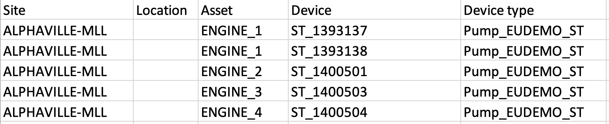
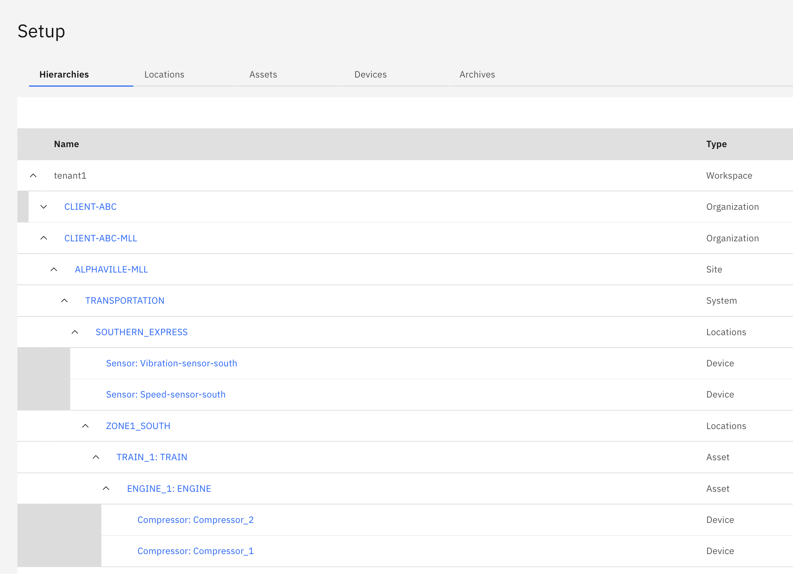

# Objectives
In this Exercise you will learn how to:

* Assign devices to the asset hierarchy

Assign compressor devices to assets by using a CSV template file and import the assignment.

## 
The CSV file to assign devices for our functional company Acme that manages transportation networks looks like this:
&nbsp;&nbsp;

### Edit the assign devices CSV to match your hierarchy
1. Download the [Client-ABC devices CSV](https://github.ibm.com/Watson-IoT/eam-hpu-lab/blob/main/csv-files/monitor_hierarchy/Client-ABC-devices.csv) to your local system.
2. Open the file in your favorite text editor
3. Find/Replace -MLL with -<your initials\>
4. Save the file

### Assign devices

1. Open the Monitor Setup page
3. Click on Import button then choose "Assign devices"
4. Using the CSV file from step previous section, drag the CSV into the blue box or click to select CSV file from filesystem
5. The system will validate your CSV file
6. Click Add
7. You can see the devices in your hierarchy

---

