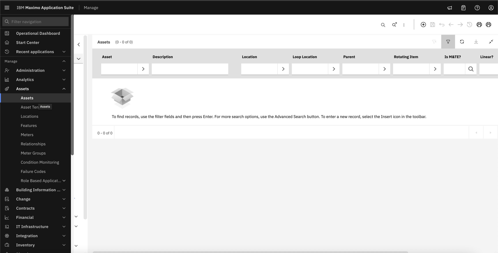
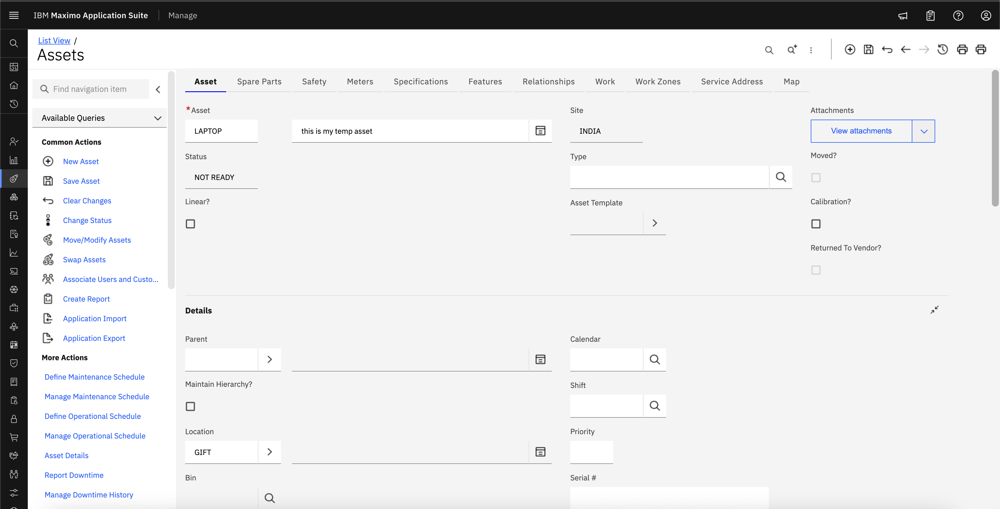

# Objectives
In this Exercise you will learn how to:

* Create Asset

---
*Before you begin:*  
This Exercise requires that you have:

1. completed the pre-requisites required for [all labs](prereqs.md)
2. completed the previous exercises

---

!!! info
    Assets are the resources that you maintain and repair, such as equipment, machinery, or technology. To view, add, or edit asset information, use the Assets page in the Manage Assets Work Center.

1. Navigate to Assets under Assets from left menu bar.
&nbsp;&nbsp;

2. Set asset Name, description, Parent and Location and save it
&nbsp;&nbsp;

---