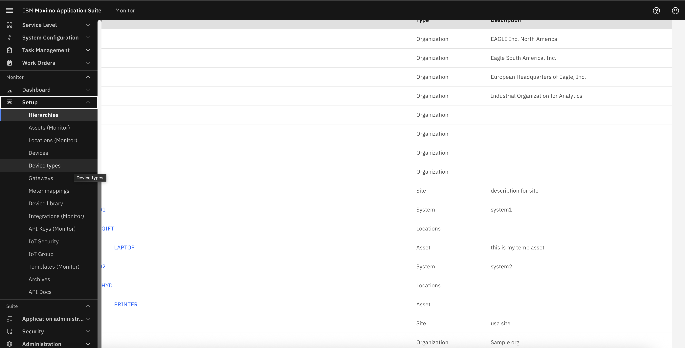
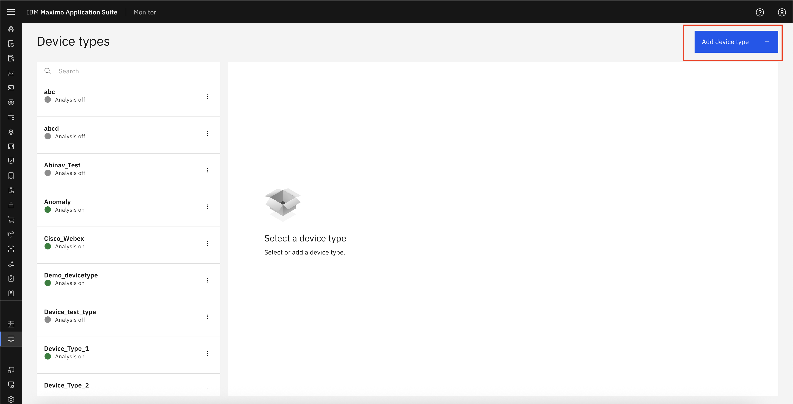
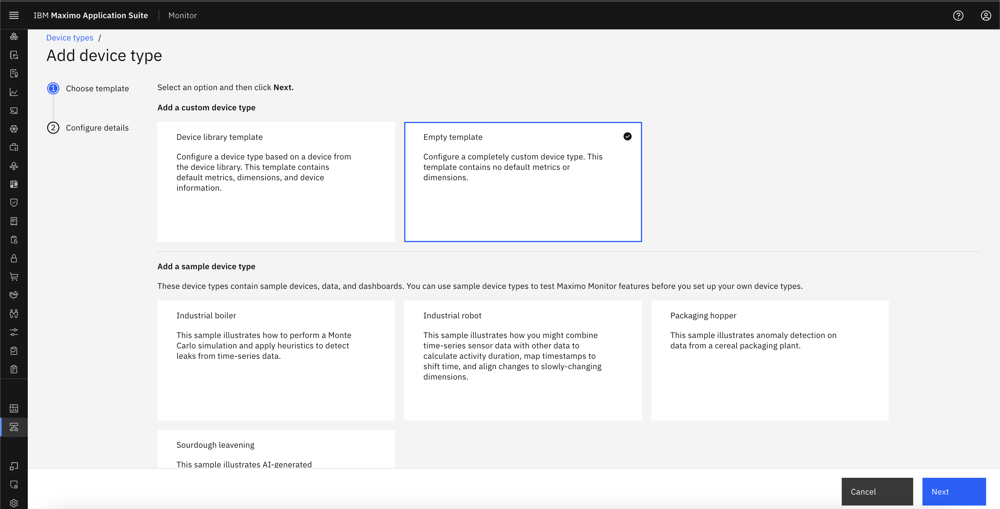
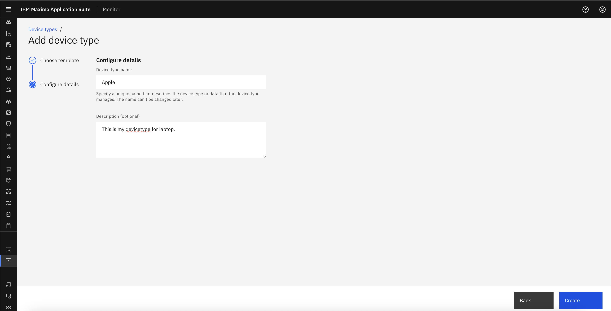
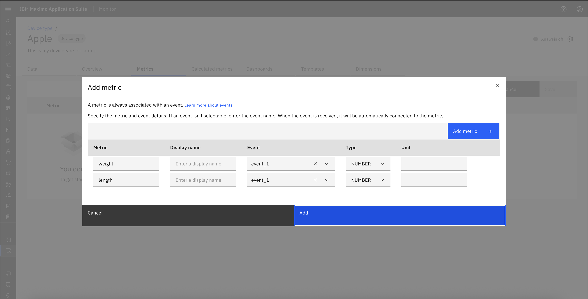
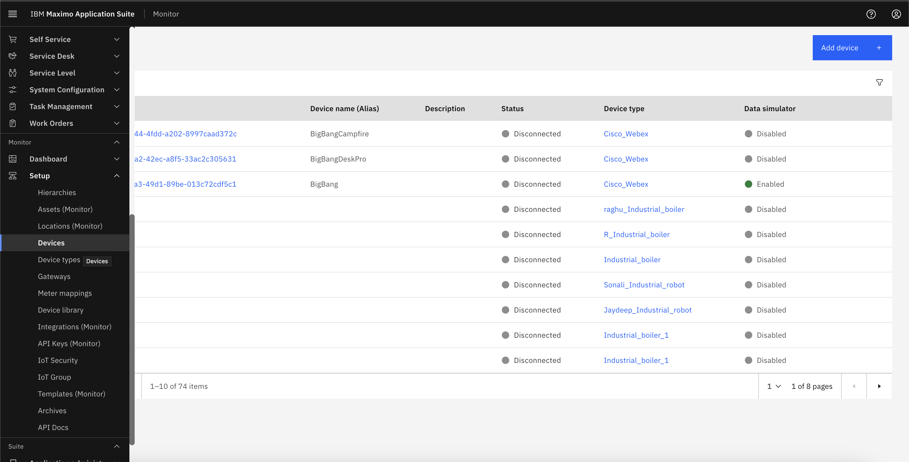
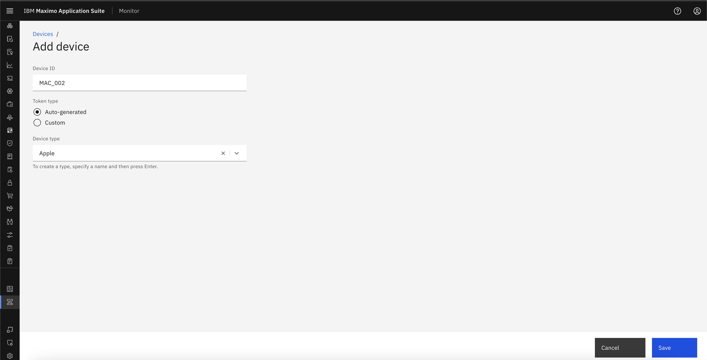

# Objectives
In this Exercise you will learn how to:

* Create DeviceType and Device

---
*Before you begin:*  
This Exercise requires that you have:

1. completed the pre-requisites required for [all labs](prereqs.md)
2. completed the previous exercises

---

!!! info
    A device type might represent the physical type of device or represent the type of asset or entity that the device is used for.

1. Navigate to Setup under Monitor Section and click on Device types.
&nbsp;&nbsp;

2. Select Add Device type.
&nbsp;&nbsp;

3. Select Any Template
&nbsp;&nbsp;

4. Configure details for Device Type
&nbsp;&nbsp;

5. Add some metric.
&nbsp;&nbsp;

### Create Devices
1. Navigate to Setup under Monitor Section and click on Device.
&nbsp;&nbsp;

2. Click on Add Devices and fill the Devices details and save it.
&nbsp;&nbsp;

!!! note
    To know more about Device and Device Type creation, please go to [Create DeviceType](/../monitor_device_devicetype_setup_9.1).

---