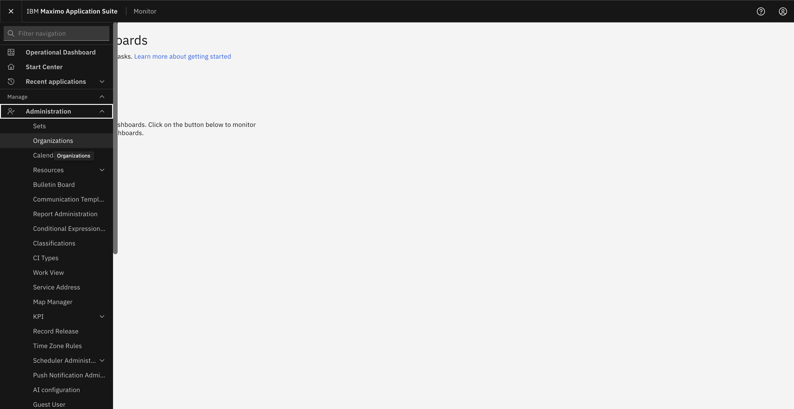
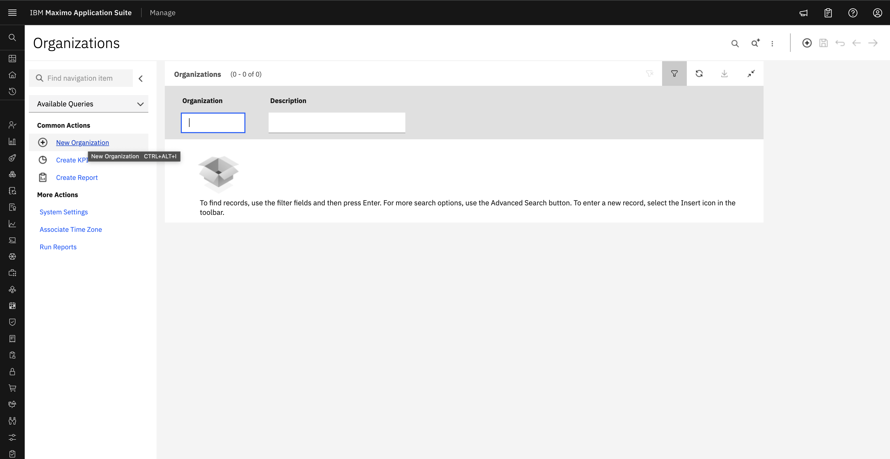
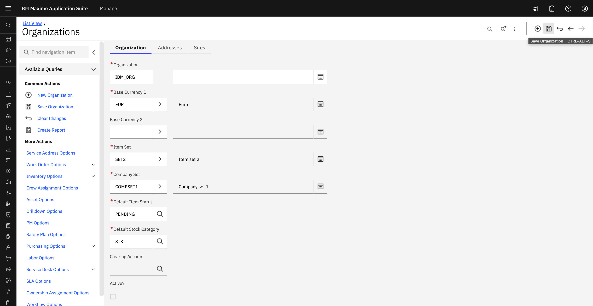

# Objectives
In this Exercise you will learn how to:

* Create Organization

In the Maximo application, you create the organizations to use with the system. Each organization can have multiple sites.
&nbsp;&nbsp;

1. In the left side Menu, select Organizations application, click New Organization.
&nbsp;&nbsp;

2. Type a name for the organization.
&nbsp;&nbsp;
3. Specify base currency code 1 for your base currency.
&nbsp;&nbsp;
4. Optional: Specify base currency 2.
5. Specify the item set and the company set that you want to associate with this organization.
&nbsp;&nbsp;
6. In the Default Item Status field, select the status that you want new item master, service item, and tool records to have.
&nbsp;&nbsp;

7. Click Save Organization.
&nbsp;&nbsp;

An Orgnanization must be activated after creation.