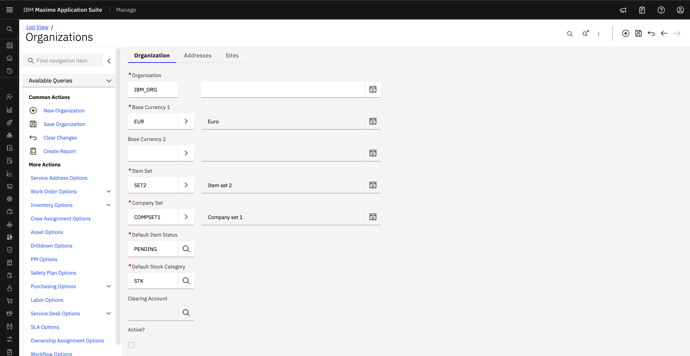

# Objectives
In this Exercise you will learn how to:

* Create Organization

---
*Before you begin:*  
This Exercise requires that you have:

1. completed the pre-requisites required for [all labs](prereqs.md)
2. completed the previous exercises

---

!!! info
    An organization is a top-level entity that represents a business or operational unit responsible for managing a set of assets, locations, and financial records.

1. Navigate to Organizations under Administration section. Click New Organization.
&nbsp;&nbsp;
&nbsp;&nbsp;

2. Set Organization name, description for the organization.
&nbsp;&nbsp;

3. Specify base currency code 1 for your base currency.
&nbsp;&nbsp;

4. Optional: Specify base currency 2.

5. Specify the item set and the company set that you want to associate with current organization. Maximo utilizes the concept of Sets to allow the sharing of data across Organizations.
&nbsp;&nbsp;

6. In the Default Item Status field, select the status that you want to have.
&nbsp;&nbsp;

7. Click Save Organization.
&nbsp;&nbsp;

!!! note
    An Orgnanization must be [activate](../activate_organization) after creation.

---

Congratulations you have successfully created organization. 