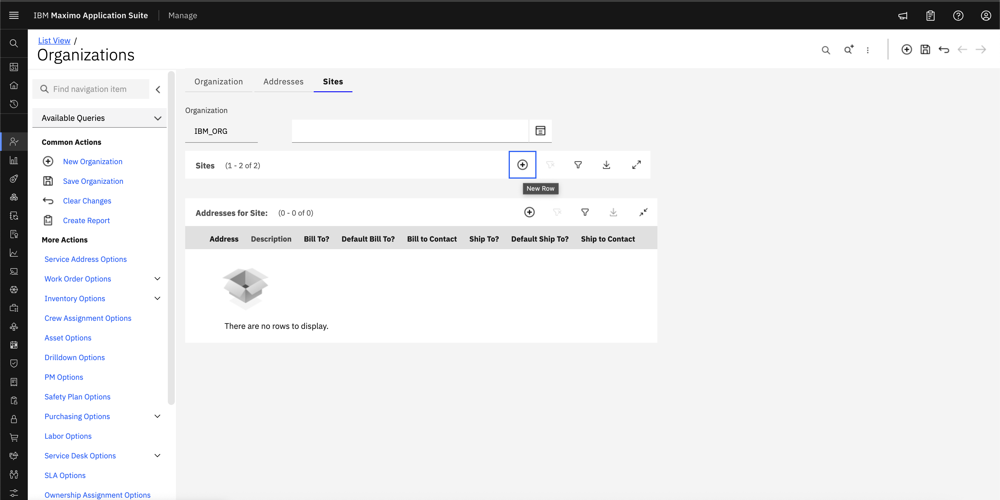
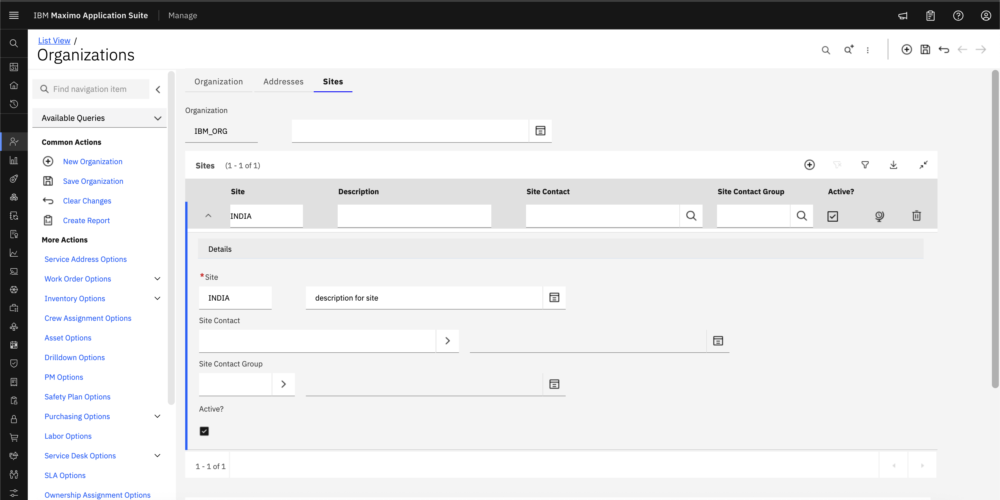
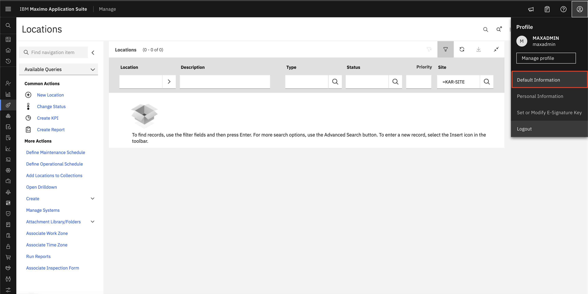
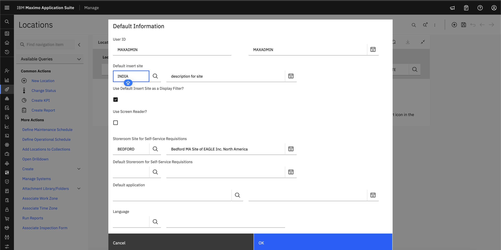
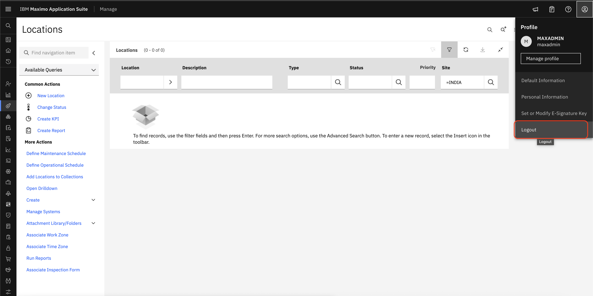

# Objectives
In this Exercise you will learn how to:

* Create Site

In the Maximo application, Each Site configured under the Organization inherits information and settings from the Organization level. Each organization can have multiple sites.

1. In the left side Menu, navigate to Organizations and select the organization that you want to add Site.
&nbsp;&nbsp;

2. Add Site Name, Description and click on Save.
&nbsp;&nbsp;

3. For setting a default insert site, go to the Profile section and select Default information.
&nbsp;&nbsp;

4. Click on the Default insert site.
&nbsp;&nbsp;

5. Log out of the application and login again for the changes to reflect.
&nbsp;&nbsp;

---