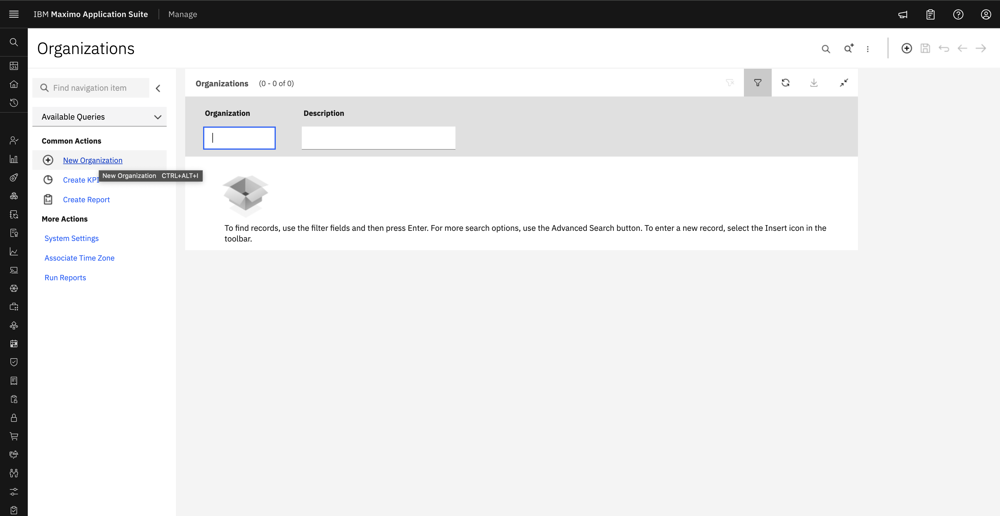

# Objectives
In this Exercise you will learn how to:

* Create Site

In the Maximo application, Each organization can have multiple sites.

1. In the left side Menu, select Organizations application, click New Organization.
&nbsp;&nbsp;

After creating and activating an Organization, the administrator can set an activated site as the default insert site of the environment.
For setting a default insert site, go to the Profile section and select Default information.
Click on the Default insert site and add the active site.
Log out of the application and login again for the changes to reflect.