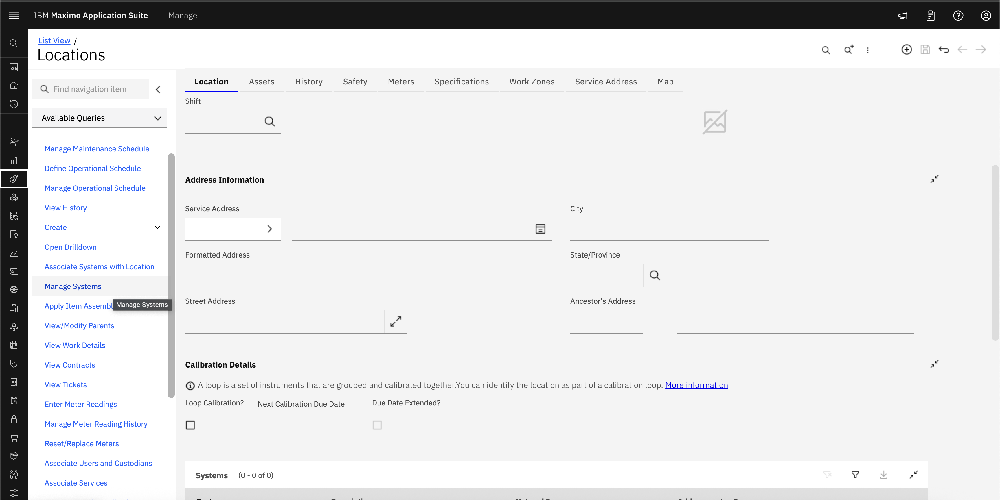

# Objectives
In this Exercise you will learn how to:

* Create System

A system is a group of locations that is organized into a logical hierarchy of parent and child locations to help you track assets and manage work more effectively.

You can use systems to categorize the use or physical qualities of locations and to build a hierarchy of locations within a site. For example, a system can represent a group of buildings at a site or even the whole site.

A site can have multiple systems, but one system in the site must be designated as the primary system. The first system that is associated with a site is automatically the primary system, but you can designate a different system as the primary system if necessary. The primary system must be hierarchical, meaning that there is a parent-child relationship between each location in the system.

1. In the Manage Assets Work Center, select the Places(Location/Asset) page.

2. Select the Manage Systems tab and select Add system.
&nbsp;&nbsp;

3. Enter a system name, description and save the record.
&nbsp;&nbsp;

* Optional: To make the system that you added the primary system for the site, edit the row for that system and specify Y in the Primary System column.

---