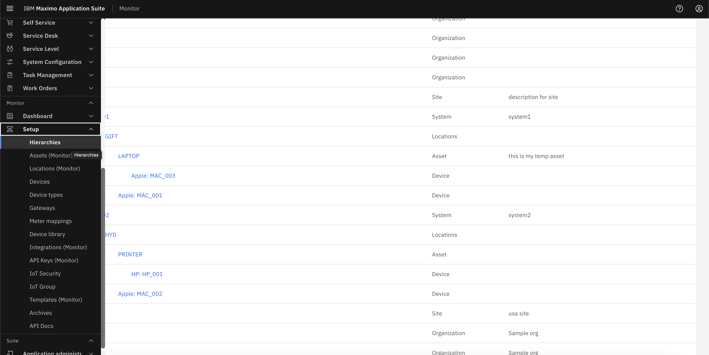

# Objectives
In this Exercise you will learn how to:

* Explore Hierarchy View

Now it's time to observe our hierarchy in Monitor:

1. Navigate to Hierarchy section of Monitor.
&nbsp;&nbsp;

2. Observe we created Hierarchy in Manage now sync with Monitor, you can explore each funcationalites of Monitor from Hierarchy .
&nbsp;&nbsp;

!!! note
    Now with this hierarchy, you can explore all Monitor's features.

---

