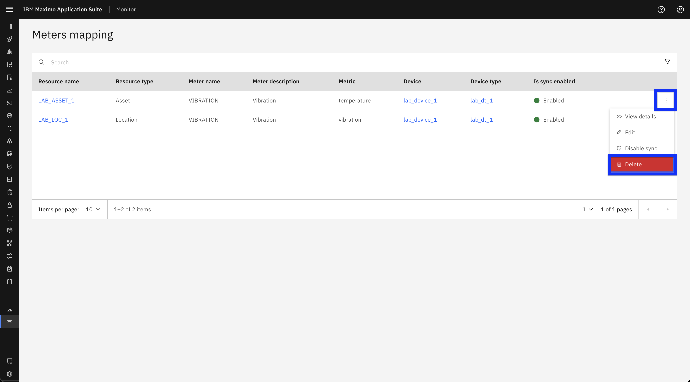
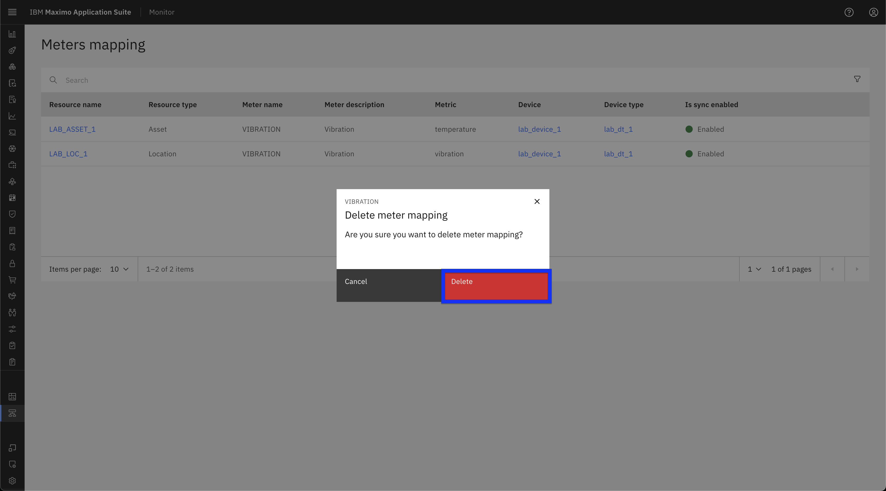

# Objectives
In this Exercise you will learn how to:

* Delete Meter/Metrics Mappings

---
**Before you begin:**

This Exercise requires that you have:

1. completed the pre-requisites required for [all labs](prereqs.md)
2. completed the [previous exercises](setup.md)
 
---

Follow the steps below to delete Meter/Metrics Mappings:

1. Navigate to the Meter Mappings page in the MAS Monitor UI. [refer to previous exercise](setup.md/#accessing-metermetrics-mappings).

2. Click the three-dot menu next to the meter mapping which you want to delete.
3. From the dropdown menu, select **Delete**.
  

5. Confirm the deletion by clicking **Delete**.
  

!!! Attention
    This action is permanent and cannot be undone. Ensure you are deleting the correct meter mapping.

---
🎉 Congratulations! You have successfully learn how to delete meter/metric mappings.