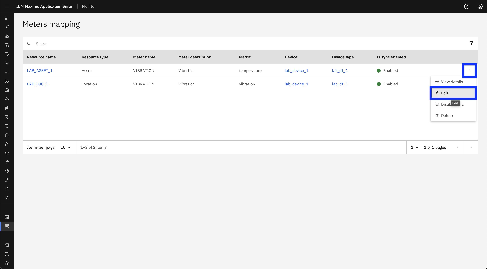
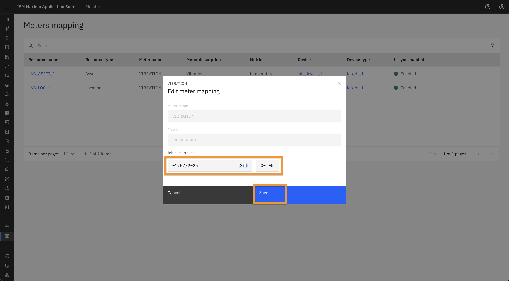
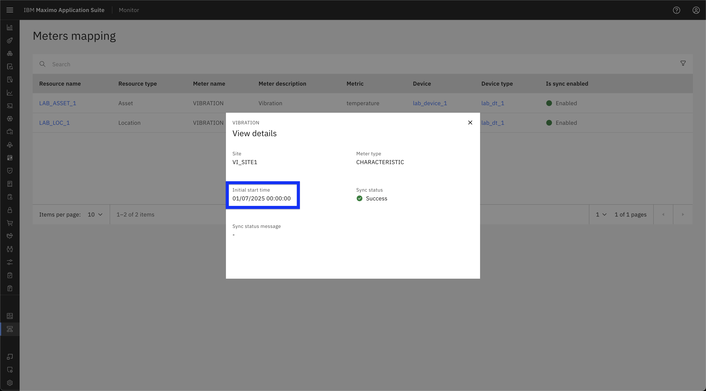

# Objectives
In this Exercise you will learn how to:

* Edit Meter/Metrics Mappings

---
**Before you begin:**

This Exercise requires that you have:

1. completed the pre-requisites required for [all labs](prereqs.md)
2. completed the [previous exercises](setup.md)
 
---

Follow the steps below to edit Meter/Metrics Mappings:

1. Navigate to the Meter Mappings page in the MAS Monitor UI. [refer to previous exercise](setup.md/#accessing-metermetrics-mappings).

2. Click the three-dot menu next to the meter mapping which you want to edit.
3. From the dropdown menu, select **Edit Mapping**.
  

4. Update the **Initial Start Time** field as needed.
5. Click **Save** to save the changes
  

6. Verify that the updated Initial Start Time is reflected in the mapping.
  

!!! Note
    Only the **Initial Start Time** field is editable. All other fields are read-only.

---
🎉 Congratulations! You have successfully learn how to edit meter/metric mappings.