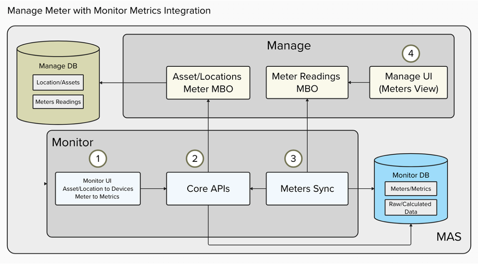

# Welcome to the Maximo Monitor 9.1 Monitor Meter/Metric Mapping Lab

In this lab, you will learn how to configure and use the Meter-Metric Mapping feature in Maximo Monitor 9.1. This feature enables you to link meters to metrics in the Monitor UI, allowing you to view device data directly in the Manage UI and make data-driven decisions more efficiently.

  

## Objectives 

After completing this lab, you will be able to:

* Configure meter/metric mappings in Maximo Monitor 9.1
* View meter data in the Manage UI
* Toggle sync enable/disable for Meter/Metrics Mappings
* Edit Meter/Metrics Mappings
* Delete Meter/Metrics Mappings
* Have fun

!!! note
    Expected time needed to run the complete lab: 1 hour

---

**Updated: 2025-06-26**

---