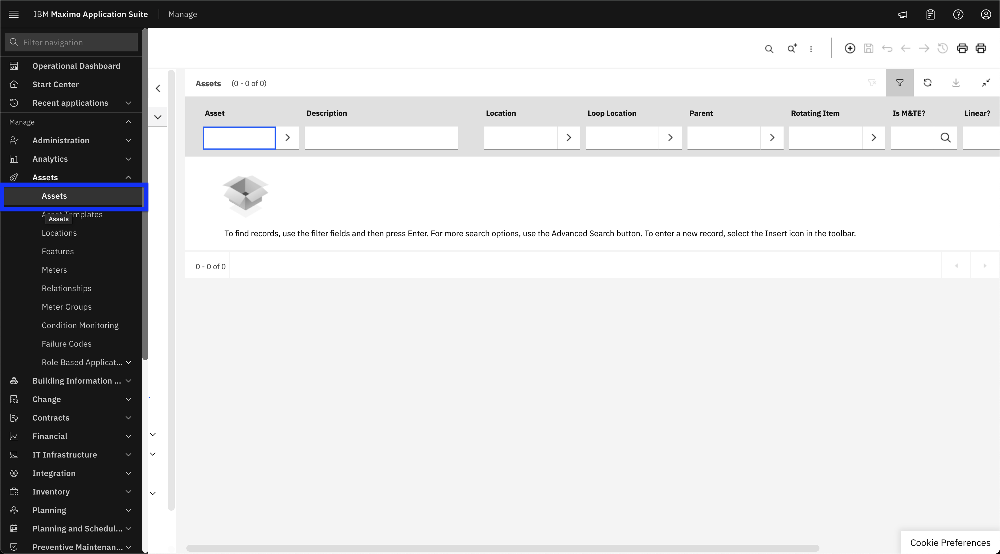
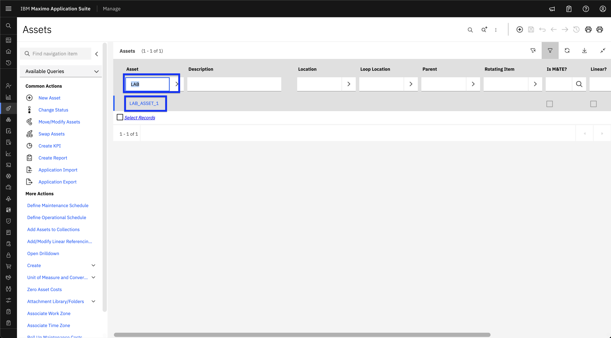
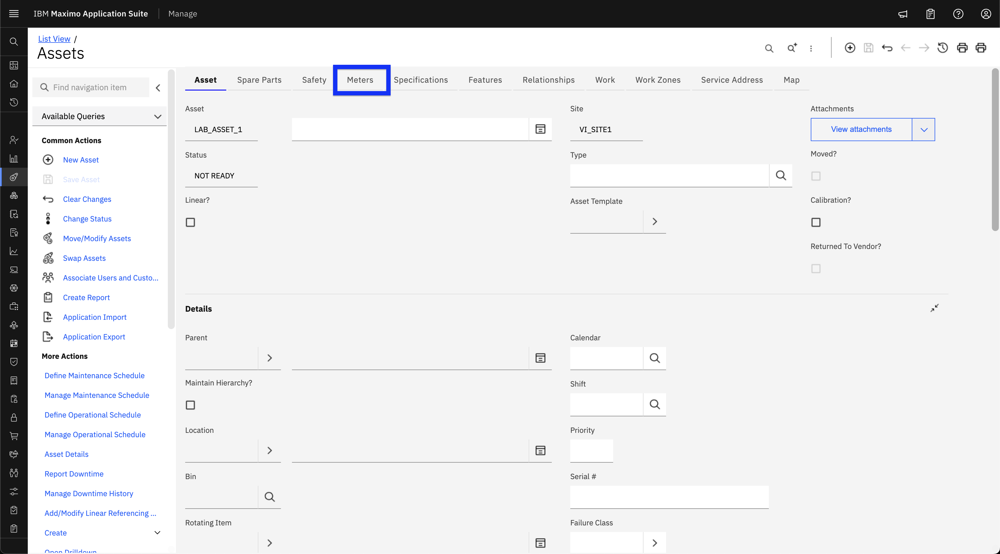
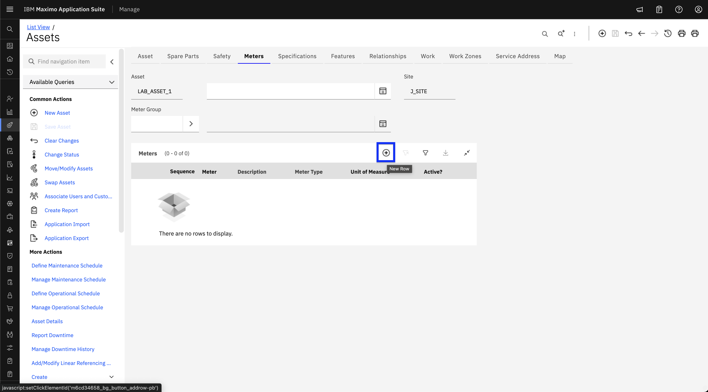
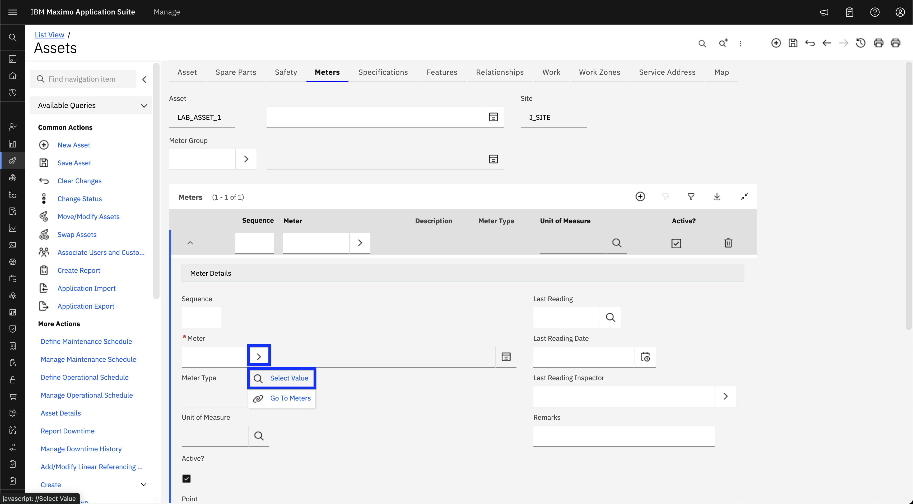
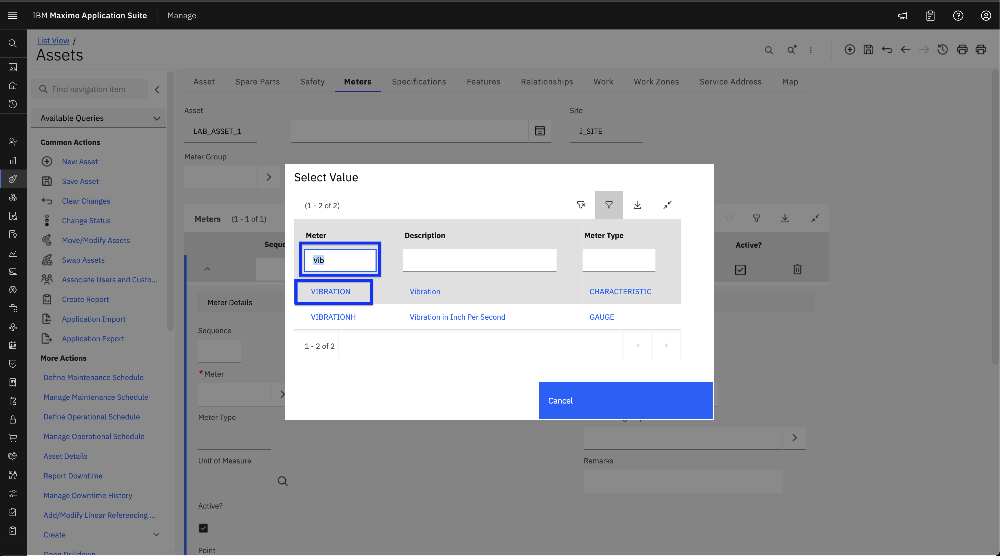
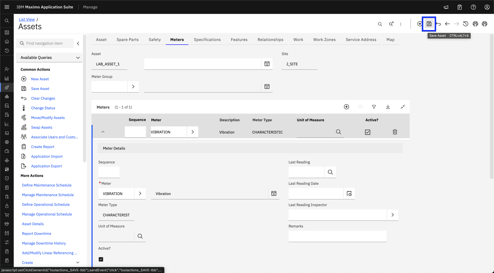
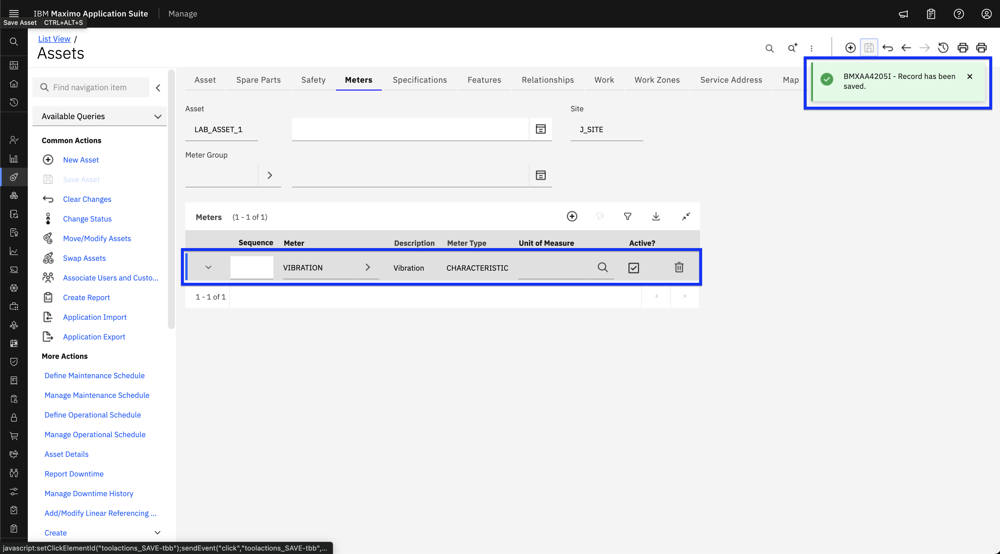
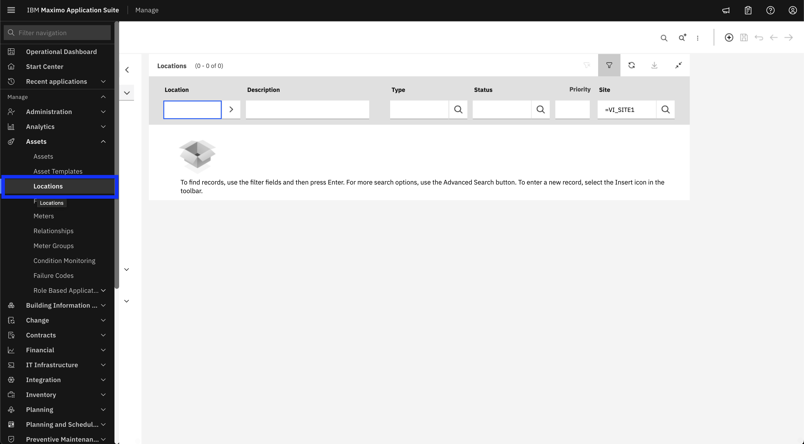
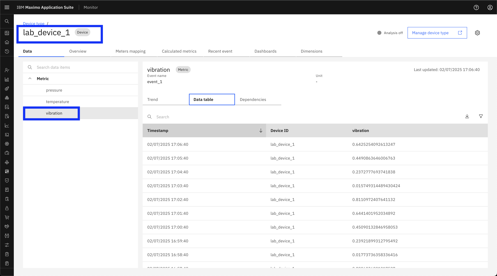

# Pre-Requisite Instructions

Here are the required pre-requisites for the Maximo Monitor Meter/Metric Mapping exercises.

!!! attention
    This lab requires Maximo Application Suite 9.1 or later. 
    MAS application entitlement must be `Limited` or higher.

# All Exercises

All Exercises require that you have:

1.  A computer with a Chrome browser and internet connectivity.

2.  User access to a Maximo Application Suite 9.1 environment. 
Your Exercise facilitator should have provided you with the information on your access.

3.  An IBM ID.  If you don't have an IBM ID you can get one [here](https://www.ibm.com/account/reg/signup?): 
o Click `Login to MY IBM` button 
o Click `Create an IBM ID` link

4.  Test your access to the Maximo Application Suite environment.

5.  Please complete the following exercises.

!!! Attention
    You should have the necessary permissions to view/create/edit/delete meter mappings.

## Exercise 1 - Add a meter to an Asset or Location in Maximo Manage

!!! Note
    To create Assets and Locations, refer to the step-by-step instructions in the [Maximo Monitor Hierarchy Lab](https://ibm.github.io/maximo-labs/monitor_managed_hierarchy_9.1).

### Add a meter to an Asset

1. Log in to MAS and navigate to Asset page ( **Manage → Assets → Assets** ) in Manage UI: 
  

2. Search for the Asset by name and click on it to view its meters.
  

3. Click on the **Meters** tab.
  

4. Click the Add Meter icon (➕ in a circle).
  

5. Click the **“>”** icon in the Meter field and click on **Select value** from dropdown.
  

6. Search for the meter by name and Select a meter from the meter table.
  

7. Click the Save icon (💾) at the top.
  

8. Verify the meter is added in the list.
  

### Add a meter to a Location

1. Log in to MAS and navigate to Location page ( **Manage → Assets → Locations** ) in Manage UI: 
  

2. Search for the Location by name and click on it to view its meters.
  

3. Refer to the [Asset section above](#add-a-meter-to-an-asset) and continue from Step 3 to complete the process. Practice the process on your own.

## Exercise 2 - Create and Assign a Device with Metric

!!! Note
    Refer to the step-by-step instructions in the [Device and Device type Setup Lab](https://ibm.github.io/maximo-labs/monitor_device_devicetype_setup_9.1/) for this exercise.

1. Create a device with metric in the Monitor UI.
2. Turn on the data simulator for the device.
3. Assign the device to the Location or Asset created in Exercise 1.
  

!!! Note
    Only **numeric metrics** can be mapped to meters. Ensure you have created a numeric metric in the device type.

