# Objectives
In this Exercise you will learn how to:

* setup meter/metric mappings

---
**Before you begin:**

This Exercise requires that you have:

1. completed the pre-requisites required for [all labs](prereqs.md)
 
---

## Setup meter/metric mappings for Assets

1. Log in to MAS and navigate to the Assets page ( **Monitor → Setup → Assets (Monitor)** ) in the Monitor UI.
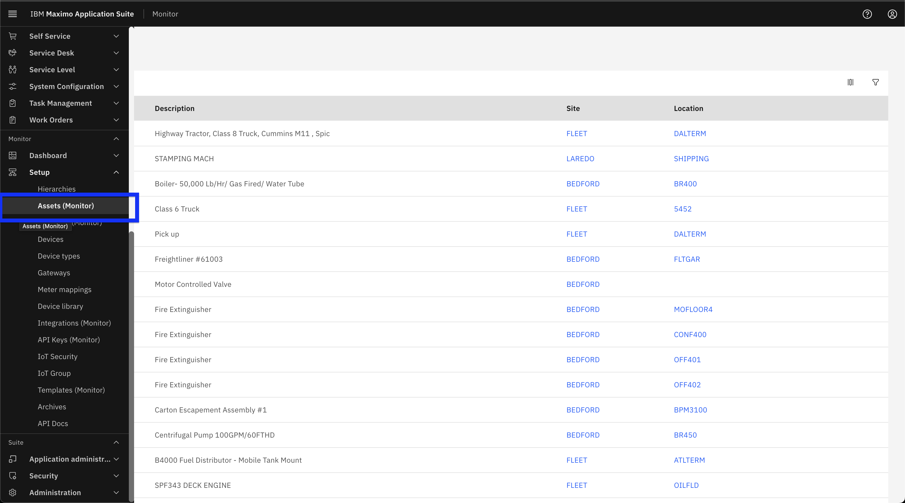  

2. Search for the Asset by name and click on it.
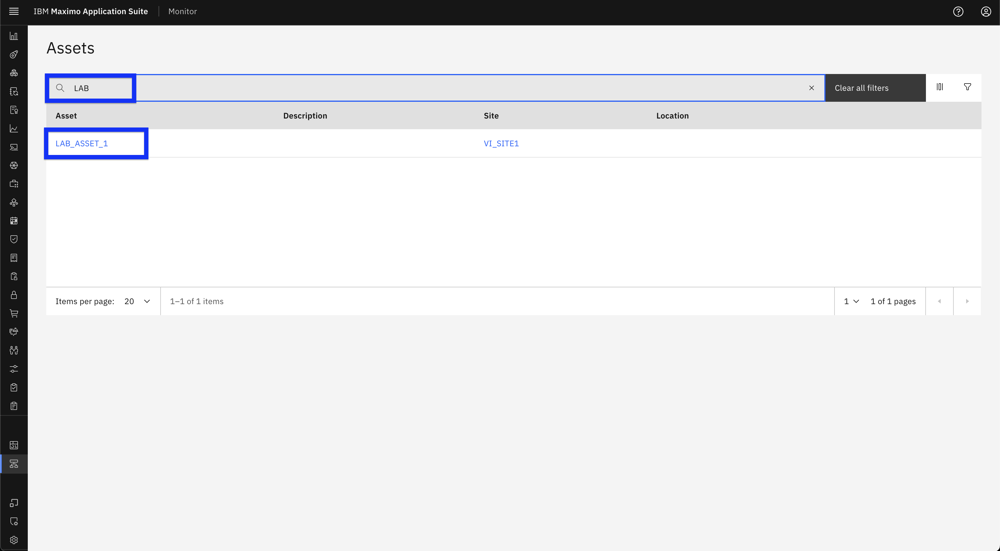  

3. Click on **Meters mapping** Tab to view list of Meters that link to Asset.
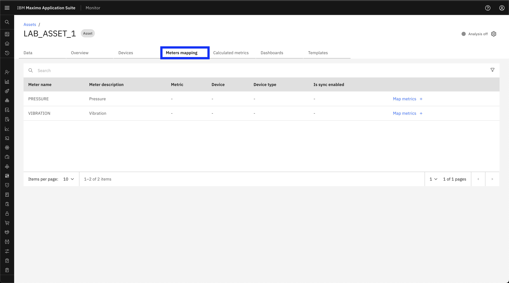  

4. Click on **Map Metrics** to open the Add Meter Mapping model window.
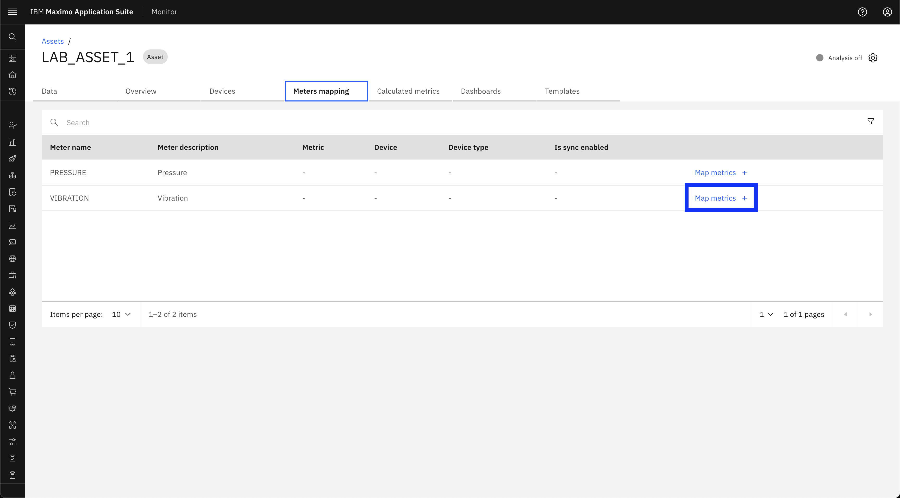  

5. Select a device that contains the desired metric, then click **Next**.
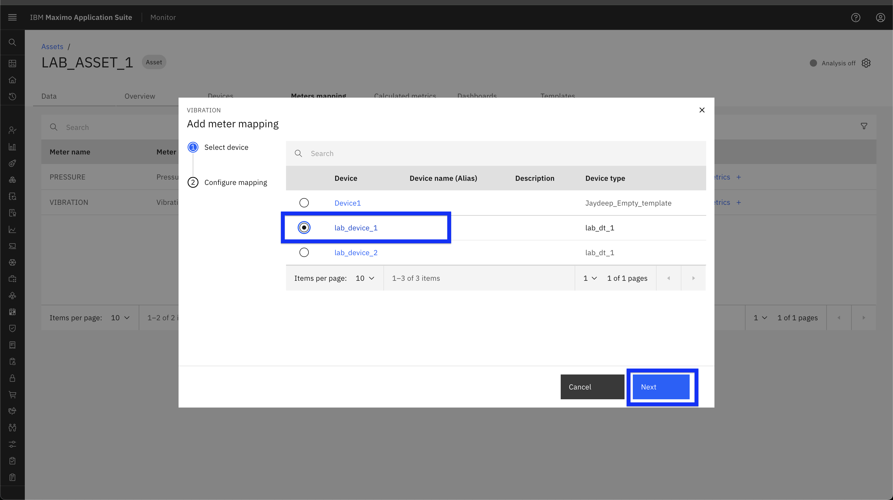  

6. Choose a metric and set the initial date, then click **Submit**.
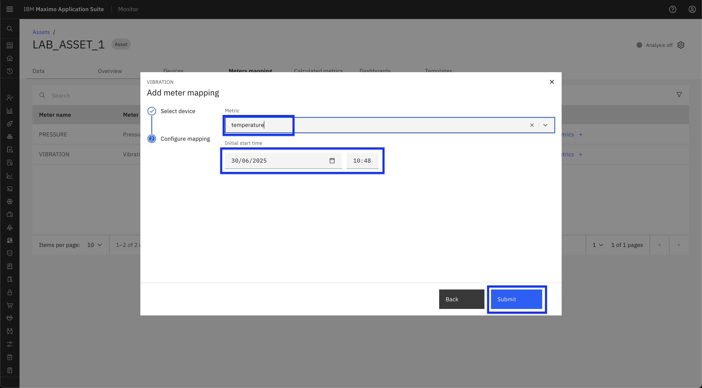  

7. Verify that the new mapping appears in the Mapping Table.
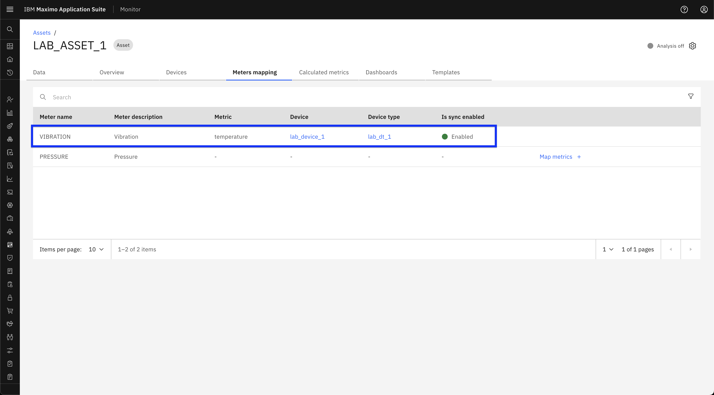  

## Setup meter/metric mappings for Location

1. Navigate to the Location page ( **Monitor → Setup → Locations (Monitor)** ) in Monitor UI.
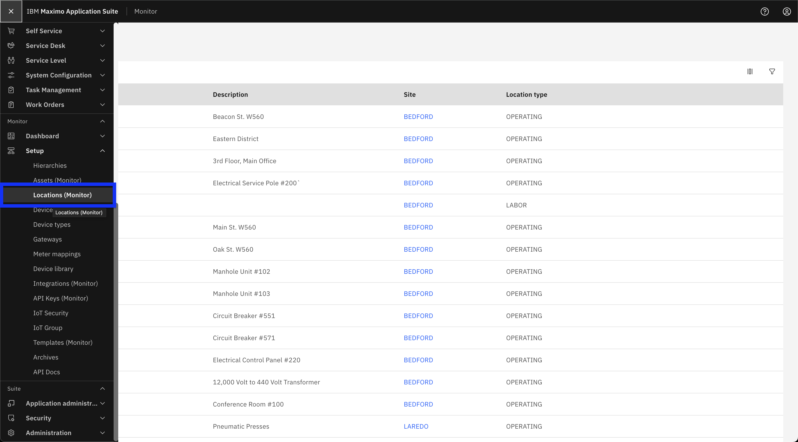  

2. Search for the Location by name and click on it.
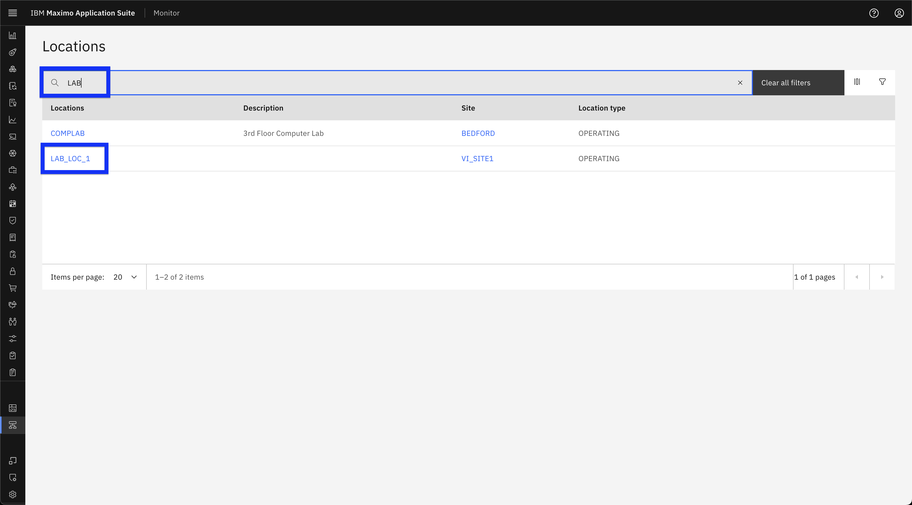  

3. Refer to the [Asset section above](#setup-metermetric-mappings-for-assets) and continue from Step 3 to complete the process. Practice the process on your own.

## Accessing Meter/Metrics Mappings

You can view all meter-to-metric associations in a centralized location. To access them, follow the steps below:

1. Navigate to the **Meter Mappings** page from side menu bar ( **Monitor → Setup → Meter Mappings** )
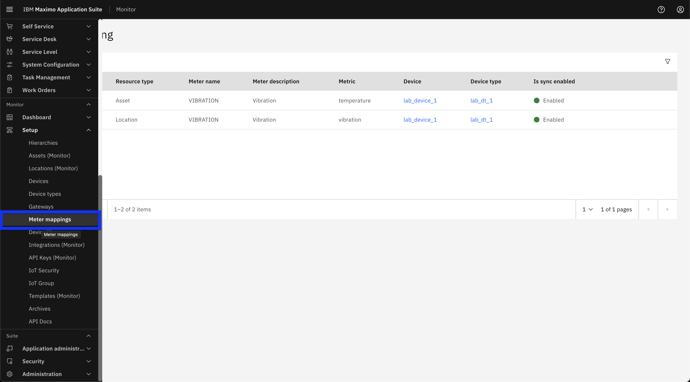  

2. Verify that you can view all Asset and Location meters that are mapped to metrics.
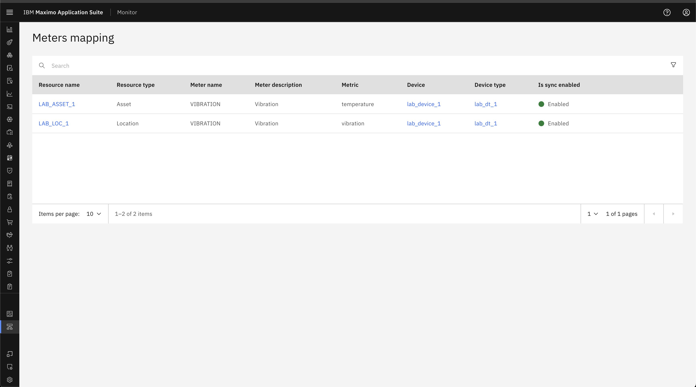  

3. Click the three-dot menu next to the meter mapping and select **View Details**.
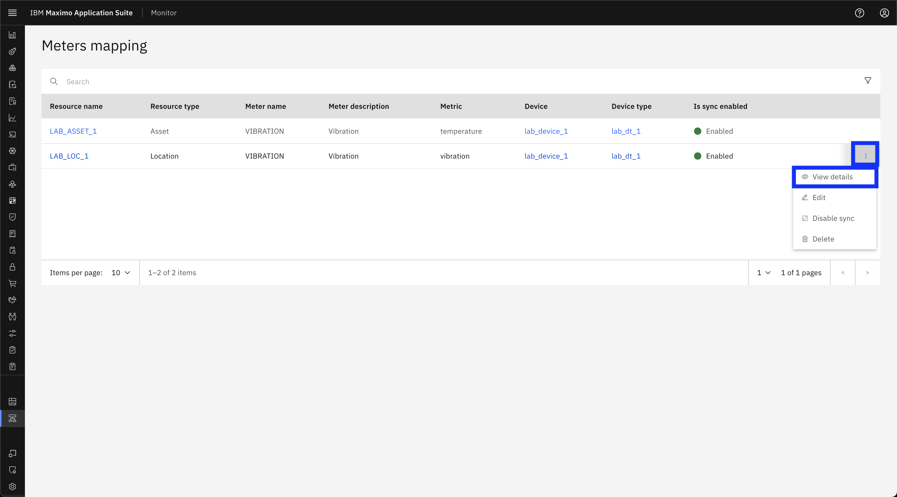  

4. The Meter Mapping Details panel will open, showing the configuration.
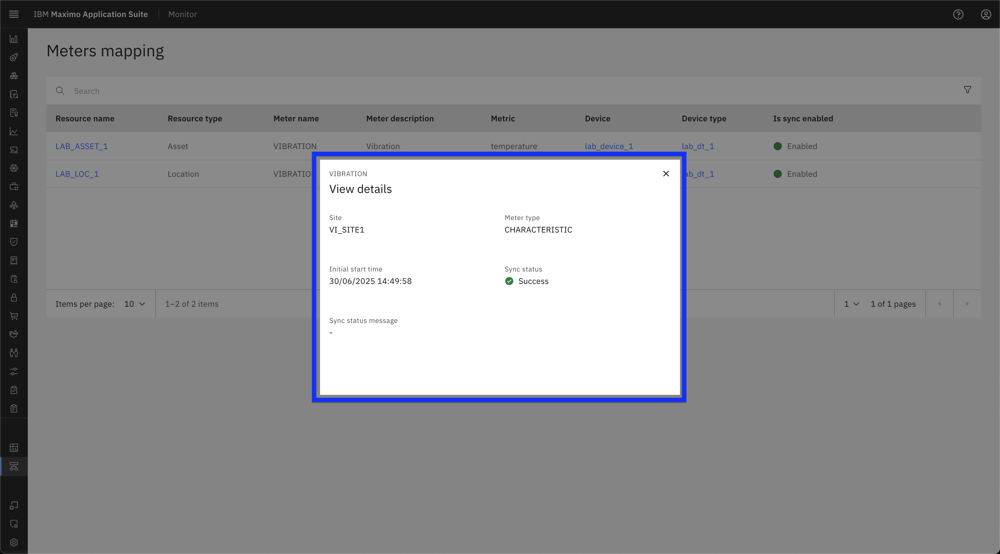  

---
🎉 Congratulations! You have successfully setup meter/metric mappings.