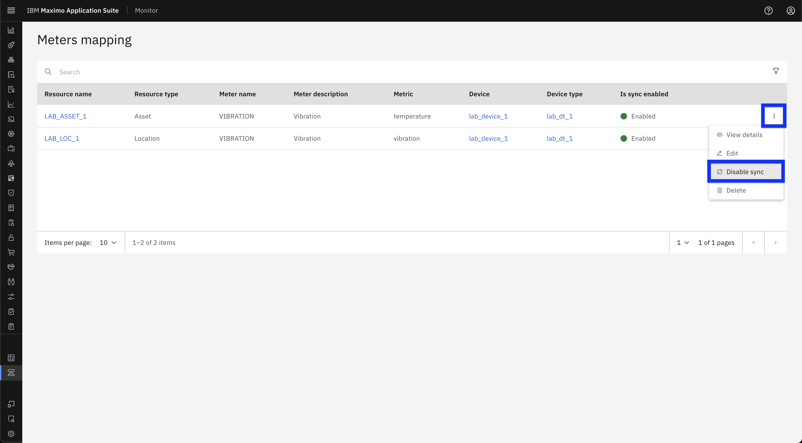
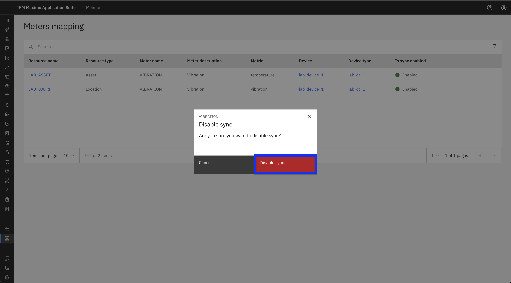
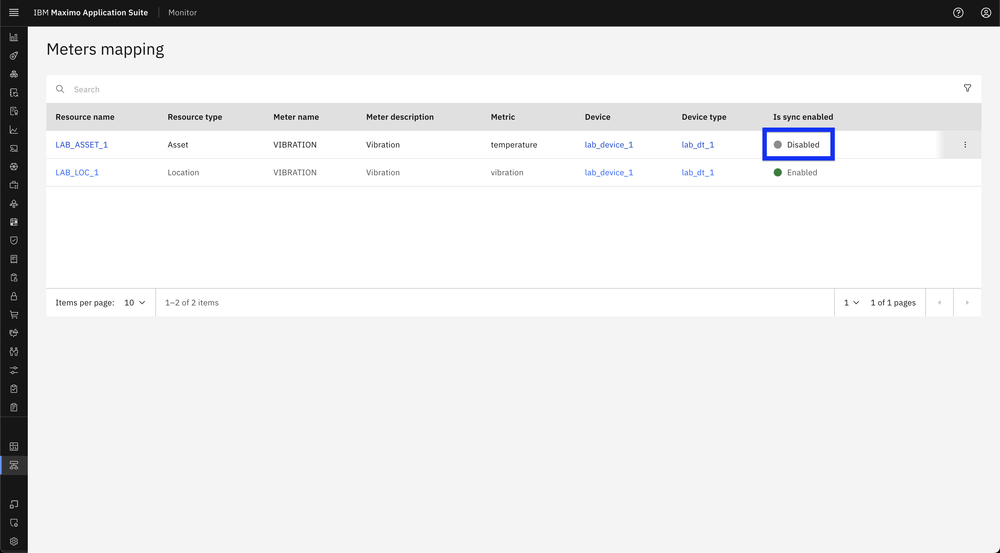
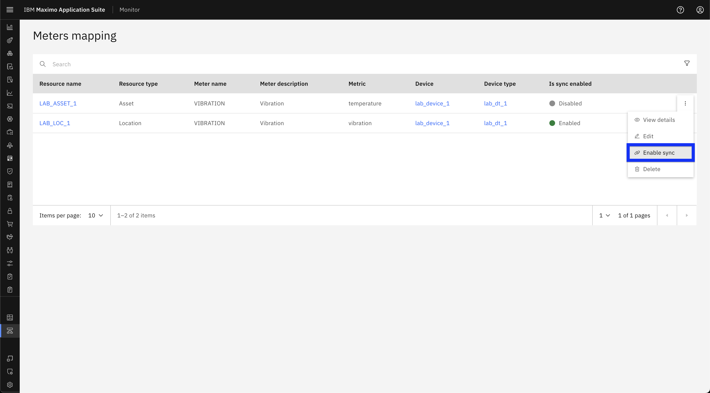
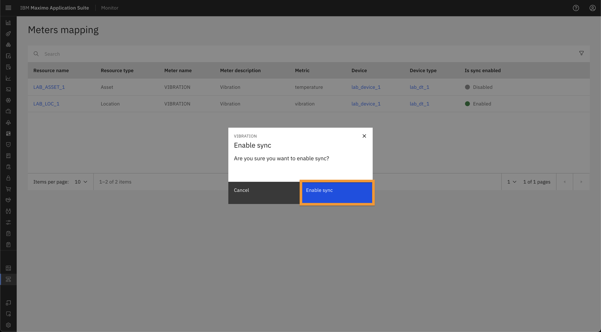
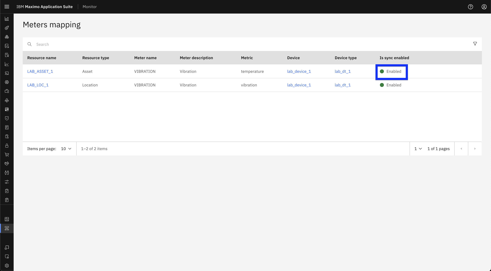

# Objectives
In this Exercise you will learn how to:

* Toggle sync enable/disable for Meter/Metrics Mappings

---
**Before you begin:**

This Exercise requires that you have:

1. completed the pre-requisites required for [all labs](prereqs.md)
2. completed the [previous exercises](setup.md)
 
---

### Disable Sync

1. Navigate to the Meter Mappings page in the MAS Monitor UI. [refer to previous exercise](setup.md/#accessing-metermetrics-mappings).

2. Click the three-dot menu next to the meter mapping you want to modify.
3. From the dropdown, select **Disable Sync**.
  

4. Confirm the action by clicking **Disable sync**.
  

5. Verify that the sync status has been updated accordingly in the Meter Mappings table.
  

### Enable Sync

1. Navigate to the Meter Mappings page in the MAS Monitor UI. [refer to previous exercise](setup.md/#accessing-metermetrics-mappings).

2. Click the three-dot menu next to the meter mapping you want to modify.
3. From the dropdown, select **Enable Sync**.
  

4. Confirm the action by clicking **Enable sync**.
  

5. Verify that the sync status has been updated accordingly in the Meter Mappings table.
  

**Expected Outcome:**

- If sync is enabled, the meter mapping will begin pushing data to the meter.
- If sync is disabled, data will no longer be pushed.
- Confirm that the sync status is updated in the Meter Mappings table.

---
🎉 Congratulations! You have successfully learn how to toggle sync enable/disable for meter/metric mappings.