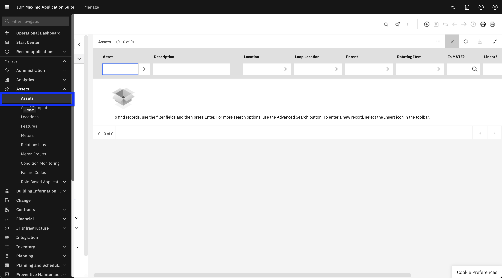
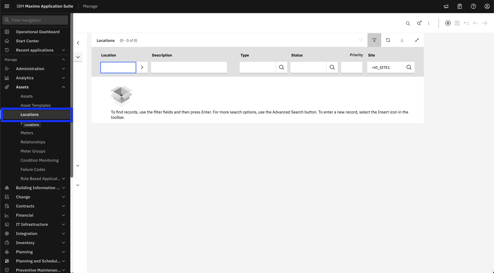
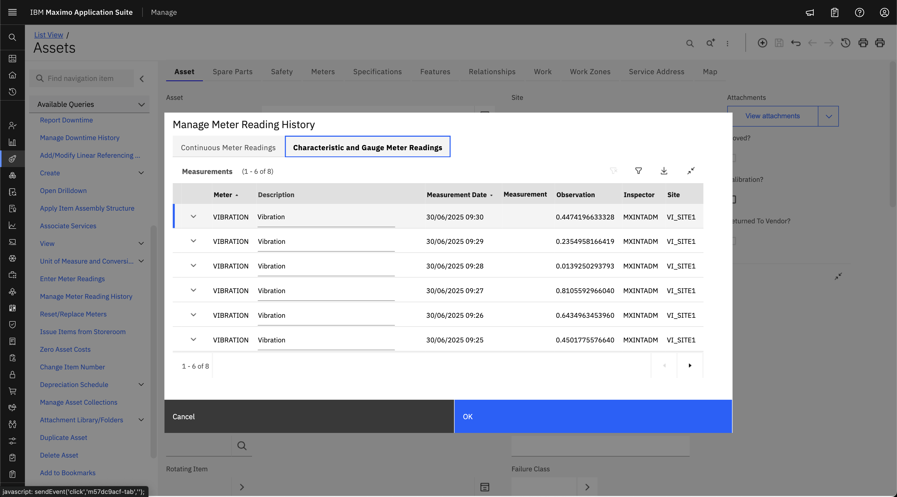

# Objectives
In this Exercise you will learn how to:

* View meter data in the Manage UI

---
**Before you begin:**

This Exercise requires that you have:

1. completed the pre-requisites required for [all labs](prereqs.md)
2. completed the [previous exercises](setup.md)

!!! Attention
    You should have the necessary permissions to view meter readings in the Maximo Manage.

---

Follow the steps below to view meter data in the Manage UI:

1. Log in to MAS and navigate to Asset or Location page in Manage UI: 
    - For **Asset**: ( **Manage → Assets → Assets** )
      
    - For **Location**: ( **Manage → Assets → Locations** )
      

2. Search for the Asset or Location by name and click on it to view its meters.
  

3. In the left panel, click **Manage Meter Reading History**
  

4. Click **Characteristic and Gauge Meter Readings** depending on meter type, to view all meters data.
  

!!! Attention
    Metric data is pushed to meters in batches every 5 minutes. Please allow some time for the readings to appear in the meter view.

---
🎉 Congratulations! You have successfully learn how to view meter data in the Manage UI.