# Objectives
In this Exercise you will learn how to add a custom Modbus device to the Device library.

---
*Before you begin:*  
This Exercise requires that you have:
    1. completed the pre-requisites required for [all labs](prereqs.md)
    2. completed the previous exercises

---

!!! note "New in MAS 9.1"
    You can add custom devices, such as PLCs or OPC-UA servers, or industrial devices which supports Modbus, BACnet and Json protocols that are not available in the Maximo Monitor Device library. Later the same device can be used by anyone who is creating a device on the Devices page.  

Assuming the Lenze i550 VFD device is not in the pre-configured library, you can add this device to the Device library by uploading the CSV file in given format. 

- Navigate to the Device library page: 
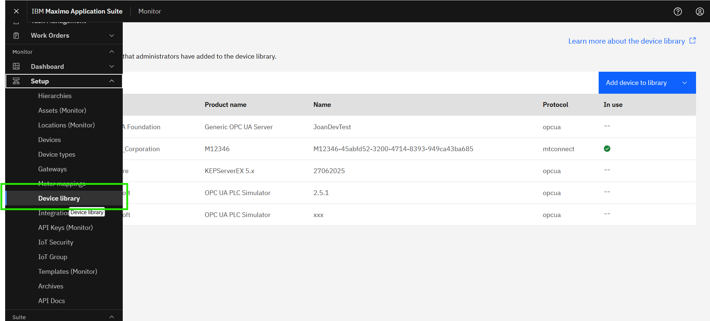 

- Modbus devices can be added using device settings in CSV file format . 
Click `Add device to library` and select `Import device settings` option: 
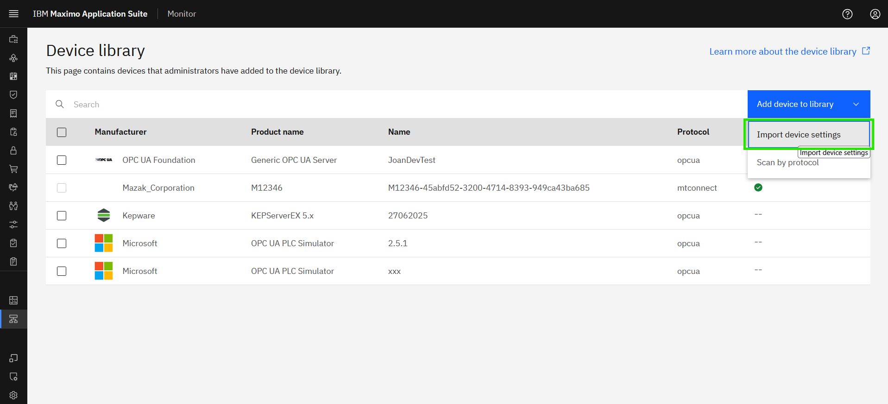 

- Select protocol as `Modbus`  
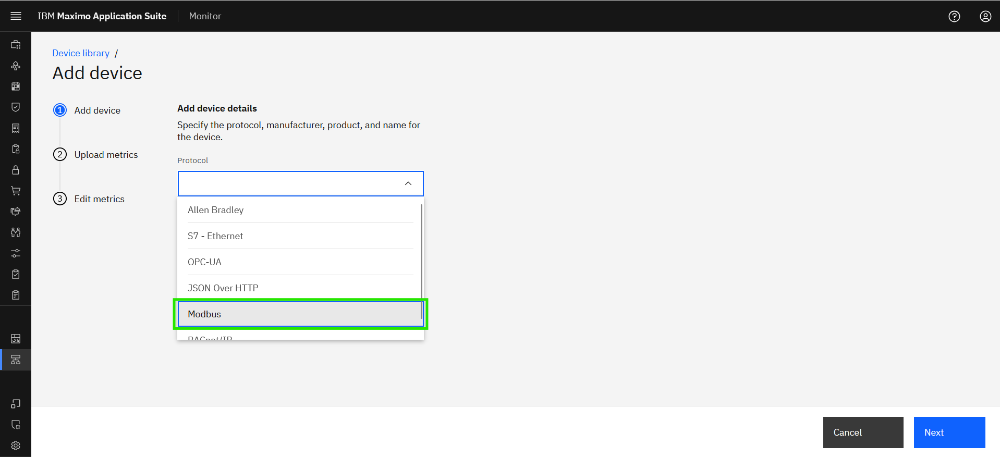 

- Enter the device details and click `Next`: 
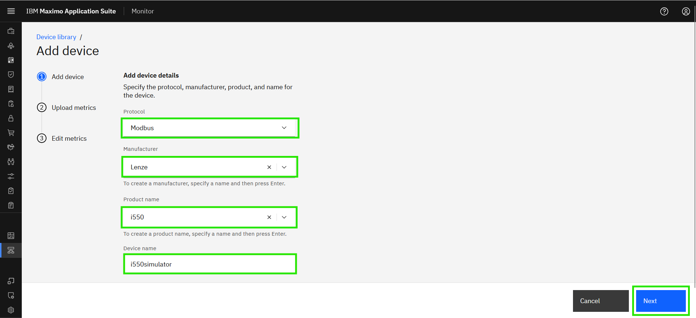 

!!! tip
    * New manufacutrer can be added if you couldn't find it in the option.
    * XX in the Device name should be your initials in case other people are following this lab in the same Maximo Application Suite environment.

- Download `example.xlsx file` 
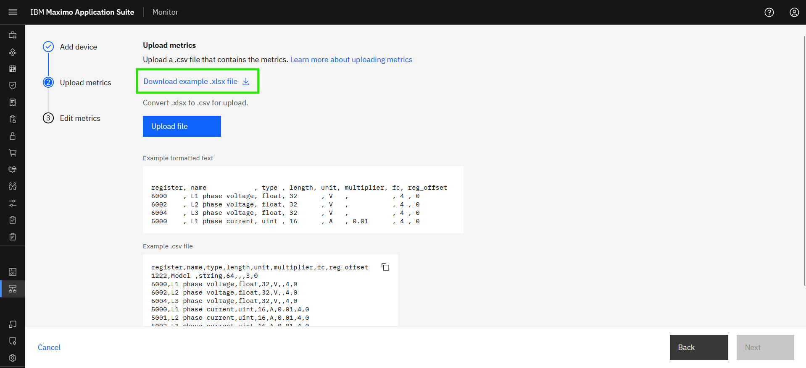 

- Open Excel file to fill the data points in `metrics` sheet, Each column in the template, offering context on its purpose and instructions for completing the corresponding cell values. It is important to note that each row in the CSV represents a single Modbus datapoint.
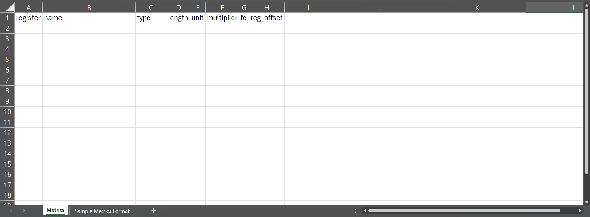 

- Modbus datapoint details can be found in the Manufacturer user manual/Communication manual. Example - For Lenze i550 the Modbus registers details are found in this [Commissioning Manual](https://www.lenze.com/product-information/PCS04-0000-0107-0/?contextType=PcsIdList&activeService=docFinder&documentId=OBJ_DOKU-0000000019-EN-015){target=_blank} [Page - 418]
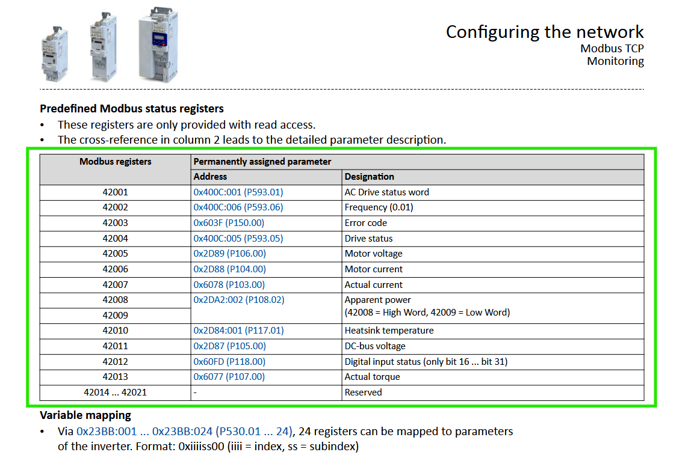 
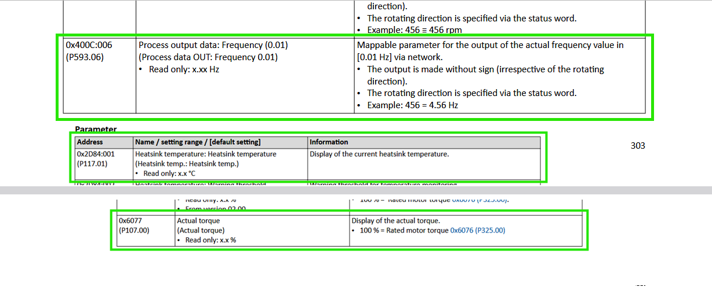 
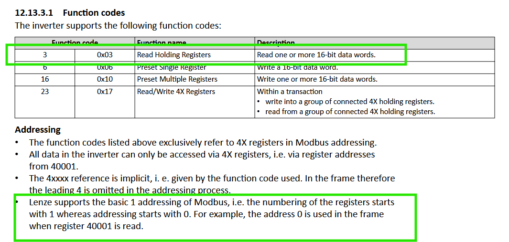 

- Fill the `Metrics` sheet using the modbus details:
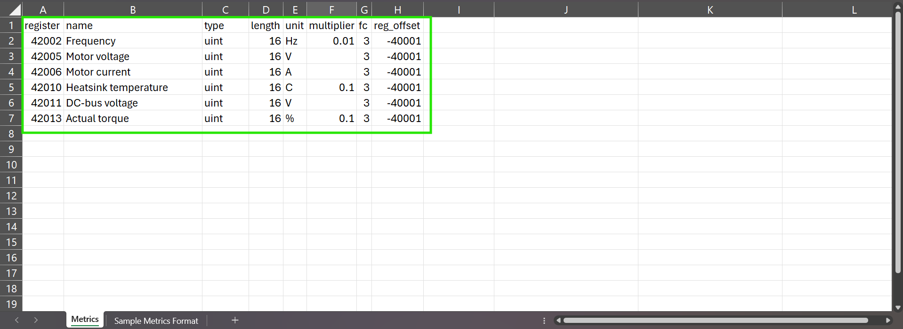 

# Examples of input for csv template 

| Column_Name&emsp;&emsp;&emsp;&emsp;&emsp;| Description&emsp;&emsp;&emsp;&emsp;&emsp;&emsp;&emsp;&emsp;&emsp;&emsp;&emsp;&emsp;&emsp;&emsp;&emsp;&emsp;&emsp;&emsp;&emsp;&emsp;&emsp;&emsp;&emsp;&emsp;&emsp;&emsp;&emsp;&emsp;&emsp;&emsp;&emsp;&emsp;&emsp;&emsp;&emsp;&emsp;&emsp;&emsp;&emsp;&emsp;&emsp;&emsp;&emsp;&emsp;&emsp;&emsp;&emsp;&emsp;&emsp;&emsp;&emsp;&emsp;&emsp;&emsp;&emsp;&emsp;&emsp;&emsp;&emsp;&emsp;&emsp;&emsp;&emsp;&emsp;&emsp;&emsp;&emsp;&emsp;&emsp;&emsp;&emsp;&emsp;&emsp;&emsp;&emsp;&emsp;&emsp;|
|----------------------------------------------------------------|------------------------------------------------------------------------------------|
| <i>Register</i> | Register column expects the value to be always in decimal (base-10)and not in Hexadecimal. Actual Torque - `42013`|
| <i>Name</i> | The name of the data point should be added in this column. The value will be used in Monitor as the related metric name. `Actual Torque` |
| <i>Type</i>   |Supported formats `uint`,`sint`,`float`,`string` and `bool`. The data type of a datapoint is determined by the physical property it represents and the range of values expected. For instance, if a value like frequency, Torque never goes negative, it's categorized as an unsigned integer (uint).  Manuals may explicitly label it as "uint". If the data can include negative values, it's treated as a signed integer (int or sint), and is often directly mentioned in the documentation. Floating point numbers (float) are typically specified as such in the manual and are used for properties requiring decimal precision.  Strings are made up of characters packed in 16-bit unsigned integers, and may be referred to as "ascii" or "char" in device documentation.  Coil addresses represent Boolean values, storing simple binary data (0 or 1). |
| <i>Length</i>     | 1 byte = 8 bits   2 byte = 16 bits = 1 word (42013)   4 byte = 32 bits = 2 words (42025 + 42026)   12 byte = 96 bits = 6 words (30008 to 30013) |
| <i>Unit</i>     | This column indicates the unit in which the data is reported for a specific datapoint. This is an optional parameter as not all datapoints require a unit. |
| <i>Multiplier</i>     |Used to get the exact values from the raw values   In the example for Acutal torque it is x.x % as defined, so the multiplier is `0.1`. Not applicable for float, string, bool data types. |
| <i>Function Code[FC]</i>     |Function codes are usually decided based on the starting number of register number (old Modicon notation). In the example, 4xxxx and 3xxxx registers mean Holding registers[FC3] and Input registers[FC4] respectively. |
| <i>Register_Offset</i>     |In the example, register offset is required the address 0 is used in the frame.  when register 40001 is read. The register offset is the amount that needs to be added to the Register address to obtain the real Modbus Decimal address.  Since the register is in the FC format (i.e. 42013), we have added -40001 offset. If the register address was 4097, offset would need to be just -1 |

- For filling the `metrics` sheet, please refer `Sample Metrics Format`sheet.
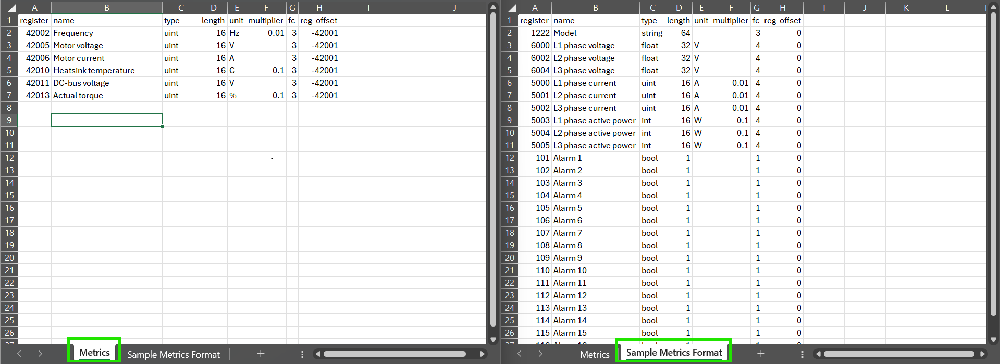 

!!! note
    Once completed the required datapoint details in Metrics sheet, kindly save as CSV format for uploading.   

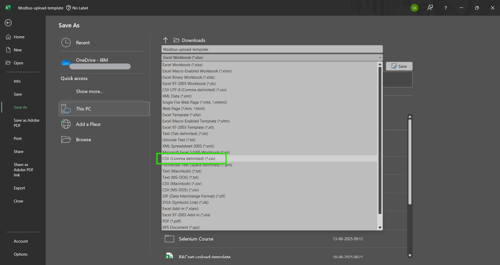 

- Upload the CSV file and select `Next`
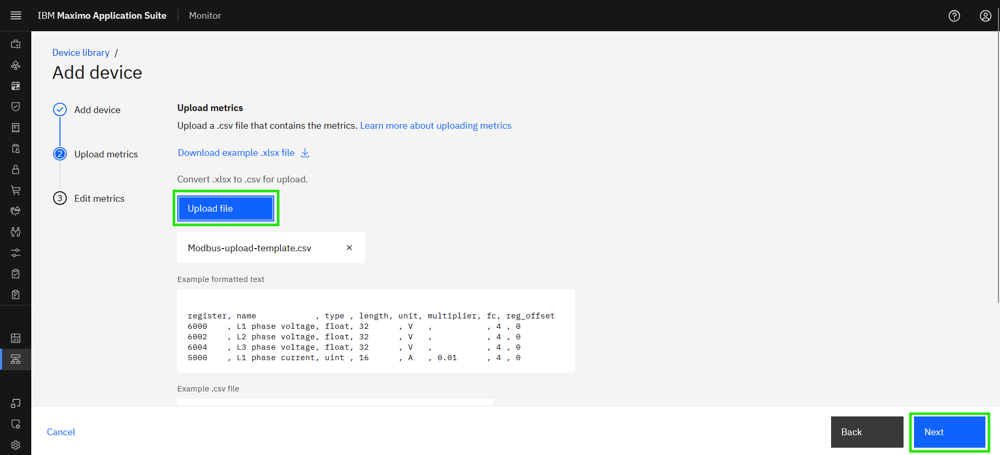 

- You can see the summary of datapoints, if required you can remove the metrics here. Once done click `Finish`: 
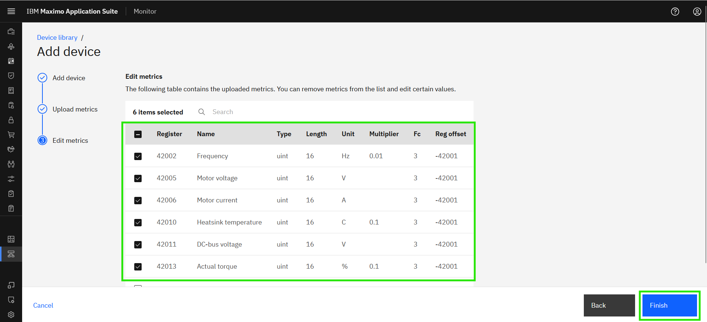 

!!! attention
    If you see a `Bad Request` error while Uploading the CSV file,  
    then you might need to check the CSV file for each metrics which you might be missing details or it maybe in a invalid format.

- You can see the newly added device in Device library: 
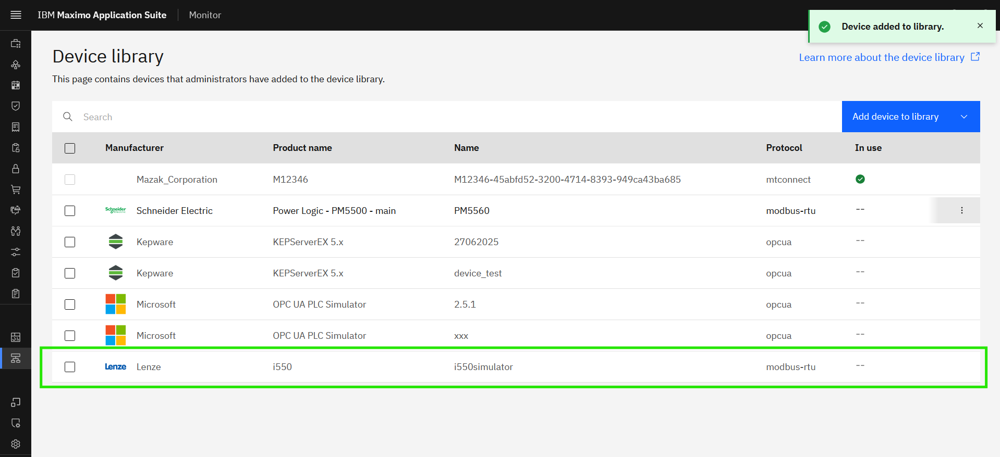
 
Now the device is ready to use. Enjoy!!! 🤗. 

---
Congratulations you have successfully added a device to the Device library. 
