# Objectives
In this Exercise you will learn how to create the Managed Gateway in Monitor and add the new device you've added to the Device library.

---
*Before you begin:*  
This Exercise requires that you have:

1. completed the pre-requisites required for [all labs](prereqs.md)
2. completed the previous exercises

---

#### Add a Managed Gateway

Login to MAS:
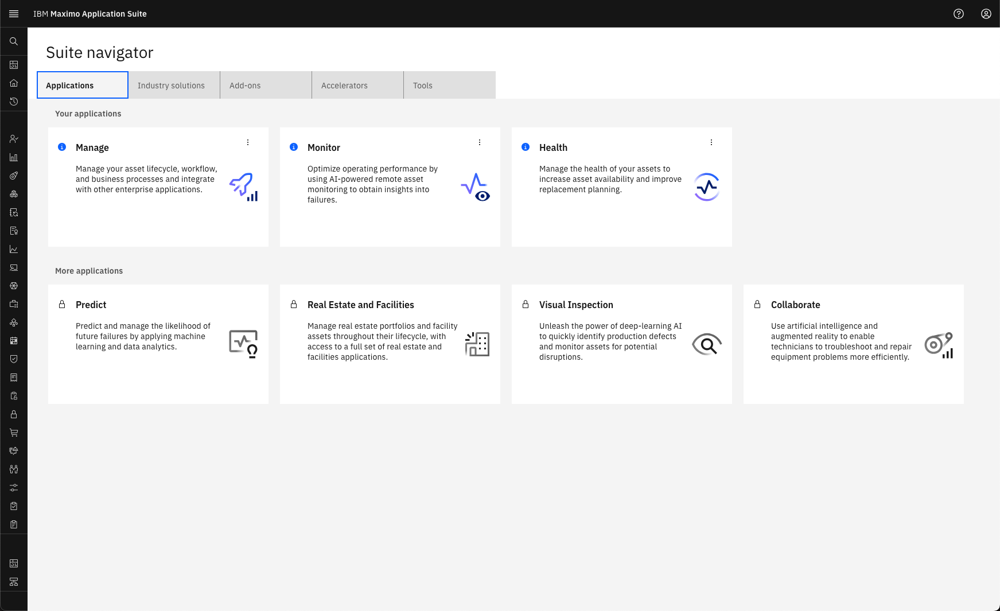  

Expand Setup under the Monitor section in the left menu and select Gateways:
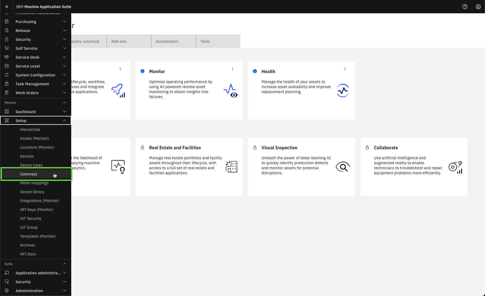

!!! note "New in MAS 9.1"
    Monitor no longer have a main home page. All interaction with Monitor is initiated from the Monitor section in the left menu 

 
Select `Add gateway`:
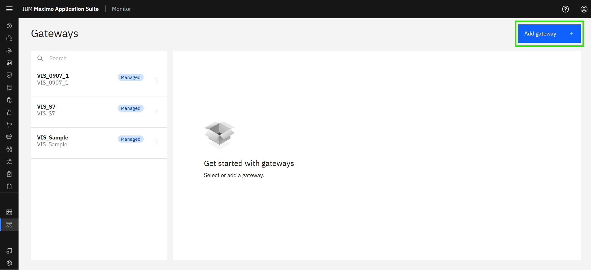  

Define the gateway ID `XX_MGT_GW_01` and the gateway Type `XX_MGT_GW`.

!!! tip
    XX in the gateway ID and Type should be your initials in case other people are following this lab in the same Maximo Application Suite environment.

Make sure the gateway Configuration is Managed and click `Save`:
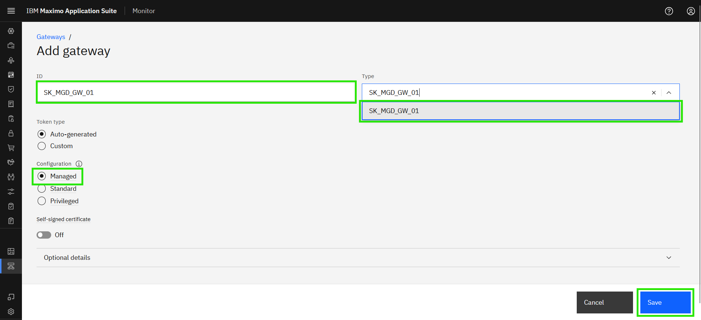  

You will now see your new Managed Gateway, including a `Managed` tag in both the list of Gateways as well as in the gateway definition:
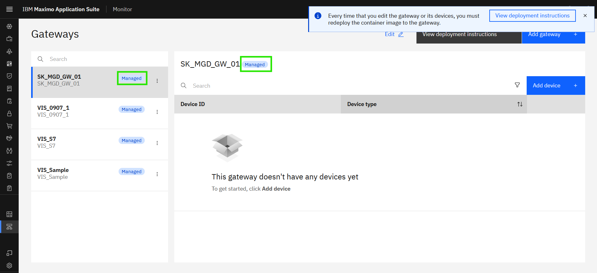 

!!! note
    Credentials are automatically "baked into" the docker image for the Managed Gateway. 
    This means that the credentials will not be presented to you, as with the other gateway configuration types. 

 

#### Add your new device to the Managed Gateway

In the Managed Gateway click on `Add device`: 
[![Add device]][Add device]{target=_blank} 

The `Use device library` will automatically be selected, as a Managed Gateway only supports devices from the library. Simply click on `Continue`:  
[![Use device library]][Use device library]

!!! note
    The type of gateway defines which types of devices that can be added to the gateway. 
    This is automatically handled by Monitor.  
    Managed Gateway: OT devices from the device library. 
    Standard/Privileged Gateway: IoT devices are added as custom devices. 

 
It is time to add the Lenze i550simulator device. 
Search for `Lenze` in the manufacurer drop-down and select it. Click `Next`: 
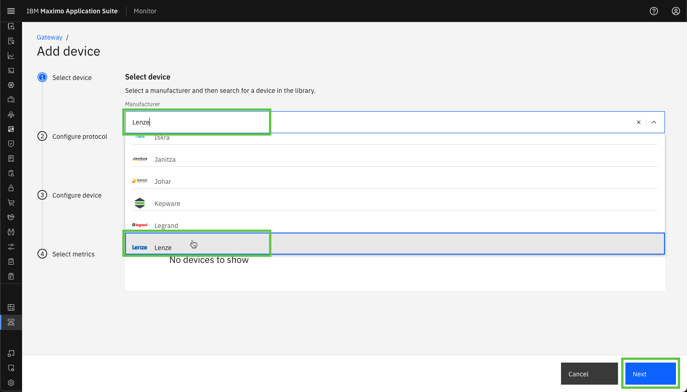  

Select the i550 product, choose `i550simulator` and click on `Next`: 
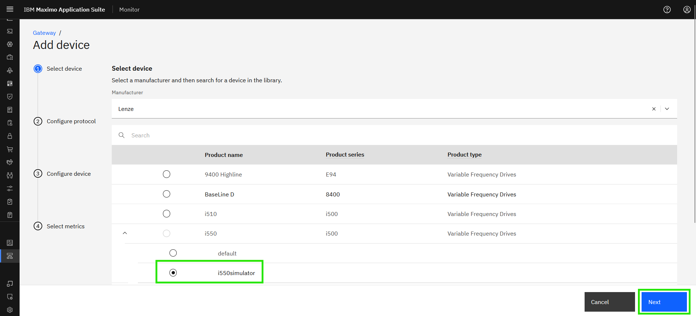  

Select the `Modbus TCP` protocol: 
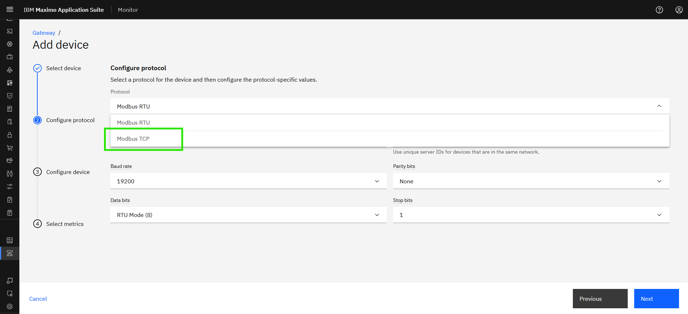

!!! tip 
    The simulator only supports the Modbus TCP protocol, so it will fail if you select another protocol. 

 
Now it is time to use the IP address of the simulator and combine it with port number 10502 separated by `:`, like `192.168.1.64:10502`. 
Click on `Next`;
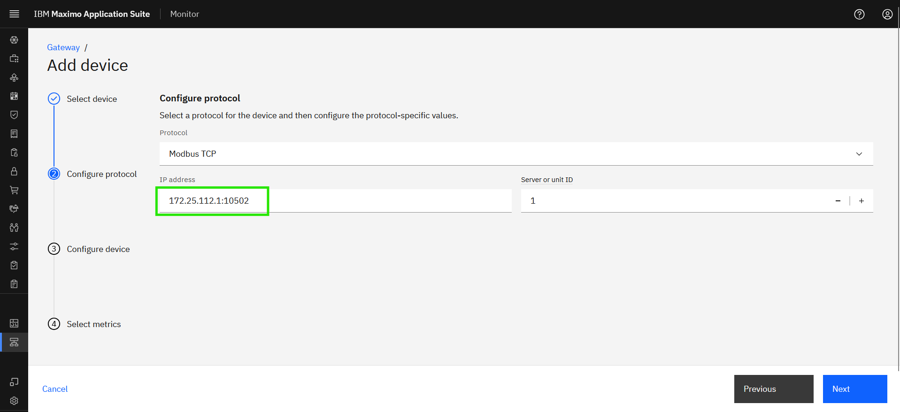

!!! tip 
    Do not change the `Server or unit ID` as the simulator does not support it. 

 
Define the Device ID as `XX_Lenze_i550_01` where you replace XX with your initials. 
You can see the Product Type of the industrial device you have chosen, i.e. Variable Frequency Drives for the Lenze i550. 
Click on the `Device type` and you should see this:
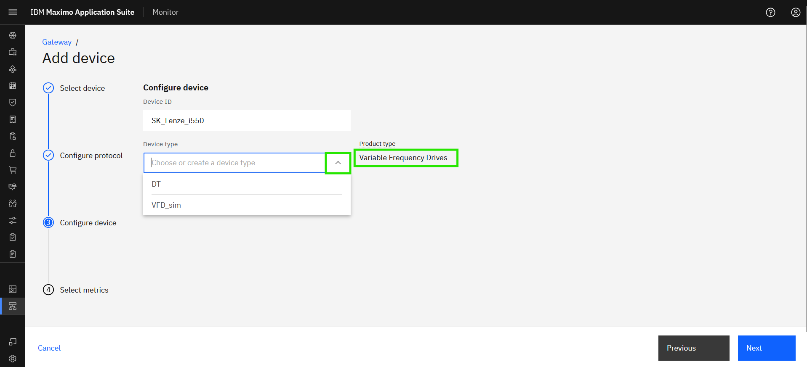  

You will create your own Device Type. Since you have not yet done so, you just type `XX_VFD` where you replace XX with your initials: 
Click on the new device type to create it and click `Next`:
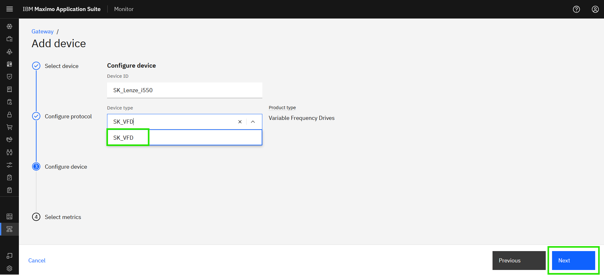

!!! tip 
    You can select your own Device Type from the drop-down list once you have created it. 

 
Define the Data frequency to 60000 (60 seconds) and it will automatically be used when you select the metrics: 
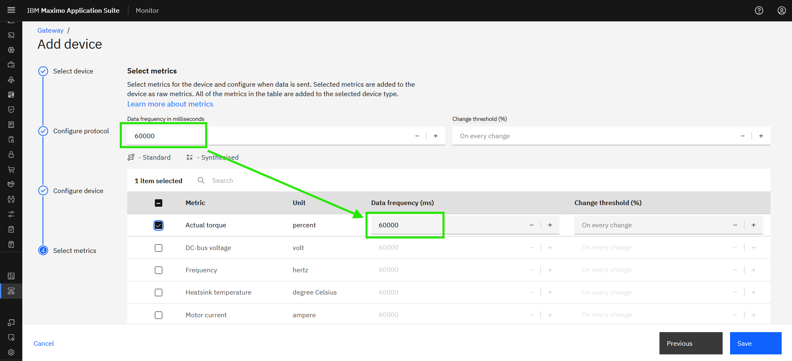  

Select all the Metrics. Click `Save`:
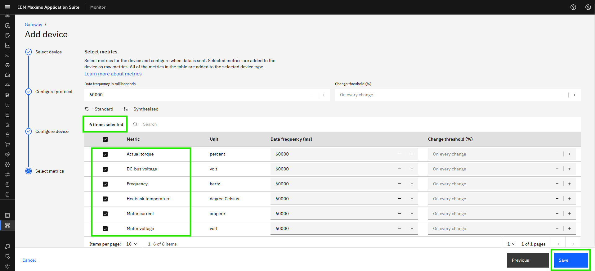

 
You will now see your new added device being a part of your new Managed Gateway:
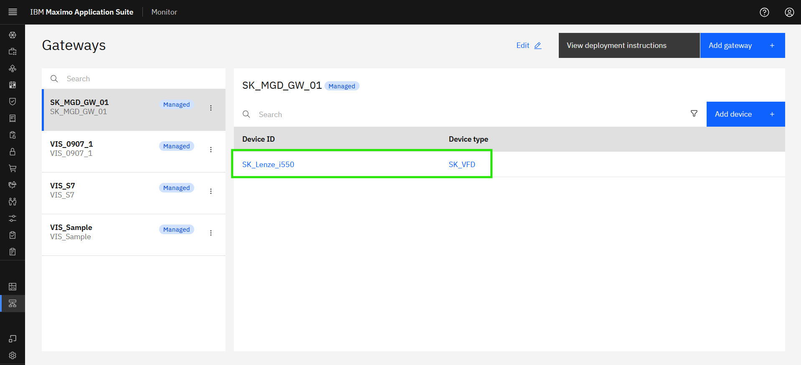  

---
Congratulations you have successfully created the Managed Gateway in Monitor and added an instance of the newly added device in the Device library. 

[Add device]: img/add_device_01.png
[Use device library]: img/add_device_02.png