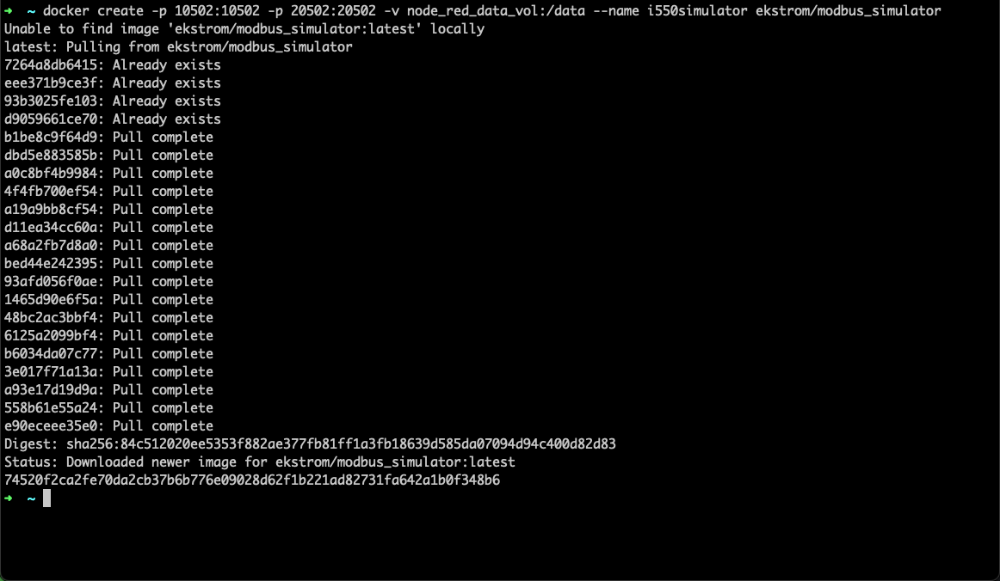
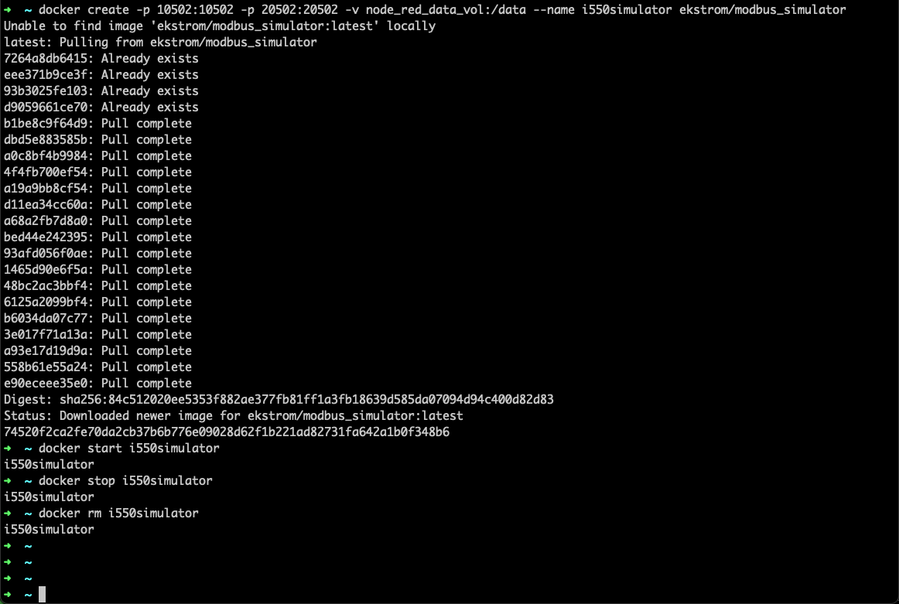

# Objectives
In this Exercise you will learn how to use Docker to run a fixed and ready docker container with the modbus simulator.

## 1. Create the Docker container
Open a terminal or command window and run the following command:

    docker create -p 10502:10502 -p 20502:20502 -v node_red_data_vol:/data --name i550simulator ekstrom/modbus_simulator

Please be patient even though you'll see the following message:

    Unable to find image 'ekstrom/modbus_simulator:latest' locally

It needs to pull the docker image. It has been given the name: `i550simulator`

## 2. Start the Docker container

Run the follwing command to start the container:

    docker start i550simulator

The simulator is now active and the random and dynamic values will change every 30 second.
It will run in the background and not produce any output in the terminal/command window.

## 3. Stop and remove the Docker container

Once you are done using the docker based simulator you can stop it with the following command:

    docker stop i550simulator

and remove the container with the following command:

    docker rm i550simulator

## All Docker commands in one window

---
Congratulations you have successfully setup a modbus simulator environment using a preconfigured docker container. 
