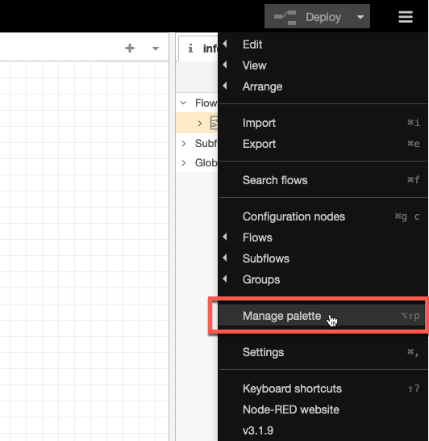
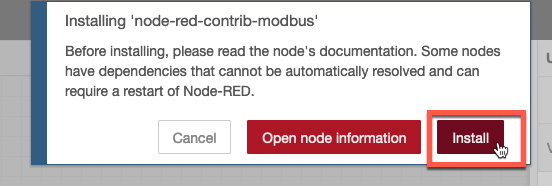
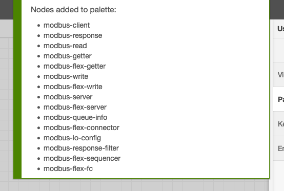
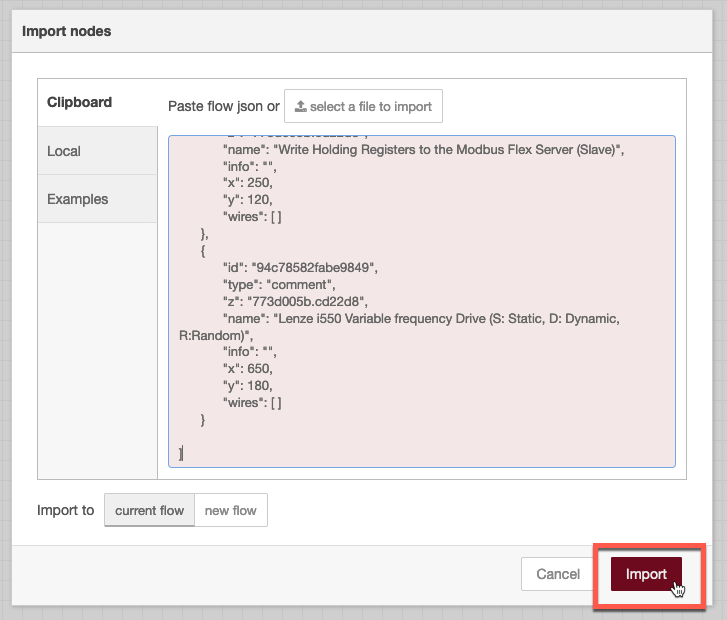
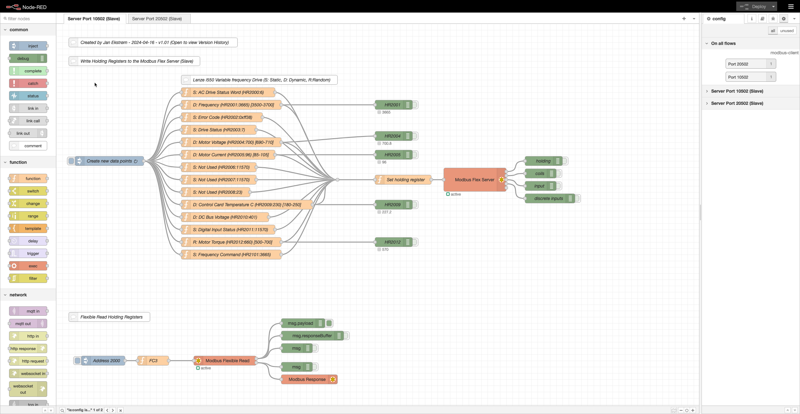

# Objectives
In this Exercise you will learn how to:

* Install Node-RED locally
* Add required additional nodes
* Install the modbus simulator script

## Install Node-RED locally

This is a fairly easy step, as you just have to follow this guide:
[Running Node-RED locally](https://nodered.org/docs/getting-started/local){target=_blank} 

Once installed and started open the browser and start the [Node-RED](http://localhost:1880/){target=_blank} editor. 

!!! attention
    Make sure you are running Node-RED v3+, i.e. if you already have an existing older Node-RED instance installed locally then make sure to upgrade it before proceeding.

## Add required additional nodes

Before loading the Node-RED script you need to add the required additional node libraries. 
Node-RED library dependencies: 
- node-red-contrib-modbus 

1. Click on the burger menu in upper right hand corner and select `Manage palette`.
  
2. Click on `Install` and write `node-red-contrib-modbus`in the Search field - then click on `Install`.
  
3. Click on `Install` again.
  
4. Wait until you see the new nodes have been installed.
  

## Install the modbus simulator script

1. Download the [flow](config/flows.json){target=_blank}
2. Launch Node-RED
3. Click on the burger menu and choose Import 
  
4. Click on select a file to import
5. Choose the file downloaded in step 1.
6. Click Import 
  
7. Delete Flow 1
8. Click on Deploy
9. Your local Modbus Simulator is now active and the random and dynamic values will change every 30 second.
  

---
Congratulations you have successfully installed and prepared a local instance of Node-RED running as a modbus simulator.
