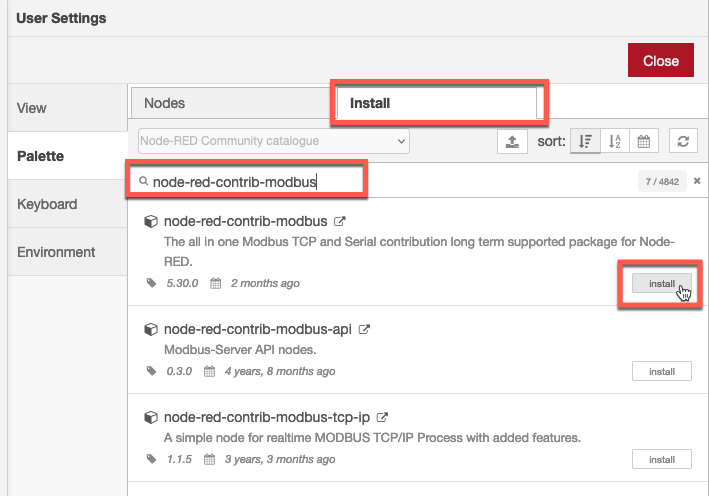
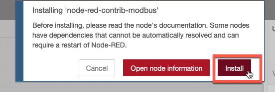
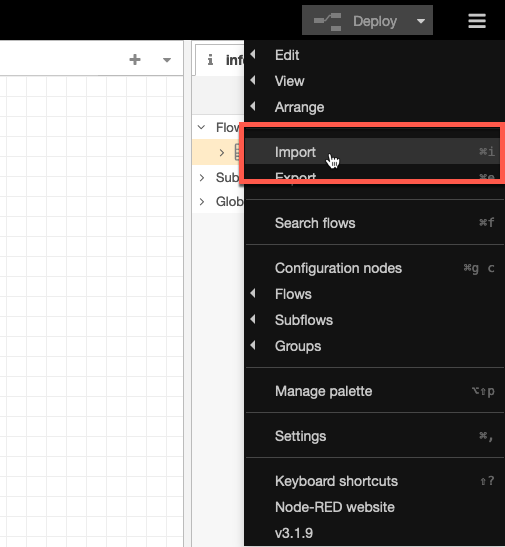
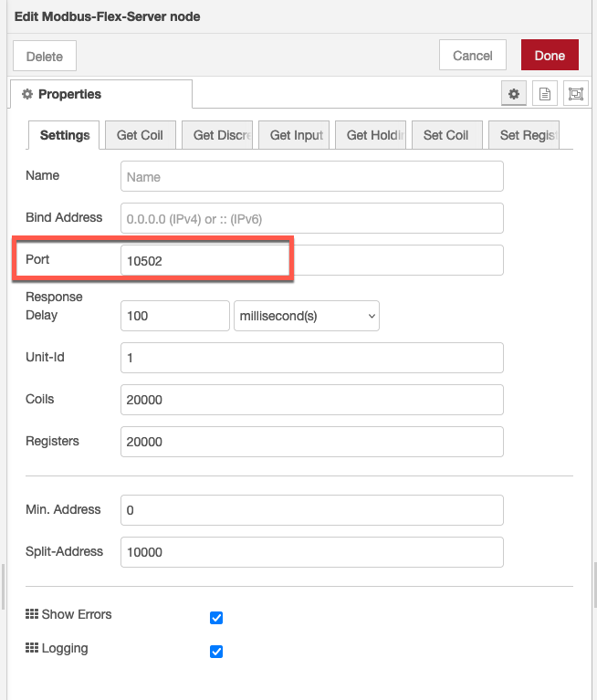
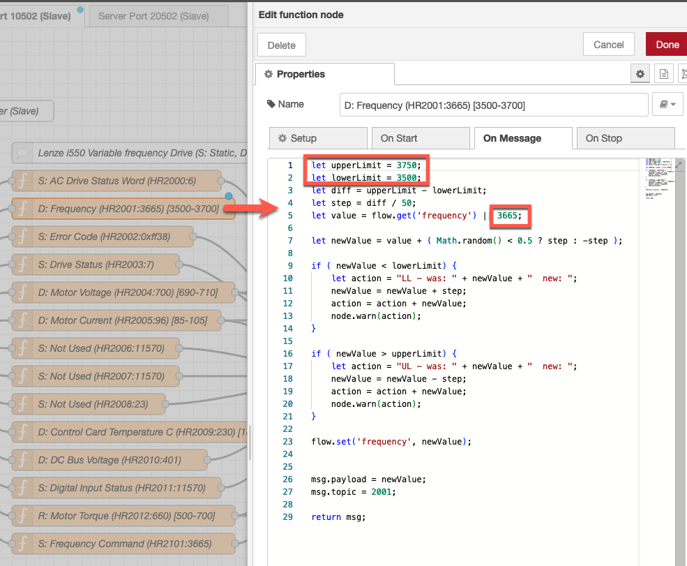
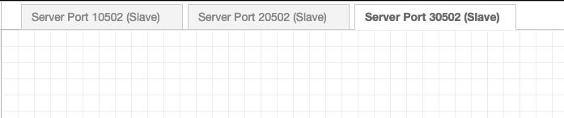

# Objectives
In this Exercise you will learn how to:

* Install Node-RED locally
* Add required additional nodes
* Install the modbus simulator script

## Install Node-RED locally

This is a fairly easy step, as you just have to follow this guide:
[Running Node-RED locally](https://nodered.org/docs/getting-started/local){target=_blank} 

Once installed and started open the browser and start the [Node-RED](http://localhost:1880/){target=_blank} editor. 

!!! attention
    Make sure you are running Node-RED v3+, i.e. if you already have an existing older Node-RED instance installed locally then make sure to upgrade it before proceeding.

## Add required additional nodes

Before loading the Node-RED script you need to add the required additional node library. 
Node-RED library dependency: 
- node-red-contrib-modbus 

1. Click on the burger menu in upper right hand corner and select `Manage palette`.
  
2. Click on `Install` and write `node-red-contrib-modbus`in the Search field - then click on `Install`.
  
3. Click on `Install` again.
  
4. Wait until you see the new nodes have been installed.
  

## Install the modbus simulator script

1. Download the [flow](config/flows.json){target=_blank}
2. Launch Node-RED
3. Click on the burger menu and choose Import 
  
4. Click on `select a file to import`
5. Choose the file downloaded in step 1.
6. Click Import 
  
7. Delete Flow 1
8. Click on Deploy
9. Your local Modbus Simulator is now active and the random and dynamic values will change every 30 second.
  

## Customisation tips and tricks

#### Changing port number

If you need to change the port number, this is done in the Modbus Flex Server node:
  

#### Changing dynamic range

The function nodes provide the content of the holding registers (defined in msg.topic). 
You can change the upper limit, the lower limit, and the default value if needed.
  

#### Adding another device

You can add another device by duplicating one of the tabs. Just remember to change the port number in the Modbus Flex Server node in the new tab.
  

---
Congratulations you have successfully installed and prepared a local instance of Node-RED running as a modbus simulator.
